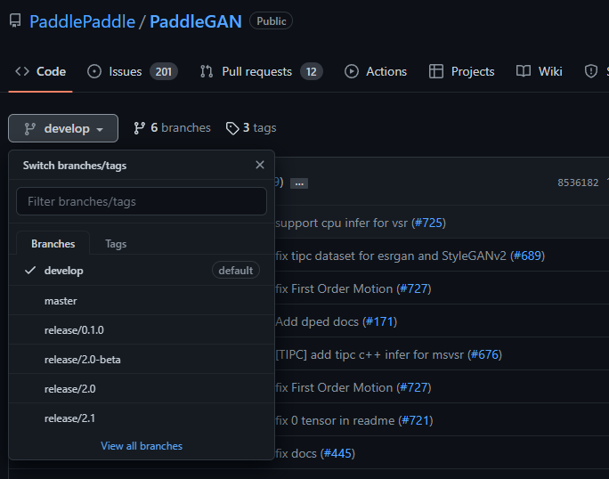

# 项目概述

​		本文重点介绍如何利用飞桨生成对抗网络`PaddleGAN` 在视频超分数据集上，使用当前`PaddleGAN`的`EDVR`模型完视频超分任务。通过EDVR模型实现视频超分，从而应用到视频生成等领域。

​		**关键词: 图像超分、EDVR、PaddleGAN**

## 文档目录结构

- (1) 模型简述
- (2) 环境安装
  - (2.1) `PaddlePaddle`安装
    - (2.1.1) 安装对应版本`PaddlePaddle`
    - (2.1.2) 验证安装是否成功
  - (2.2) `PaddleGAN`安装
    - (2.2.1) 下载`PaddleGAN`代码
    - (2.2.2) 安装依赖项目
    - (2.2.3) 验证安装是否成功
- (3) 数据准备
  - (3.1) facade数据集
  - (3.2) 自制数据集
- (4) 模型训练
  - (4.1) 训练前数据准备
  - (4.2) 开始训练
  - (4.3) 可视化训练
  - (4.4) 回复训练
  - (4.5) 多卡训练
- (5) 模型验证与预测
  - (5.1) 开始验证
  - (5.2) 开始预测
- (6) 模型部署与转化
- (7) 配置文件的说明
  - (7.1) 整体配置文件格式综述
  - (7.2) 数据路径与数据预处理说明
  - (7.3) 模型与损失函数说明
  - (7.4) 优化器说明
  - (7.5) 其它参数说明
- (8) 部分参数值推荐说明
  - (8.1) 训练批大小
  - (8.2) 训练轮次大小
  - (8.3) 训练学习率大小
  - (8.4) 配置文件说明

# (1) 模型简述

​       [EDVR](https://arxiv.org/pdf/1905.02716.pdf)模型在NTIRE19视频恢复和增强挑战赛的四个赛道中都赢得了冠军，并以巨大的优势超过了第二名。视频超分的主要难点在于（1）如何在给定大运动的情况下对齐多个帧；（2）如何有效地融合具有不同运动和模糊的不同帧。首先，为了处理大的运动，EDVR模型设计了一个金字塔级联的可变形（PCD）对齐模块，在该模块中，从粗到精的可变形卷积被使用来进行特征级的帧对齐。其次，EDVR使用了时空注意力（TSA）融合模块，该模块在时间和空间上同时应用注意力机制，以强调后续恢复的重要特征。


# (2) 环境安装

## (2.1) `PaddlePaddle`安装

### (2.1.1) 安装对应版本`PaddlePaddle`

​		根据系统和设备的`cuda`环境，选择对应的安装包，这里默认使用`pip`在`linux`设备上进行安装。


​		在终端中执行:

```bash
pip install paddlepaddle-gpu==2.3.0.post110 -f https://www.paddlepaddle.org.cn/whl/linux/mkl/avx/stable.html
```

​		安装效果:


### (2.1.2) 验证安装是否成功

```bash
# 安装完成后您可以使用 python进入python解释器，
python
# 继续输入
import paddle 
# 再输入 
paddle.utils.run_check()
```

​		如果出现`PaddlePaddle is installed successfully!`，说明您已成功安装。


## (2.2) `PaddleGAN`安装

### (2.2.1) 下载`PaddleGAN`代码

​		用户可以通过使用`github`或者`gitee`的方式进行下载，我们当前版本为`PaddleGAN`的release v2.5版本。后续在使用时，需要对应版本进行下载。



```bash
# github下载
git clone -b release/2.5 https://github.com/PaddlePaddle/PaddleGAN.git
# gitee下载
git clone -b release/2.5 https://gitee.com/PaddlePaddle/PaddleGAN.git
```

### (2.2.2) 安装依赖项目

* 方式一：
  通过直接`pip install` 安装，可以最高效率的安装依赖

``` bash
pip install --upgrade ppgan
```

* 方式二：
  下载`PaddleGAN`代码后，进入`PaddleGAN`代码文件夹目录下面

``` bash
cd PaddleGAN
pip install -v -e .  # or "python setup.py develop"

# 安装其他依赖
pip install -r requirements.txt
```

### (2.2.3) 其他第三方工具安装

* 涉及视频的任务都需安装**ffmpeg**，这里推荐使用[conda](https://docs.conda.io/en/latest/miniconda.html)安装：

```
conda install x264=='1!152.20180717' ffmpeg=4.0.2 -c conda-forge
```

* 如需使用可视化工具监控训练过程，请安装[飞桨VisualDL](https://github.com/PaddlePaddle/VisualDL)：

```
python -m pip install visualdl -i https://mirror.baidu.com/pypi/simple
```

*注意：VisualDL目前只维护Python3以上的安装版本

# (3) 数据准备

## (3.1)REDS数据集

  这里提供4个视频超分辨率常用数据集，REDS，Vimeo90K，Vid4，UDM10。其中REDS和vimeo90k数据集包括训练集和测试集，Vid4和UDM10为测试数据集。将需要的数据集下载解压后放到``PaddleGAN/data``文件夹下 。

  REDS（[数据下载](https://seungjunnah.github.io/Datasets/reds.html)）数据集是NTIRE19比赛最新提出的高质量（720p）视频数据集，其由240个训练片段、30个验证片段和30个测试片段组成（每个片段有100个连续帧）。由于测试数据集不可用，这里在训练集选择了四个具有代表性的片段（分别为'000', '011', '015', '020'，它们具有不同的场景和动作）作为测试集，用REDS4表示。剩下的训练和验证片段被重新分组为训练数据集（总共266个片段）。


  处理后的数据集 REDS 的组成形式如下:

	  PaddleGAN
	    ├── data
	        ├── REDS
	              ├── train_sharp
	              |    └──X4
	              ├── train_sharp_bicubic
	              |    └──X4
	              ├── REDS4_test_sharp
	              |    └──X4
	              └── REDS4_test_sharp_bicubic
	                   └──X4
	            ...

## (3.2) Vimeo90K数据集

 Vimeo90K（[数据下载](http://toflow.csail.mit.edu/)）数据集是Tianfan Xue等人构建的一个用于视频超分、视频降噪、视频去伪影、视频插帧的数据集。Vimeo90K是大规模、高质量的视频数据集，包含从vimeo.com下载的 89,800 个视频剪辑，涵盖了大量场景和动作。

  处理后的数据集 Vimeo90K 的组成形式如下:

  ```
  PaddleGAN
    ├── data
        ├── Vimeo90K
              ├── vimeo_septuplet
              |    |──sequences
              |    └──sep_trainlist.txt
              ├── vimeo_septuplet_BD_matlabLRx4
              |    └──sequences
              └── vimeo_super_resolution_test
                   |──low_resolution
                   |──target
                   └──sep_testlist.txt
            ...
  ```


## (3.3) Vid4数据集

  Vid4（[数据下载](https://paddlegan.bj.bcebos.com/datasets/Vid4.zip)）数据集是常用的视频超分验证数据集，包含4个视频段。

  处理后的数据集 Vid4 的组成形式如下:

  ```
  PaddleGAN
    ├── data
        ├── Vid4
              ├── BDx4
              └── GT
            ...
  ```


## (3.4)UDM10数据集

 UDM10（[数据下载](https://paddlegan.bj.bcebos.com/datasets/udm10_paddle.tar)）数据集是常用的视频超分验证数据集，包含10个视频段。

  处理后的数据集 UDM10 的组成形式如下:

  ```
  PaddleGAN
    ├── data
        ├── udm10
              ├── BDx4
              └── GT
            ...
  ```


# (4) 模型训练

## (4.1) 训练前准备

 **修改选中模型的配置文件**

 所有模型的配置文件均在``` PaddleGAN/configs ```目录下。 找到你需要的模型的配置文件，修改模型参数，一般修改迭代次数，num_workers，batch_size以及数据集路径。

 找到``` /home/aistudio/PaddleGAN/configs ```目录，修改配置文件``EDVR_facades.yaml``中的

-  参数``epochs``设置为 200

-  参数``dataset：train：num_workers``设置为4

-  参数``dataset：train：batch_size``设置为1

-  参数``dataset：train：lq_folder``改为data/REDS/train_blur/X4

-  参数``dataset：train： gt_folder``改为data/REDS/train_sharp/X4

-  参数``dataset：train： ann_file``改为data/REDS/meta_info_REDS_GT.txt

-  参数``dataset：test：lq_folder``改为data/REDS/test_blur/X4

-  参数``dataset：test： gt_folder``改为data/REDS/test_sharp/X4

-  参数``dataset：test： ann_file``改为data/REDS/meta_info_REDS_GT.txt
-  configs/keypoint/tiny_pose/tinypose_128x96.yml


```yaml
dataset:
  train:
    name: RepeatDataset
    times: 1000
    num_workers: 6
    batch_size: 8  #4 gpus
    dataset:
      name: VSRREDSDataset
      lq_folder: data/REDS/train_blur/X4
      gt_folder: data/REDS/train_sharp/X4
      ann_file: data/REDS/meta_info_REDS_GT.txt
      num_frames: 5
      val_partition: REDS4
      test_mode: False
      preprocess:
        - name: GetFrameIdx
          interval_list: [1]
          frames_per_clip: 99
        - name: ReadImageSequence
          key: lq
        - name: ReadImageSequence
          key: gt
        - name: Transforms
          input_keys: [lq, gt]
          pipeline:
            - name: SRPairedRandomCrop
              gt_patch_size: 256
              scale: 1
              keys: [image, image]
            - name: PairedRandomHorizontalFlip
              keys: [image, image]
            - name: PairedRandomVerticalFlip
              keys: [image, image]
            - name: PairedRandomTransposeHW
              keys: [image, image]
            - name: TransposeSequence
              keys: [image, image]
            - name: NormalizeSequence
              mean: [0., 0., 0.]
              std: [255., 255., 255.]
              keys: [image, image]


  test:
    name: VSRREDSDataset
    lq_folder: data/REDS/REDS4_test_blur/X4
    gt_folder: data/REDS/REDS4_test_sharp/X4
    ann_file: data/REDS/meta_info_REDS_GT.txt
    num_frames: 5
    val_partition: REDS4
    test_mode: True
    preprocess:
        - name: GetFrameIdxwithPadding
          padding: reflection_circle
        - name: ReadImageSequence
          key: lq
        - name: ReadImageSequence
          key: gt
        - name: Transforms
          input_keys: [lq, gt]
          pipeline:
            - name: TransposeSequence
              keys: [image, image]
            - name: NormalizeSequence
              mean: [0., 0., 0.]
              std: [255., 255., 255.]
              keys: [image, image]
```

## (4.2) 开始训练

​		请确保已经完成了`PaddleGAN`的安装工作，并且当前位于`PaddleGAN`目录下，执行以下脚本：

```bash
%cd /home/aistudio/PaddleGAN/
!export CUDA_VISIBLE_DEVICES=0 # 设置1张可用的卡

!python -u tools/main.py --config-file configs/edvr_m_wo_tsa.yaml
```

​	

## (4.3) 可视化训练

[飞桨VisualDL](https://github.com/PaddlePaddle/VisualDL)是针对深度学习模型开发所打造的可视化分析工具，提供关键指标的实时趋势可视化、样本训练中间过程可视化、网络结构可视化等等，更能直观展示超参与模型效果间关系，辅助实现高效调参。

以下操作请确保您已完成[VisualDL](https://github.com/PaddlePaddle/VisualDL)的安装，安装指南请见[VisualDL安装文档](https://github.com/PaddlePaddle/VisualDL/blob/develop/README_CN.md#%E5%AE%89%E8%A3%85%E6%96%B9%E5%BC%8F)。

**通过在配置文件 EDVR_facades.yaml 中添加参数`enable_visualdl: true`使用 [飞桨VisualDL](https://github.com/PaddlePaddle/VisualDL)对训练过程产生的指标或生成的图像进行记录，并运行相应命令对训练过程进行实时监控：**


如果想要自定义[飞桨VisualDL](https://github.com/PaddlePaddle/VisualDL)可视化内容，可以到 [./PaddleGAN/ppgan/engine/trainer.py](https://github.com/PaddlePaddle/PaddleGAN/blob/develop/ppgan/engine/trainer.py) 中进行修改。

本地启动命令：

```
visualdl --logdir output_dir/EDVR_facade-2022-11-29-09-21/
```

更多启动方式及可视化功能使用指南请见[VisualDL使用指南](https://github.com/PaddlePaddle/VisualDL/blob/develop/docs/components/README_CN.md)。

## (4.4) 恢复训练

​	    在训练过程中默认会**保存上一个epoch的checkpoint在`output_dir`中，方便恢复训练。**

​	    本次示例中，cyclegan的训练默认**每五个epoch会保存checkpoint**，如需更改，可以到**config文件中的`interval`**进行修改。


```bash
python -u tools/main.py --config-file configs/edvr_m_wo_tsa.yaml --resume your_checkpoint_path
```

​	`--resume (str)`: 用来恢复训练的checkpoint路径（保存于上面配置文件中设置的output所在路径）。


## (4.5) 多卡训练

```bash
!CUDA_VISIBLE_DEVICES=0,1,2,3
!python -m paddle.distributed.launch tools/main.py --config-file configs/edvr_m_wo_tsa.yaml
```


# (5) 模型验证与预测

## (5.1) 开始验证

​		训练完成后，用户可以使用评估脚本`tools/eval.py`来评估模型效果。运行``/home/aistudio/pretrained_model/EDVR_PSNR_50000_weight.pdparams``代码测试 EDVR 模型。

```bash
%cd /home/aistudio/PaddleGAN/

!python tools/main.py --config-file configs/edvr_m_wo_tsa.yaml \
    --evaluate-only --load /home/aistudio/pretrained_model/EDVR_facades_50000_weight.pdparams
```

​	

​	

## (5.4) 开始预测

​		除了可以分析模型的准确率指标之外，我们还可以对一些具体样本的预测。

```bash
%cd /home/aistudio/PaddleGAN/

!python tools/main.py --config-file configs/EDVR_facades.yaml \
    --evaluate-only --load /home/aistudio/pretrained_model/EDVR_facades_50000_weight.pdparams
```

​	`--evaluate-only`: 是否仅进行预测。


- `--load (str)`: 训练好的权重路径。

# (6) 模型部署与转化

以msvsr模型为例，``inputs_size``为模型输入size，``model_name``为导出模型的命名，``model_path``为模型权重的路径.

```python
# 导出行人检测模型
!python tools/export_model.py -c configs/msvsr_reds.yaml  --inputs_size="1,2,3,180,320"  --model_name inference --load model_path

```


以msvsr模型为例

```
python tools/inference.py --model_type msvsr -c configs/msvsr_reds.yaml --output_path output_dir
```

# (7) 配置文件说明

​		正是因为有配置文件的存在，我们才可以使用更便捷的进行消融实验。在本章节中我们选择
```PaddleGAN/configs/EDVR_facades.yaml```文件来进行配置文件的详细解读。

## (7.1) 整体配置文件格式综述

我们将```EDVR_facades.yml```进行拆分解释

* **EDVR** 表示模型的名称 *EDVR*
* **facades** 表示数据集为街景分隔数据集

一个模型的配置文件按功能可以分为:

- **主配置文件入口**: `EDVR_facades.yml`

## (7.2) 数据路径与数据预处理说明

​		这一小节主要是说明数据部分，当准备好数据，如何进行配置文件修改，以及该部分的配置文件有什么内容。

**首先是进行数据路径配置

```yaml
dataset:
  train:
    name: RepeatDataset
    times: 1000
    num_workers: 6
    batch_size: 8  #4 gpus
    dataset:
      name: VSRREDSDataset
      lq_folder: data/REDS/train_blur/X4
      gt_folder: data/REDS/train_sharp/X4
      ann_file: data/REDS/meta_info_REDS_GT.txt
      num_frames: 5
      val_partition: REDS4
      test_mode: False
      preprocess:
        - name: GetFrameIdx
          interval_list: [1]
          frames_per_clip: 99
        - name: ReadImageSequence
          key: lq
        - name: ReadImageSequence
          key: gt
        - name: Transforms
          input_keys: [lq, gt]
          pipeline:
            - name: SRPairedRandomCrop
              gt_patch_size: 256
              scale: 1
              keys: [image, image]
            - name: PairedRandomHorizontalFlip
              keys: [image, image]
            - name: PairedRandomVerticalFlip
              keys: [image, image]
            - name: PairedRandomTransposeHW
              keys: [image, image]
            - name: TransposeSequence
              keys: [image, image]
            - name: NormalizeSequence
              mean: [0., 0., 0.]
              std: [255., 255., 255.]
              keys: [image, image]


  test:
    name: VSRREDSDataset
    lq_folder: data/REDS/REDS4_test_blur/X4
    gt_folder: data/REDS/REDS4_test_sharp/X4
    ann_file: data/REDS/meta_info_REDS_GT.txt
    num_frames: 5
    val_partition: REDS4
    test_mode: True
    preprocess:
        - name: GetFrameIdxwithPadding
          padding: reflection_circle
        - name: ReadImageSequence
          key: lq
        - name: ReadImageSequence
          key: gt
        - name: Transforms
          input_keys: [lq, gt]
          pipeline:
            - name: TransposeSequence
              keys: [image, image]
            - name: NormalizeSequence
              mean: [0., 0., 0.]
              std: [255., 255., 255.]
              keys: [image, image]
```

## (7.3) 模型与损失函数说明

当我们配置好数据后，下面在看关于模型和主干网络的选择

``` yaml
total_iters: 600000
output_dir: output_dir
checkpoints_dir: checkpoints
# tensor range for function tensor2img
min_max:
  (0., 1.)

model:
  name: EDVRModel
  tsa_iter: False
  generator:
    name: EDVRNet
    in_nf: 3
    out_nf: 3
    scale_factor: 1
    nf: 128
    nframes: 5
    groups: 8
    front_RBs: 5
    back_RBs: 40
    center: 2
    predeblur: True
    HR_in: True
    w_TSA: False
  pixel_criterion:
    name: CharbonnierLoss
```

  **Note**

* 我们模型的`architecture`是`PicoDet`。
* 主干网络是 `LCNet`，在这里我们可以自由更换，比如换成`ResNet50_vd`, 不同的主干网络需要选择不同的参数。
* `nms` 此部分内容是预测与评估的后处理，一般可以根据需要调节`threshold`参数来优化处理效果。

## (7.4) 优化器说明

当我们配置好数据与模型后，下面再看关于优化器的选择

``` yaml
# 优化器配置

lr_scheduler:
  name: CosineAnnealingRestartLR
  learning_rate: !!float 2e-4
  periods: [150000, 150000, 150000, 150000]
  restart_weights: [1, 0.5, 0.5, 0.5]
  eta_min: !!float 1e-7
```

## (7.5) 其它参数说明

``` yaml

optimizer:
  name: Adam
  # add parameters of net_name to optim
  # name should in self.nets
  net_names:
    - generator
  beta1: 0.9
  beta2: 0.99

validate:
  interval: 5000
  save_img: false

  metrics:
    psnr: # metric name, can be arbitrary
      name: PSNR
      crop_border: 0
      test_y_channel: False
    ssim:
      name: SSIM
      crop_border: 0
      test_y_channel: False

log_config:
  interval: 10
  visiual_interval: 5000

snapshot_config:
  interval: 5000
```

# (8) 部分参数值推荐说明

## (8.1) 训练批大小

```yaml
batch_size: 64
```

​		批大小(batch_size)通常取值: **32, 64, 128, 256, 512**。

​		一般可以按照数据集中训练的样本(图像)数量大小以及期望一轮训练迭代次数来大致取值。

- 如果数据集训练样本数量为: `N`
- 期望一轮训练迭代次数为: `I`
- 得到大致`batch_size`大小: `B = N/I`

如果B大于32小于64，则可以选32；以此类推。

**Note**

- `batch_size`会收显存大小影响，因此过大的批大小可能大致运行训练失败——因为GPU显存不够。
- `batch_size` 是训练神经网络中的一个重要的超参数，该值决定了一次将多少数据送入神经网络参与训练。论文 [Accurate, Large Minibatch SGD: Training ImageNet in 1 Hour](https://arxiv.org/abs/1706.02677)，当 `batch size` 的值与学习率的值呈线性关系时，收敛精度几乎不受影响。在训练 ImageNet 数据时，大部分的神经网络选择的初始学习率为 0.1，`batch size` 是 256，所以根据实际的模型大小和显存情况，可以将学习率设置为 0.1*k, batch_size 设置为 256*k。在实际任务中，也可以将该设置作为初始参数，进一步调节学习率参数并获得更优的性能。

## (8.2) 训练轮次大小

```bash
total_iters: 1000000
```

​		总轮次(`total_iters`)通常取值: **1000000。**

​		如果取1000000轮效果不理想，可以用10000000轮尝试，如果效果有提升则可以用大的训练轮次进行训练。

## (8.3) 训练学习率大小

```yaml
learning_rate: 0.0002
```

​		学习率(`learning_rate`)通常取配置文件的默认值，如果性能不好，可以尝试调小或调大，公式: $new\_lr=lr * ratio$。其中调小时: `ratio`可以取`0.5`或者`0.1`；而调大时:  `ratio`可以取或`1.0`者`2.0`。但学习率一般不超过1.0，否则容易训练不稳定。

​		如果配置文件所对应的模型默认为N卡训练的模型，则需要对学习率除以卡数N: $new\_lr=lr / N$。

​		由于本模型默认为4卡训练的，因此如果是在单卡上训练该模型需要修改学习率为`0.08`。

## (8.4) 配置文件说明


###  (8.4.1)Config文件参数介绍

以`lapstyle_rev_first.yaml`为例。

 Global

| 字段                      | 用途                           | 默认值       |
| ------------------------- | ------------------------------ | ------------ |
| total_iters               | 设置总训练步数                 | 30000        |
| min_max                   | tensor数值范围（存图像时使用） | (0., 1.)     |
| output_dir                | 设置输出结果所在的文件路径     | ./output_dir |
| snapshot_config: interval | 设置保存模型参数的间隔         | 5000         |

###  (8.4.2)Model

| 字段                    | 用途                         | 默认值                              |
| :---------------------- | ---------------------------- | ----------------------------------- |
| name                    | 模型名称                     | LapStyleRevFirstModel               |
| revnet_generator        | 设置revnet生成器             | RevisionNet                         |
| revnet_discriminator    | 设置revnet判别器             | LapStyleDiscriminator               |
| draftnet_encode         | 设置draftnet编码器           | Encoder                             |
| draftnet_decode         | 设置draftnet解码器           | DecoderNet                          |
| calc_style_emd_loss     | 设置style损失1               | CalcStyleEmdLoss                    |
| calc_content_relt_loss  | 设置content损失1             | CalcContentReltLoss                 |
| calc_content_loss       | 设置content损失2             | CalcContentLoss                     |
| calc_style_loss         | 设置style损失2               | CalcStyleLoss                       |
| gan_criterion: name     | 设置GAN损失                  | GANLoss                             |
| gan_criterion: gan_mode | 设置GAN损失模态参数          | vanilla                             |
| content_layers          | 设置计算content损失2的网络层 | ['r11', 'r21', 'r31', 'r41', 'r51'] |
| style_layers            | 设置计算style损失2的网络层   | ['r11', 'r21', 'r31', 'r41', 'r51'] |
| content_weight          | 设置content总损失权重        | 1.0                                 |
| style_weigh             | 设置style总损失权重          | 3.0                                 |

###  (8.4.3)Dataset (train & test)

| 字段         | 用途                             | 默认值               |
| :----------- | -------------------------------- | -------------------- |
| name         | 数据集名称                       | LapStyleDataset      |
| content_root | 数据集所在路径                   | data/coco/train2017/ |
| style_root   | 目标风格图片所在路径             | data/starrynew.png   |
| load_size    | 输入图像resize后图像大小         | 280                  |
| crop_size    | 随机剪裁图像后图像大小           | 256                  |
| num_workers  | 设置工作进程个数                 | 16                   |
| batch_size   | 设置一次训练所抓取的数据样本数量 | 5                    |

###  (8.4.4)Lr_scheduler 

| 字段          | 用途             | 默认值         |
| :------------ | ---------------- | -------------- |
| name          | 学习策略名称     | NonLinearDecay |
| learning_rate | 设置初始学习率   | 1e-4           |
| lr_decay      | 设置学习率衰减率 | 5e-5           |

###  (8.4.5)Optimizer

| 字段      | 用途                | 默认值  |
| :-------- | ------------------- | ------- |
| name      | 优化器类名          | Adam    |
| net_names | 优化器作用的网络    | net_rev |
| beta1     | 设置优化器参数beta1 | 0.9     |
| beta2     | 设置优化器参数beta2 | 0.999   |

###  (8.4.6) Validate

| 字段     | 用途               | 默认值 |
| :------- | ------------------ | ------ |
| interval | 设置验证间隔       | 500    |
| save_img | 验证时是否保存图像 | false  |

###  (8.4.7) Log_config

| 字段             | 用途                             | 默认值 |
| :--------------- | -------------------------------- | ------ |
| interval         | 设置打印log间隔                  | 10     |
| visiual_interval | 设置训练过程中保存生成图像的间隔 | 500    |
