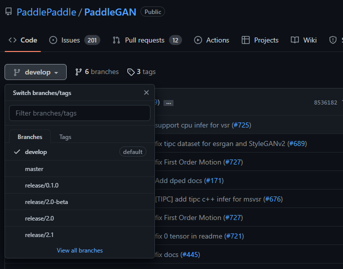
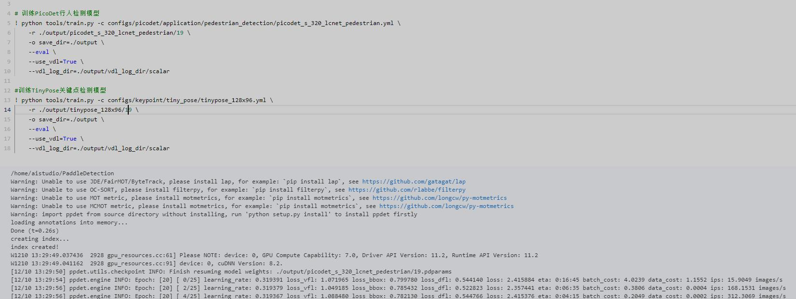

# 项目概述

​		本文重点介绍如何利用飞桨生成对抗网络`PaddleGAN` 在卡通人物数据集上，使用当前`PaddleGAN`的`ESRGAN`模型完图像超分任务。通过ESRGAN模型实现图像超分，从而应用到图像超分等领域。

​		**关键词: 图像超分、ESRGAN、PaddleGAN**

## 文档目录结构

- (1) 模型简述
- (2) 环境安装
  - (2.1) `PaddlePaddle`安装
    - (2.1.1) 安装对应版本`PaddlePaddle`
    - (2.1.2) 验证安装是否成功
  - (2.2) `PaddleGAN`安装
    - (2.2.1) 下载`PaddleGAN`代码
    - (2.2.2) 安装依赖项目
    - (2.2.3) 验证安装是否成功
- (3) 数据准备
  - (3.1) animeSR
  - (3.2) 自制数据集
- (4) 模型训练
  - (4.1) 训练前数据准备
  - (4.2) 开始训练
  - (4.3) 可视化训练
  - (4.4) 回复训练
  - (4.5) 多卡训练
- (5) 模型验证与预测
  - (5.1) 开始验证
  - (5.2) 开始预测
- (6) 模型部署与转化
- (7) 配置文件的说明
  - (7.1) 整体配置文件格式综述
  - (7.2) 数据路径与数据预处理说明
  - (7.3) 模型与损失函数说明
  - (7.4) 优化器说明
  - (7.5) 其它参数说明
- (8) 部分参数值推荐说明
  - (8.1) 训练批大小
  - (8.2) 训练轮次大小
  - (8.3) 训练学习率大小
  - (8.4) 配置文件说明

# (1) 模型简述

​        Super-Resolution Generative Adversarial Network (SR-GAN)是一项开创性的工作，能够在单幅超分辨率图像中生成真实的纹理。然而，幻觉中的细节往往伴随着令人不快的伪影 unpleasant artifacts。为了进一步提高视觉质量，我们深入研究了SRGAN的三个关键组成部分——网络结构，对抗性损失adversarial loss和感知损失perceptual loss，并对它们进行了改进，得到了增强型Enhanced SRGAN(ESRGAN)。


# (2) 环境安装

## (2.1) `PaddlePaddle`安装

### (2.1.1) 安装对应版本`PaddlePaddle`

​		根据系统和设备的`cuda`环境，选择对应的安装包，这里默认使用`pip`在`linux`设备上进行安装。


​		在终端中执行:

```bash
pip install paddlepaddle-gpu==2.3.0.post110 -f https://www.paddlepaddle.org.cn/whl/linux/mkl/avx/stable.html
```

​		安装效果:


### (2.1.2) 验证安装是否成功

```bash
# 安装完成后您可以使用 python进入python解释器，
python
# 继续输入
import paddle 
# 再输入 
paddle.utils.run_check()
```

​		如果出现`PaddlePaddle is installed successfully!`，说明您已成功安装。


## (2.2) `PaddleGAN`安装

### (2.2.1) 下载`PaddleGAN`代码

​		用户可以通过使用`github`或者`gitee`的方式进行下载，我们当前版本为`PaddleGAN`的release v2.5版本。后续在使用时，需要对应版本进行下载。



```bash
# github下载
git clone -b release/2.5 https://github.com/PaddlePaddle/PaddleGAN.git
# gitee下载
git clone -b release/2.5 https://gitee.com/PaddlePaddle/PaddleGAN.git
```

### (2.2.2) 安装依赖项目

* 方式一：
  通过直接`pip install` 安装，可以最高效率的安装依赖

``` bash
pip install --upgrade ppgan
```

* 方式二：
  下载`PaddleGAN`代码后，进入`PaddleGAN`代码文件夹目录下面

``` bash
cd PaddleGAN
pip install -v -e .  # or "python setup.py develop"

# 安装其他依赖
pip install -r requirements.txt
```

### (2.2.3) 其他第三方工具安装

* 涉及视频的任务都需安装**ffmpeg**，这里推荐使用[conda](https://docs.conda.io/en/latest/miniconda.html)安装：

```
conda install x264=='1!152.20180717' ffmpeg=4.0.2 -c conda-forge
```

* 如需使用可视化工具监控训练过程，请安装[飞桨VisualDL](https://github.com/PaddlePaddle/VisualDL)：

```
python -m pip install visualdl -i https://mirror.baidu.com/pypi/simple
```

*注意：VisualDL目前只维护Python3以上的安装版本

# (3) 数据准备

​		

## (3.1)animeSR

```
    PaddleGAN
      ├── data
          ├── animeSR
                ├── train
                ├── train_X4
                ├── test
                └── test_X4
```

- 训练数据集包括400张卡通画
- 其中``` train ```中是高分辨率图像，``` train_X4 ```中是对应的4倍缩小的低分辨率图像
- 测试数据集包括20张卡通画，其中``` test ```中是高分辨率图像，``` test_X4 ```中是对应的4倍缩小的低分辨率图像。


## (3.2) 自制数据集

训练数据主要是通过resize得到，首先是将 1280×768 大小的图像resize成320×180作为训练时的原始图像，其中resize选择最近邻元方式，低分辨率图像也是通过resize得到，大小为320×180，并且利用高斯模糊降低图像质量，具体如下：

- 原   图：320×180
- 高分图：1280×768


# (4) 模型训练

## (4.1) 训练前准备

 **修改选中模型的配置文件**

 所有模型的配置文件均在``` PaddleGAN/configs ```目录下。 找到你需要的模型的配置文件，修改模型参数，一般修改迭代次数，num_workers，batch_size以及数据集路径。

 找到``` /home/aistudio/PaddleGAN/configs ```目录，修改配置文件``_psnr_x4_div2k.yaml``中的

-  参数``total_iters``设置为50000

-  参数``dataset：train：num_workers``设置为4

-  参数``dataset：train：batch_size``设置为16

-  参数``dataset：train：gt_folder``改为data/animeSR/train

-  参数``dataset：train：lq_folder``改为data/animeSR/train_X4

-  参数``dataset：test：gt_folder``改为data/animeSR/test

-  参数``dataset：test：lq_folder``改为data/animeSR/test_X4

-  参数``periods: [… , … , … , …]``periods的数字总和要等于``total_iters``的数值configs/keypoint/tiny_pose/tinypose_128x96.yml


```yaml
dataset:
  train:
    name: SRDataset
    gt_folder: data/animeSR/train
    lq_folder: data/animeSR/train_X4
    num_workers: 6
    batch_size: 32
    scale: 4
    preprocess:
      - name: LoadImageFromFile
        key: lq
      - name: LoadImageFromFile
        key: gt
      - name: Transforms
        input_keys: [lq, gt]
        pipeline:
          - name: SRPairedRandomCrop
            gt_patch_size: 128
            scale: 4
            keys: [image, image]
          - name: PairedRandomHorizontalFlip
            keys: [image, image]
          - name: PairedRandomVerticalFlip
            keys: [image, image]
          - name: PairedRandomTransposeHW
            keys: [image, image]
          - name: Transpose
            keys: [image, image]
          - name: Normalize
            mean: [0., 0., 0.]
            std: [255., 255., 255.]
            keys: [image, image]
  test:
    name: SRDataset
    gt_folder: data/animeSR/test
    lq_folder: data/animeSR/test_X4
    scale: 4
    preprocess:
      - name: LoadImageFromFile
        key: lq
      - name: LoadImageFromFile
        key: gt
      - name: Transforms
        input_keys: [lq, gt]
        pipeline:
          - name: Transpose
            keys: [image, image]
          - name: Normalize
            mean: [0., 0., 0.]
            std: [255., 255., 255.]
            keys: [image, image]
```

## (4.2) 开始训练

​		请确保已经完成了`PaddleGAN`的安装工作，并且当前位于`PaddleGAN`目录下，执行以下脚本：

```bash
%cd /home/aistudio/PaddleGAN/
!export CUDA_VISIBLE_DEVICES=0 # 设置1张可用的卡

!python -u tools/main.py \
    --config-file configs/esrgan_psnr_x4_div2k.yaml
```

​	执行效果:


## (4.3) 可视化训练

[飞桨VisualDL](https://github.com/PaddlePaddle/VisualDL)是针对深度学习模型开发所打造的可视化分析工具，提供关键指标的实时趋势可视化、样本训练中间过程可视化、网络结构可视化等等，更能直观展示超参与模型效果间关系，辅助实现高效调参。

以下操作请确保您已完成[VisualDL](https://github.com/PaddlePaddle/VisualDL)的安装，安装指南请见[VisualDL安装文档](https://github.com/PaddlePaddle/VisualDL/blob/develop/README_CN.md#%E5%AE%89%E8%A3%85%E6%96%B9%E5%BC%8F)。

**通过在配置文件 esrgan_psnr_x4_div2k.yaml 中添加参数`enable_visualdl: true`使用 [飞桨VisualDL](https://github.com/PaddlePaddle/VisualDL)对训练过程产生的指标或生成的图像进行记录，并运行相应命令对训练过程进行实时监控：**


如果想要自定义[飞桨VisualDL](https://github.com/PaddlePaddle/VisualDL)可视化内容，可以到 [./PaddleGAN/ppgan/engine/trainer.py](https://github.com/PaddlePaddle/PaddleGAN/blob/develop/ppgan/engine/trainer.py) 中进行修改。

本地启动命令：

```
visualdl --logdir output_dir/CycleGANModel-2022-11-29-09-21/
```

更多启动方式及可视化功能使用指南请见[VisualDL使用指南](https://github.com/PaddlePaddle/VisualDL/blob/develop/docs/components/README_CN.md)。

## (4.4) 恢复训练

​	    在训练过程中默认会**保存上一个epoch的checkpoint在`output_dir`中，方便恢复训练。**

​	    本次示例中，cyclegan的训练默认**每五个epoch会保存checkpoint**，如需更改，可以到**config文件中的`interval`**进行修改。


```bash
python -u tools/main.py --config-file configs/esrgan_psnr_x4_div2k.yaml --resume your_checkpoint_path
```

​	`--resume (str)`: 用来恢复训练的checkpoint路径（保存于上面配置文件中设置的output所在路径）。


## (4.5) 多卡训练

```bash
!CUDA_VISIBLE_DEVICES=0,1,2,3
!python -m paddle.distributed.launch tools/main.py --config-file configs/esrgan_psnr_x4_div2k.yaml
```

​		执行效果:



# (5) 模型验证与预测

## (5.1) 开始验证

​		训练完成后，用户可以使用评估脚本`tools/eval.py`来评估模型效果。运行``/home/aistudio/pretrained_model/ESRGAN_PSNR_50000_weight.pdparams``代码测试 ESRGAN 模型。

```bash
%cd /home/aistudio/PaddleGAN/

!python tools/main.py --config-file configs/esrgan_psnr_x4_div2k.yaml \
    --evaluate-only --load /home/aistudio/pretrained_model/esrgan_iter_50000_weight.pdparams
```

​		执行效果:


​	

## (5.4) 开始预测

​		除了可以分析模型的准确率指标之外，我们还可以对一些具体样本的预测。

```bash
%cd /home/aistudio/PaddleGAN/

!python tools/main.py --config-file configs/esrgan_psnr_x4_div2k.yaml \
    --evaluate-only --load /home/aistudio/pretrained_model/esrgan_iter_50000_weight.pdparams
```

​		执行效果:


- - `--evaluate-only`: 是否仅进行预测。

- `--load (str)`: 训练好的权重路径。

  


# (6) 模型部署与转化

```python
# 导出行人检测模型
!python tools/export_model.py -c configs/picodet/application/pedestrian_detection/picodet_s_320_lcnet_pedestrian.yml \
        -o weights=https://paddledet.bj.bcebos.com/models/picodet_s_320_lcnet_pedestrian.pdparams

# 导出关键点检测模型
!python tools/export_model.py -c configs/keypoint/tiny_pose/tinypose_128x96.yml \
        -o weights=https://bj.bcebos.com/v1/paddledet/models/keypoint/tinypose_128x96.pdparams
```


# (7) 配置文件说明

​		正是因为有配置文件的存在，我们才可以使用更便捷的进行消融实验。在本章节中我们选择
```configs/esrgan_psnr_x4_div2k.yaml```文件来进行配置文件的详细解读。

## (7.1) 整体配置文件格式综述

我们将```esrgan_psnr_x4_div2k.yml```进行拆分解释

* **esrgan** 表示模型的名称*ESRGAN: Enhanced Super-Resolution Generative Adversarial Networks*
* **psnr** 表示模型衡量指标为PSNR
* **x4** 表示4倍超分
* **div2k** 表示尺寸为2K分辨率

一个模型的配置文件按功能可以分为:

- **主配置文件入口**: `tinypose_128x96.yml`

## (7.2) 数据路径与数据预处理说明

​		这一小节主要是说明数据部分，当准备好数据，如何进行配置文件修改，以及该部分的配置文件有什么内容。

**首先是进行数据路径配置

```yaml
dataset:
# 训练集配置
  train:
    name: SRDataset
    gt_folder: data/animeSR/train
    lq_folder: data/animeSR/train_X4
    num_workers: 4
    batch_size: 16
    scale: 4
    preprocess:
      - name: LoadImageFromFile
        key: lq
      - name: LoadImageFromFile
        key: gt
      - name: Transforms
        input_keys: [lq, gt]
        pipeline:
          - name: SRPairedRandomCrop
            gt_patch_size: 128
            scale: 4
            keys: [image, image]
          - name: PairedRandomHorizontalFlip
            keys: [image, image]
          - name: PairedRandomVerticalFlip
            keys: [image, image]
          - name: PairedRandomTransposeHW
            keys: [image, image]
          - name: Transpose
            keys: [image, image]
          - name: Normalize
            mean: [0., 0., 0.]
            std: [255., 255., 255.]
            keys: [image, image]
  # 测试集配置
  test:
    name: SRDataset
    gt_folder: data/animeSR/test
    lq_folder: data/animeSR/test_X4
    scale: 4
    preprocess:
      - name: LoadImageFromFile
        key: lq
      - name: LoadImageFromFile
        key: gt
      - name: Transforms
        input_keys: [lq, gt]
        pipeline:
          - name: Transpose
            keys: [image, image]
          - name: Normalize
            mean: [0., 0., 0.]
            std: [255., 255., 255.]
            keys: [image, image]

```

## (7.3) 模型与损失函数说明

当我们配置好数据后，下面在看关于模型和主干网络的选择

``` yaml
# 训练轮次
total_iters: 1000000
output_dir: output_dir
# tensor range for function tensor2img
min_max:
  (0., 1.)

# 模型架构
model:
  name: BaseSRModel
  generator:
    name: RRDBNet
    in_nc: 3
    out_nc: 3
    nf: 64
    nb: 23
  pixel_criterion:
    name: L1Loss

export_model:
  - {name: 'generator', inputs_num: 1}
  
```

  **Note**

* 我们模型的`architecture`是`PicoDet`。
* 主干网络是 `LCNet`，在这里我们可以自由更换，比如换成`ResNet50_vd`, 不同的主干网络需要选择不同的参数。
* `nms` 此部分内容是预测与评估的后处理，一般可以根据需要调节`threshold`参数来优化处理效果。

## (7.4) 优化器说明

当我们配置好数据与模型后，下面再看关于优化器的选择

``` yaml
# 优化器配置
optimizer:
  name: Adam
  # add parameters of net_name to optim
  # name should in self.nets
  net_names:
    - generator
  beta1: 0.9
  beta2: 0.99
```

## (7.5) 其它参数说明

``` yaml
# 验证设置
validate:
  interval: 5000
  save_img: false

# 验证指标
  metrics:
    psnr: # metric name, can be arbitrary
      name: PSNR
      crop_border: 4
      test_y_channel: True
    ssim:
      name: SSIM
      crop_border: 4
      test_y_channel: True

# 日志配置
log_config:
  interval: 10
  visiual_interval: 500

# 模型保存轮次
snapshot_config:
  interval: 5000
```

# (8) 部分参数值推荐说明

## (8.1) 训练批大小

```yaml
batch_size: 64
```

​		批大小(batch_size)通常取值: **32, 64, 128, 256, 512**。

​		一般可以按照数据集中训练的样本(图像)数量大小以及期望一轮训练迭代次数来大致取值。

- 如果数据集训练样本数量为: `N`
- 期望一轮训练迭代次数为: `I`
- 得到大致`batch_size`大小: `B = N/I`

如果B大于32小于64，则可以选32；以此类推。

**Note**

- `batch_size`会收显存大小影响，因此过大的批大小可能大致运行训练失败——因为GPU显存不够。
- `batch_size` 是训练神经网络中的一个重要的超参数，该值决定了一次将多少数据送入神经网络参与训练。论文 [Accurate, Large Minibatch SGD: Training ImageNet in 1 Hour](https://arxiv.org/abs/1706.02677)，当 `batch size` 的值与学习率的值呈线性关系时，收敛精度几乎不受影响。在训练 ImageNet 数据时，大部分的神经网络选择的初始学习率为 0.1，`batch size` 是 256，所以根据实际的模型大小和显存情况，可以将学习率设置为 0.1*k, batch_size 设置为 256*k。在实际任务中，也可以将该设置作为初始参数，进一步调节学习率参数并获得更优的性能。

## (8.2) 训练轮次大小

```bash
total_iters: 1000000
```

​		总轮次(`total_iters`)通常取值: **1000000。**

​		如果取1000000轮效果不理想，可以用10000000轮尝试，如果效果有提升则可以用大的训练轮次进行训练。

## (8.3) 训练学习率大小

```yaml
learning_rate: 0.0002
```

​		学习率(`learning_rate`)通常取配置文件的默认值，如果性能不好，可以尝试调小或调大，公式: $new\_lr=lr * ratio$。其中调小时: `ratio`可以取`0.5`或者`0.1`；而调大时:  `ratio`可以取或`1.0`者`2.0`。但学习率一般不超过1.0，否则容易训练不稳定。

​		如果配置文件所对应的模型默认为N卡训练的模型，则需要对学习率除以卡数N: $new\_lr=lr / N$。

​		由于本模型默认为4卡训练的，因此如果是在单卡上训练该模型需要修改学习率为`0.08`。

## (8.4) 配置文件说明


###  (8.4.1)Config文件参数介绍

以`lapstyle_rev_first.yaml`为例。

 Global

| 字段                      | 用途                           | 默认值       |
| ------------------------- | ------------------------------ | ------------ |
| total_iters               | 设置总训练步数                 | 30000        |
| min_max                   | tensor数值范围（存图像时使用） | (0., 1.)     |
| output_dir                | 设置输出结果所在的文件路径     | ./output_dir |
| snapshot_config: interval | 设置保存模型参数的间隔         | 5000         |

###  (8.4.2)Model

| 字段                    | 用途                         | 默认值                              |
| :---------------------- | ---------------------------- | ----------------------------------- |
| name                    | 模型名称                     | LapStyleRevFirstModel               |
| revnet_generator        | 设置revnet生成器             | RevisionNet                         |
| revnet_discriminator    | 设置revnet判别器             | LapStyleDiscriminator               |
| draftnet_encode         | 设置draftnet编码器           | Encoder                             |
| draftnet_decode         | 设置draftnet解码器           | DecoderNet                          |
| calc_style_emd_loss     | 设置style损失1               | CalcStyleEmdLoss                    |
| calc_content_relt_loss  | 设置content损失1             | CalcContentReltLoss                 |
| calc_content_loss       | 设置content损失2             | CalcContentLoss                     |
| calc_style_loss         | 设置style损失2               | CalcStyleLoss                       |
| gan_criterion: name     | 设置GAN损失                  | GANLoss                             |
| gan_criterion: gan_mode | 设置GAN损失模态参数          | vanilla                             |
| content_layers          | 设置计算content损失2的网络层 | ['r11', 'r21', 'r31', 'r41', 'r51'] |
| style_layers            | 设置计算style损失2的网络层   | ['r11', 'r21', 'r31', 'r41', 'r51'] |
| content_weight          | 设置content总损失权重        | 1.0                                 |
| style_weigh             | 设置style总损失权重          | 3.0                                 |

###  (8.4.3)Dataset (train & test)

| 字段         | 用途                             | 默认值               |
| :----------- | -------------------------------- | -------------------- |
| name         | 数据集名称                       | LapStyleDataset      |
| content_root | 数据集所在路径                   | data/coco/train2017/ |
| style_root   | 目标风格图片所在路径             | data/starrynew.png   |
| load_size    | 输入图像resize后图像大小         | 280                  |
| crop_size    | 随机剪裁图像后图像大小           | 256                  |
| num_workers  | 设置工作进程个数                 | 16                   |
| batch_size   | 设置一次训练所抓取的数据样本数量 | 5                    |

###  (8.4.4)Lr_scheduler 

| 字段          | 用途             | 默认值         |
| :------------ | ---------------- | -------------- |
| name          | 学习策略名称     | NonLinearDecay |
| learning_rate | 设置初始学习率   | 1e-4           |
| lr_decay      | 设置学习率衰减率 | 5e-5           |

###  (8.4.5)Optimizer

| 字段      | 用途                | 默认值  |
| :-------- | ------------------- | ------- |
| name      | 优化器类名          | Adam    |
| net_names | 优化器作用的网络    | net_rev |
| beta1     | 设置优化器参数beta1 | 0.9     |
| beta2     | 设置优化器参数beta2 | 0.999   |

###  (8.4.6) Validate

| 字段     | 用途               | 默认值 |
| :------- | ------------------ | ------ |
| interval | 设置验证间隔       | 500    |
| save_img | 验证时是否保存图像 | false  |

###  (8.4.7) Log_config

| 字段             | 用途                             | 默认值 |
| :--------------- | -------------------------------- | ------ |
| interval         | 设置打印log间隔                  | 10     |
| visiual_interval | 设置训练过程中保存生成图像的间隔 | 500    |
