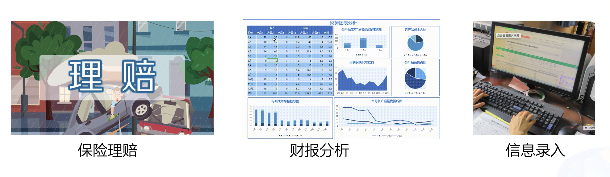
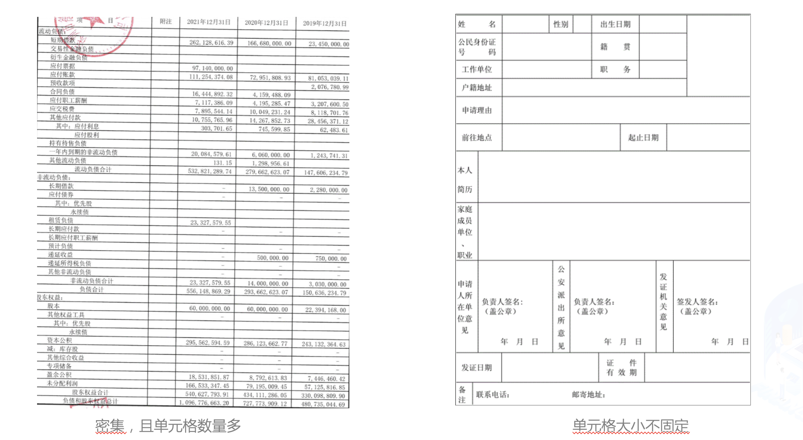
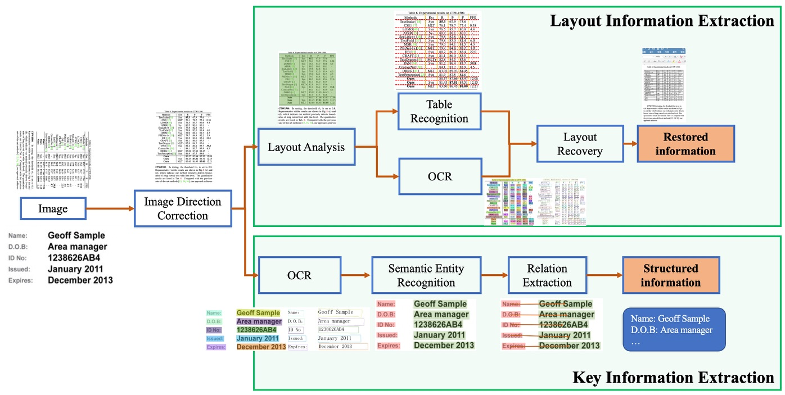
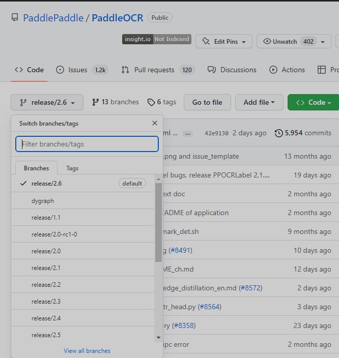
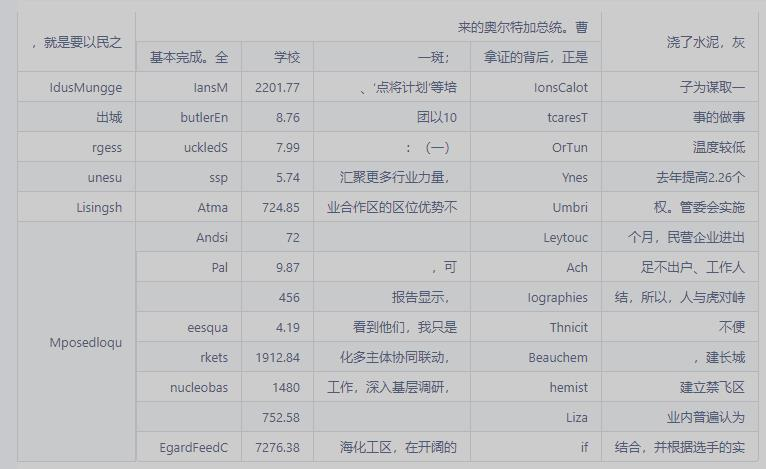
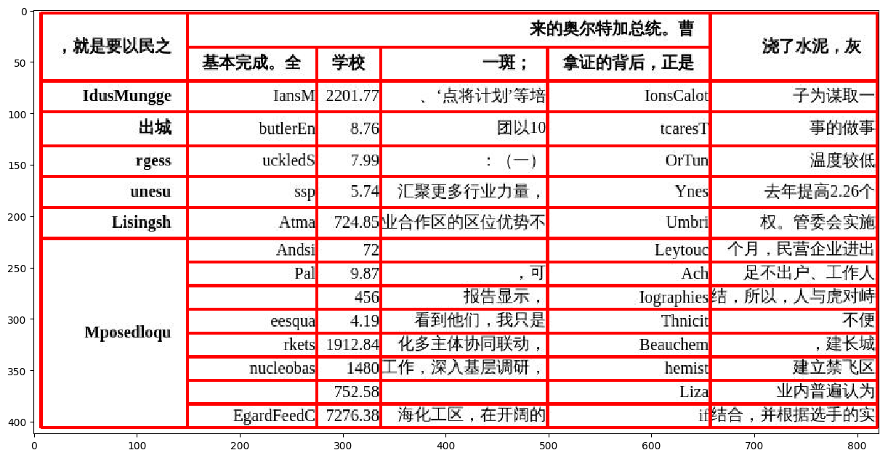

# 项目概述

​		中文表格识别在金融行业有着广泛的应用，如保险理赔、财报分析和信息录入等领域。当前，金融行业的表格识别主要以手动录入为主，开发一种自动表格识别成为丞待解决的问题。



​		在金融行业中，表格图像主要有清单类的单元格密集型表格，申请表类的大单元格表格，拍照表格和倾斜表格四种主要形式。		



​		**关键词: 表格识别、PaddleOCR、PP-Structure**

## 文档目录结构

- (1) 模型简述
- (2) 环境安装
  - (2.1) `PaddlePaddle`安装
    - (2.1.1) 安装对应版本`PaddlePaddle`
    - (2.1.2) 验证安装是否成功
  - (2.2) `PaddleOCR`安装
    - (2.2.1) 下载`PaddleOCR`代码
    - (2.2.2) 安装依赖项目
    - (2.2.3) 验证安装是否成功
- (3) 数据准备
  - (3.1) SDE数据集
  - (3.2) 数据集格式
- (4) 直接使用PP-OCRv3模型评估
- (5) 基于合成数据finetune
  - (5.1) 下载Text Renderer代码
  - (5.2) 准备背景图片
  - (5.3) 准备语料
  - (5.3) 准备字体
  -  (5.5) 运行数据合成命令
  - (5.6) 模型训练
  - (5.7) 主要训练参数说明
  - (5.8) 多卡训练
  - (5.9) 恢复训练
- (6) 基于真实数据finetune
  - (6.1) python爬虫获取数据
  - (6.2) 数据挖掘
  - (6.3) 模型训练
- (7) 基于合成+真实数据finetune

# (1) 模型简述

​        PP-Structure是PaddleOCR团队自研的智能文档分析系统，旨在帮助开发者更好的完成版面分析、表格识别等文档理解相关任务。

​       PP-StructureV2系统流程图如下所示，文档图像首先经过图像矫正模块，判断整图方向并完成转正，随后可以完成版面信息分析与关键信息抽取2类任务。

- 版面分析任务中，图像首先经过版面分析模型，将图像划分为文本、表格、图像等不同区域，随后对这些区域分别进行识别，如，将表格区域送入表格识别模块进行结构化识别，将文本区域送入OCR引擎进行文字识别，最后使用版面恢复模块将其恢复为与原始图像布局一致的word或者pdf格式的文件；
- 关键信息抽取任务中，首先使用OCR引擎提取文本内容，然后由语义实体识别模块获取图像中的语义实体，最后经关系抽取模块获取语义实体之间的对应关系，从而提取需要的关键信息。



# (2) 环境安装

## (2.1) `PaddlePaddle`安装

### (2.1.1) 安装对应版本`PaddlePaddle`

​		根据系统和设备的`cuda`环境，选择对应的安装包，这里默认使用`pip`在`linux`设备上进行安装。


​		在终端中执行:

```bash
pip install paddlepaddle-gpu==2.3.0.post110 -f https://www.paddlepaddle.org.cn/whl/linux/mkl/avx/stable.html
```

​		安装效果:


### (2.1.2) 验证安装是否成功

```bash
# 安装完成后您可以使用 python进入python解释器，
python
# 继续输入
import paddle 
# 再输入 
paddle.utils.run_check()
```

​		如果出现`PaddlePaddle is installed successfully!`，说明您已成功安装。


## (2.2) `PaddleOCR`安装

### (2.2.1) 下载`PaddleOCR`代码

​		用户可以通过使用`github`或者`gitee`的方式进行下载，我们当前版本为`PaddleOCR`的release v2.6版本。后续在使用时，需要对应版本进行下载。



```bash
# github下载
git clone -b release/2.6 https://github.com/PaddlePaddle/PaddleOCR.git
# gitee下载
git clone -b release/2.6 https://gitee.com/PaddlePaddle/PaddleOCR.git
```

### (2.2.2) 安装依赖项目

* 通过直接`pip install` 安装，可以最高效率的安装依赖

``` bash
# 安装 paddleocr，推荐使用2.6版本
pip3 install "paddleocr>=2.6.0.3"

# 安装 图像方向分类依赖包paddleclas（如不需要图像方向分类功能，可跳过）
pip3 install paddleclas>=2.4.3
```


### (2.2.3) 验证安装是否成功

​		在`PaddleOCR`目录下执行如下命令，会进行简单的单卡训练和单卡预测。等待模型下载以及查看执行日志，若没有报错，则验证安装成功。

```bash
paddleocr --image_dir ./imgs/11.jpg --use_angle_cls true --use_gpu false
```

# (3) 数据准备

## (3.1) TableGeneration简介

[TableGeneration)](https://github.com/WenmuZhou/TableGeneration)

通过浏览器渲染生成表格图像，代码修改自论文 [Rethinking Table Parsing using Graph Neural Networks](https://arxiv.org/pdf/1905.13391.pdf) [源代码](https://github.com/hassan-mahmood/TIES_DataGeneration) 。

修改后主要特性如下：

1. 支持更多参数可配置，如单元格类型，表格行列，合并单元格数量，
2. 支持彩色单元格
3. 内置四种类型表格，如下表所示

| 类型         | 样例                   |
| ------------ | ---------------------- |
| 简单表格     |    |
| 彩色表格     |     |
| 清单表格     |        |
| 大单元格表格 |  |

## (3.2)TableGeneration安装

###  (3.2.1)T安装python包

```bash
pip3 install -r requirements.txt
```

目前支持使用chrome浏览器和火狐浏览器，使用方式分别如下

###  (3.2.2)chrome浏览器(Linux下推荐)

- 安装chrome浏览器和中文字体

```bash
wget https://dl.google.com/linux/direct/google-chrome-stable_current_amd64.deb
sudo dpkg -i google-chrome-stable_current_amd64.deb
apt-get update && sudo apt-get install libnss3
apt-get install xfonts-wqy
apt install ttf-wqy-zenhei
apt install fonts-wqy-microhei
# refresh fonts
fc-cache -fv
```

### (3.2.3)安装chrome浏览器驱动 chromedriver

首先在[官网](https://chromedriver.chromium.org/downloads)下载适合自己系统的驱动文件。然后执行下列命令

```shell
unzip chromedriver_linux64.zip
cp chromedriver /usr/local/share/
ln -s /usr/local/share/chromedriver /usr/local/bin/chromedriver
ln -s /usr/local/share/chromedriver /usr/bin/chromedriver
```

- 测试浏览器和chromedriver

使用如下命令测试chromedriver和chrome浏览器是否安装正确

```python
from selenium import webdriver

options = webdriver.ChromeOptions()
options.add_argument('--headless')
options.add_argument('--no-sandbox')
driver = webdriver.Chrome(chrome_options=options)
driver.get('https:www.baidu.com')
print(driver.title)
driver.close()
```

如果成功，会在终端看见如下输出


```bash
百度一下，你就知道
```

## (3.3)生成表格

使用如下命令可生成表格，`ch_dict_path`和`en_dict_path`
不指定时，将会使用默认的中英文语料。最终生成的表格图片，表格html文件和PP-Structure格式标注文件会保存在`output`指定路径下。

```bash
# 简单表格
python3 generate_data.py --output output/simple_table --num=1
# 单元格坐标为单元格内文字坐标的表格
python3 generate_data.py --output output/simple_table --num=1 --cell_box_type='text'
# 彩色单元格表格
python3 generate_data.py --output output/color_simple_table --num=1 --color_prob=0.3
# 清单类表格
python3 generate_data.py --output output/qd_table --num=1 --min_row=10 --max_row=80 --min_col=4 --max_col=8 --min_txt_len=2 --max_txt_len=10 --max_span_row_count=3 --max_span_col_count=3 --max_span_value=20 --color_prob=0 --brower_width=1920 --brower_height=5000
# 大单元格表格
python3 generate_data.py --output output/big_cell_table --num=1 --min_row=6 --max_row=10 --min_col=4 --max_col=8 --min_txt_len=2 --max_txt_len=10 --max_span_row_count=3 --max_span_col_count=3 --max_span_value=10 --color_prob=0 --cell_max_width=100 --cell_max_height=100 --brower_width=1920 --brower_height=1920
```
## (3.4)校验数据

使用如下命令即可对生成的数据进行校验：

````bash
```bash
python3 vis_gt.py --image_dir path/to/imgs --gt_path path/to/gt.txt
```

````

这个命令会生成一个html页面，在html页面中会展示图片名、原图、表格的可视化和cell坐标。如下所示:

| 类型                       | 样例                   |
| -------------------------- | ---------------------- |
| cell坐标为单元格内文字坐标 |  |
| cell坐标为真实单元格坐标   |  |

## (3.5)表格生成流程:

1. 随机生成表格行列
2. 随机生成表格合并单元格数量和合并的起始结束位置
3. 对于每一个单元格随机生成文本并组合成html字符串
4. 使用浏览器对html字符串进行渲染生成表格图片
5. 浏览器截图获取表格图片
6. 裁剪图片，只保留表格区域
7. 保存PP-Structure标注格式

## (3.5)划分训练测试集
使用如下命令对数据集进行解压，并查看数据集大小

    ! cd data/data165849 && tar -xf table_gen_dataset.tar && cd -
    ! wc -l data/data165849/table_gen_dataset/gt.txt

使用下述命令将数据集划分为训练集和测试集, 这里将90%划分为训练集，10%划分为测试集

    import random
    with open('/home/aistudio/data/data165849/table_gen_dataset/gt.txt') as f:
        lines = f.readlines()
    random.shuffle(lines)
    train_len = int(len(lines)*0.9)
    train_list = lines[:train_len]
    val_list = lines[train_len:]
    
    # 保存结果
    with open('/home/aistudio/train.txt','w',encoding='utf-8') as f:
        f.writelines(train_list)
    with open('/home/aistudio/val.txt','w',encoding='utf-8') as f:
        f.writelines(val_list)

划分完成后，数据集信息如下

  类型  	数量   	图片地址                                    	标注文件路径                  
  训练集 	18000	/home/aistudio/data/data165849/table_gen_dataset	/home/aistudio/train.txt
  测试集 	2000 	/home/aistudio/data/data165849/table_gen_dataset	/home/aistudio/val.txt  

## (3.6)查看数据集

```python
import cv2
import os, json
import numpy as np
from matplotlib import pyplot as plt
%matplotlib inline

def parse_line(data_dir, line):
    data_line = line.strip("\n")
    info = json.loads(data_line)
    file_name = info['filename']
    cells = info['html']['cells'].copy()
    structure = info['html']['structure']['tokens'].copy()

    img_path = os.path.join(data_dir, file_name)
    if not os.path.exists(img_path):
        print(img_path)
        return None
    data = {
        'img_path': img_path,
        'cells': cells,
        'structure': structure,
        'file_name': file_name
    }
    return data

def draw_bbox(img_path, points, color=(255, 0, 0), thickness=2):
    if isinstance(img_path, str):
        img_path = cv2.imread(img_path)
    img_path = img_path.copy()
    for point in points:
        cv2.polylines(img_path, [point.astype(int)], True, color, thickness)
    return img_path


def rebuild_html(data):
    html_code = data['structure']
    cells = data['cells']
    to_insert = [i for i, tag in enumerate(html_code) if tag in ('<td>', '>')]

    for i, cell in zip(to_insert[::-1], cells[::-1]):
        if cell['tokens']:
            text = ''.join(cell['tokens'])
            # skip empty text
            sp_char_list = ['<b>', '</b>', '\u2028', ' ', '<i>', '</i>']
            text_remove_style = skip_char(text, sp_char_list)
            if len(text_remove_style) == 0:
                continue
            html_code.insert(i + 1, text)

    html_code = ''.join(html_code)
    return html_code


def skip_char(text, sp_char_list):
    """
    skip empty cell
    @param text: text in cell
    @param sp_char_list: style char and special code
    @return:
    """
    for sp_char in sp_char_list:
        text = text.replace(sp_char, '')
    return text

save_dir = '/home/aistudio/vis'
os.makedirs(save_dir, exist_ok=True)
image_dir = '/home/aistudio/data/data165849/'
html_str = '<table border="1">'

# 解析标注信息并还原html表格
data = parse_line(image_dir, val_list[0])

img = cv2.imread(data['img_path'])
img_name = ''.join(os.path.basename(data['file_name']).split('.')[:-1])
img_save_name = os.path.join(save_dir, img_name)
boxes = [np.array(x['bbox']) for x in data['cells']]
show_img = draw_bbox(data['img_path'], boxes)
cv2.imwrite(img_save_name + '_show.jpg', show_img)

html = rebuild_html(data)
html_str += html
html_str += '</table>'

# 显示标注的html字符串
from IPython.core.display import display, HTML
display(HTML(html_str))
# 显示单元格坐标
plt.figure(figsize=(15,15))
plt.imshow(show_img)
plt.show()
```






# (4) 模型训练

这里选用PP-StructureV2中的表格识别模型[SLANet](https://github.com/PaddlePaddle/PaddleOCR/blob/dygraph/configs/table/SLANet.yml)

SLANet是PP-StructureV2全新推出的表格识别模型，相比PP-StructureV1中TableRec-RARE，在速度不变的情况下精度提升4.7%。TEDS提升2%


| 算法                | Acc    | [TEDS(Tree-Edit-Distance-based Similarity)](https://github.com/ibm-aur-nlp/PubTabNet/tree/master/src) | Speed |
| ------------------- | ------ | ------------------------------------------------------------ | ----- |
| EDD<sup>[2]</sup>   | x      | 88.30%                                                       | x     |
| TableRec-RARE(ours) | 71.73% | 93.88%                                                       | 779ms |
| SLANet(ours)        | 76.31% | 95.89%                                                       | 766ms |

进行训练之前先使用如下命令下载预训练模型

```bash
# 进入PaddleOCR工作目录
os.chdir('/home/aistudio/PaddleOCR')
# 下载英文预训练模型
! wget  -nc -P  ./pretrain_models/  https://paddleocr.bj.bcebos.com/ppstructure/models/slanet/en_ppstructure_mobile_v2.0_SLANet_train.tar --no-check-certificate
! cd ./pretrain_models/ && tar xf en_ppstructure_mobile_v2.0_SLANet_train.tar  && cd ../
```

##（4.1）训练配置

使用如下命令即可启动训练，需要修改的配置有

| 字段                             | 修改值                                                       | 含义                                                |
| -------------------------------- | ------------------------------------------------------------ | --------------------------------------------------- |
| Global.pretrained_model          | ./pretrain_models/en_ppstructure_mobile_v2.0_SLANet_train/best_accuracy.pdparams | 指向英文表格预训练模型地址                          |
| Global.eval_batch_step           | 562                                                          | 模型多少step评估一次，一般设置为一个epoch总的step数 |
| Optimizer.lr.name                | Const                                                        | 学习率衰减器                                        |
| Optimizer.lr.learning_rate       | 0.0005                                                       | 学习率设为之前的0.05倍                              |
| Train.dataset.data_dir           | /home/aistudio/data/data165849                               | 指向训练集图片存放目录                              |
| Train.dataset.label_file_list    | /home/aistudio/data/data165849/table_gen_dataset/train.txt   | 指向训练集标注文件                                  |
| Train.loader.batch_size_per_card | 32                                                           | 训练时每张卡的batch_size                            |
| Train.loader.num_workers         | 1                                                            | 训练集多进程数据读取的进程数，在aistudio中需要设为1 |
| Eval.dataset.data_dir            | /home/aistudio/data/data165849                               | 指向测试集图片存放目录                              |
| Eval.dataset.label_file_list     | /home/aistudio/data/data165849/table_gen_dataset/val.txt     | 指向测试集标注文件                                  |
| Eval.loader.batch_size_per_card  | 32                                                           | 测试时每张卡的batch_size                            |
| Eval.loader.num_workers          | 1                                                            | 测试集多进程数据读取的进程数，在aistudio中需要设为1 |

已经修改好的配置存储在 `/home/aistudio/SLANet_ch.yml`

（4.2）模型训练


```python
import os
os.chdir('/home/aistudio/PaddleOCR')
! python3 tools/train.py -c /home/aistudio/SLANet_ch.yml
```

大约在7个epoch后达到最高精度 97.49%

#（5）模型验证

训练完成后，可使用如下命令在测试集上评估最优模型的精度


```python
! python3 tools/eval.py -c /home/aistudio/SLANet_ch.yml -o Global.checkpoints=/home/aistudio/PaddleOCR/output/SLANet_ch/best_accuracy.pdparams
```

#（6）训练引擎推理

使用如下命令可使用训练引擎对单张图片进行推理

```bash
import os;os.chdir('/home/aistudio/PaddleOCR')
! python3 tools/infer_table.py -c /home/aistudio/SLANet_ch.yml -o Global.checkpoints=/home/aistudio/PaddleOCR/output/SLANet_ch/best_accuracy.pdparams Global.infer_img=/home/aistudio/data/data165849/table_gen_dataset/img/no_border_18298_G7XZH93DDCMATGJQ8RW2.jpg
```

```python
import cv2
from matplotlib import pyplot as plt
%matplotlib inline

# 显示原图
show_img = cv2.imread('/home/aistudio/data/data165849/table_gen_dataset/img/no_border_18298_G7XZH93DDCMATGJQ8RW2.jpg')
plt.figure(figsize=(15,15))
plt.imshow(show_img)
plt.show()

# 显示预测的单元格
show_img = cv2.imread('/home/aistudio/PaddleOCR/output/infer/no_border_18298_G7XZH93DDCMATGJQ8RW2.jpg')
plt.figure(figsize=(15,15))
plt.imshow(show_img)
plt.show()
```

#（7）预测引擎推理

##（7.1）模型导出

使用如下命令可将模型导出为inference模型

```bash
! python3 tools/export_model.py -c /home/aistudio/SLANet_ch.yml -o Global.checkpoints=/home/aistudio/PaddleOCR/output/SLANet_ch/best_accuracy.pdparams Global.save_inference_dir=/home/aistudio/SLANet_ch/infer
```


##（7.1）预测引擎推理

使用如下命令可使用预测引擎对单张图片进行推理
```bash
os.chdir('/home/aistudio/PaddleOCR/ppstructure')
! python3 table/predict_structure.py \
    --table_model_dir=/home/aistudio/SLANet_ch/infer \
    --table_char_dict_path=../ppocr/utils/dict/table_structure_dict.txt \
    --image_dir=/home/aistudio/data/data165849/table_gen_dataset/img/no_border_18298_G7XZH93DDCMATGJQ8RW2.jpg \
    --output=../output/inference
```

```python
# 显示原图
show_img = cv2.imread('/home/aistudio/data/data165849/table_gen_dataset/img/no_border_18298_G7XZH93DDCMATGJQ8RW2.jpg')
plt.figure(figsize=(15,15))
plt.imshow(show_img)
plt.show()

# 显示预测的单元格
show_img = cv2.imread('/home/aistudio/PaddleOCR/output/inference/no_border_18298_G7XZH93DDCMATGJQ8RW2.jpg')
plt.figure(figsize=(15,15))
plt.imshow(show_img)
plt.show()
```

# (8) 表格识别

在表格结构模型训练完成后，可结合OCR检测识别模型，对表格内容进行识别。

- 首先下载PP-OCRv3文字检测识别模型

- 使用如下命令可使用训练引擎对单张图片进行推理

```bash
import os;os.chdir('/home/aistudio/PaddleOCR/ppstructure')
! python3 table/predict_table.py \
    --det_model_dir=inference/ch_PP-OCRv3_det_slim_infer \
    --rec_model_dir=inference/ch_PP-OCRv3_rec_slim_infer  \
    --table_model_dir=/home/aistudio/SLANet_ch/infer \
    --rec_char_dict_path=../ppocr/utils/ppocr_keys_v1.txt \
    --table_char_dict_path=../ppocr/utils/dict/table_structure_dict.txt \
    --image_dir=/home/aistudio/data/data165849/table_gen_dataset/img/no_border_18298_G7XZH93DDCMATGJQ8RW2.jpg \
    --output=../output/table
```

```bash
# 显示原图
show_img = cv2.imread('/home/aistudio/data/data165849/table_gen_dataset/img/no_border_18298_G7XZH93DDCMATGJQ8RW2.jpg')
plt.figure(figsize=(15,15))
plt.imshow(show_img)
plt.show()


```

