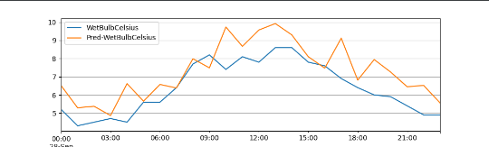
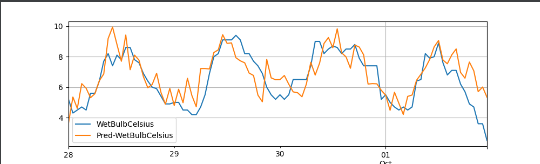
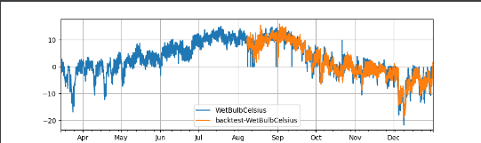

# LSTNetRegressor

多元时间序列预测是一个重要的机器学习问题，涉及许多领域，包括太阳能发电厂的能源输出、电力消耗和交通堵塞情况的预测。在这些实际应用中出现的时间数据通常涉及长期和短期模式的混合，对于这种情况，传统的方法如自回归模型和高斯过程可能会失败。在本文中，我们提出了一种新的深度学习框架，即长期和短期时间序列网络(LSTNet)，以解决这一开放挑战。LSTNet使用卷积神经网络(CNN)和循环神经网络(RNN)来提取变量之间的短期局部依赖模式，并发现时间序列趋势的长期模式。此外，我们利用传统的自回归模型来解决神经网络模型的尺度不敏感问题。在我们对具有重复模式的复杂混合的真实数据的评估中，LSTNet比几种最先进的基线方法取得了显著的性能改进。所有数据和实验代码均可在线获取。

## PaddleTS内置的LSTNetRegressor

### 模型介绍

LSTNet是2018年提出的时序预测模型, 它同时利用卷积层和循环层的优势, 提取时间序列多变量之间的局部依赖模式和捕获复杂的长期依赖。

1. `in_chunk_len`必选参数

模型输入的时间序列长度.

Type
int

2. `out_chunk_len`必选参数

模型输出的时间序列长度.

Type
int

3. `skip_chunk_len`

可选变量, 输入序列与输出序列之间跳过的序列长度, 既不作为特征也不作为序测目标使用, 默认值为0

Type
int

4. `sampling_stride`

相邻样本间的采样间隔.

Type
int

5. `loss_fn`

损失函数.

Type
Callable[…, paddle.Tensor]

6. `optimizer_fn`

优化算法.

Type
Callable[…, Optimizer]

7. `optimizer_params`

优化器参数.

Type
Dict[str, Any]

8. `eval_metrics`

模型训练过程中的需要观测的评估指标.

Type
List[str]

9. `callbacks`

自定义callback函数.

Type
List[Callback]

10. `batch_size`

训练数据或评估数据的批大小.

Type
int

11. `max_epochs`

训练的最大轮数.

Type
int

12. `verbose`

模型训练过程中打印日志信息的间隔.

Type
int

13. `patience`

模型训练过程中, 当评估指标超过一定轮数不再变优，模型提前停止训练.

Type
int

14. `seed`

全局随机数种子, 注: 保证每次模型参数初始化一致.

Type
int|None

15. `stop_training`

Type
bool

16. `skip_size`

递归跳跃组件(Skip RNN)用来捕获时间序列中的周期性所需的周期长度.

Type
int

17. `channels`

第一层Conv1D的通道数量.

Type
int

18. `kernel_size`

第一层Conv1D的卷积核大小.

Type
int

19. `rnn_cell_type`

RNN cell的类型, 支持GRU或LSTM.

Type
str

20. `rnn_num_cells`

RNN层中神经元的数量.

Type
int

21. `skip_rnn_cell_type`

Skip RNN cell的类型, 支持GRU或LSTM.

Type
str

22. `skip_rnn_num_cells`

Skip RNN层中神经元的数量.

Type
int

23. `dropout_rate`

神经元丢弃概率.

Type
float

24. `output_activation`

输出层的激活函数类型, 可以是None(无激活函数), sigmoid, tanh.

Type
str|None

### 使用LSTNet以及内置数据集进行预测

### 数据介绍与处理

使用内置数据集'UNI_WTH'作为训练数据

构建训练、验证以及测试数据集
````
from paddlets.datasets.repository import get_dataset, dataset_list
from matplotlib import pyplot as plt

dataset = get_dataset('UNI_WTH')
train_dataset, val_test_dataset = dataset.split(0.8)
val_dataset, test_dataset = val_test_dataset.split(0.5)
train_dataset.plot(add_data=[val_dataset, test_dataset], labels=['Val', 'Test'])
plt.show()
````


### 模型训练

初始化模型，模型输入的时间序列长度为24 * 7，模型输出的时间序列长度为24，最大迭代轮数250，不再减小（或增大）的累计次数设置为30，训练数据数据的批大小为512，学习率为5e-4
````
# 构建模型
from paddlets.models.forecasting import LSTNetRegressor

LSTNet =LSTNetRegressor(in_chunk_len=24 * 7,
                    out_chunk_len=24,
                    max_epochs=250,
                    batch_size=512,
                    patience=30,
                    optimizer_params=dict(learning_rate=5e-4),
                    )
    


# 模型训练

LSTNet.fit(train_dataset,val_dataset)

````
### 模型预测

#### 单步预测

预测只能预测长度为长度为out_chunk_len的数据
将使用验证集进行预测，得到的结果如下，橙色为预测结果，蓝色为真实数据：
````
subset_test_pred_dataset = LSTNet.predict(val_dataset)
subset_test_dataset, _ = test_dataset.split(len(subset_test_pred_dataset.target))
subset_test_dataset.plot(add_data=subset_test_pred_dataset, labels=['Pred'])
plt.show()
````


#### 递归多步预测

对模型进行递归多步预测,将predict改为recursive_predict，其支持指定想要输出的预测长度.
想要预测未来96个小时的 WetBulbCelsuis , 我们可以通过调用 recursive_predict 通过如下方法实现

````
from paddlets.models.forecasting import LSTNetRegressor

LSTNet =LSTNetRegressor(in_chunk_len=24 * 7,
                    out_chunk_len=24,
                    max_epochs=250,
                    batch_size=512,
                    patience=30,
                    optimizer_params=dict(learning_rate=5e-4),
                    )
LSTNet.fit(train_dataset,val_dataset)
subset_test_pred_dataset = LSTNet.recursive_predict(val_dataset,24*4)
subset_test_dataset, _ = test_dataset.split(len(subset_test_pred_dataset.target))
subset_test_dataset.plot(add_data=subset_test_pred_dataset, labels=['Pred'])
````

结果如下：



### 模型评估

有了预测数据和真实数据后，可以计算相应的metrics指标
使用PaddleTS中的MSE和MAE
````
from paddlets.metrics import MSE, MAE

mae = MAE()
print(mae(subset_test_dataset, subset_test_pred_dataset))
mse = MSE()
print(mse(subset_test_dataset, subset_test_pred_dataset))
````

结果如下：
````
{'WetBulbCelsius': 0.897288798292478}#MAE
{'WetBulbCelsius': 1.2880252671033872}#MSE
````
上面，我们只计算了测试集中部分数据的metrics指标，我们可以通过 backtest 实现对整个测试集的metrics指标计算。
以MAE为例：
回测用给定模型获得的历史上的模拟预测,是用来评测模型预测准确率的重要工具。


回测是一个迭代过程，回测用固定预测窗口在数据集上进行重复预测，然后通过固定步长向前移动到训练集的末尾。如上图所示，桔色部分是长度为3的预测窗口。在每次迭代中，预测窗口会向前移动3个长度，同样训练集也会向后扩张三个长度。这个过程会持续到窗口移动到数据末尾。
````
from paddlets.utils import backtest

score , pred_data= backtest(
    data=val_test_dataset,
    model=LSTNet,
    start=0.5, #start 可以控制回测的起始点如果设置 start 为0.5,那么回测将会在数据的中间位置开始。
    predict_window=24, # predict_window 是每次预测的窗口长度
    stride=24, # stride 是两次连续预测之间的移动步长
    return_predicts = True, #如果设置 return_predicts 为True，回测函数会同时返回指标结果和预测值 。
    metric=mae
)
print(f"mae: {score}")
val_test_dataset.plot(add_data=pred_data,labels="backtest")
plt.show()

````


### 模型持久化

模型训练完成后，我们需将训练完成的模型持久化，以便在未来使用该模型时无需对其重复训练。
同时，也可以加载一个已经被保存在硬盘上的PaddleBaseModel模型。
保存模型：
````
LSTNet.save("/G:/pycharm/pythonProject7")
````
加载模型：
````
loaded_LSTNet_reg = load("/G:/pycharm/pythonProject7")
````
#### 保存静态图模型
PaddleTS所有时序预测以及异常检测模型的save接口都新增了 network_model 以及 dygraph_to_static 的参数设置;其中, network_model默认是False, 表示仅导出只支持PaddleTS.predict推理的模型文件, 当network_model设置为True的时候, 在此基础上，会新增对paddle 原始network 的模型以及参数的导出, 可用于 Paddle Inference进行推理; dygraph_to_static参数仅当当network_model为True的时候起作用，表示将导出的模型从动态图转换成静态图, 参考 动转静.

````
LSTNet.save("./LSTNet", network_model=True, dygraph_to_static=True)

# 包含以下文件
# ./LSTNet.pdmodel
# ./LSTNet.pdiparams
# ./LSTNet_model_meta

````
其中LSTNet.pdmodel以及LSTNet.pdiparams作为paddle 原生模型以及模型参数, 可用于Paddle Inference的应用;同时PaddleTS生成了LSTNet_model_meta文件用于模型的描述, 里面包含了模型的输入数据类型以及shape的各种元信息, 便于用户对模型进行正确的部署应用.

静态图模型可以用于paddleinference进行快速推理


