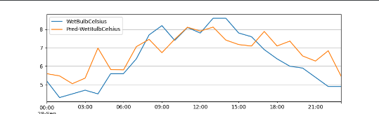
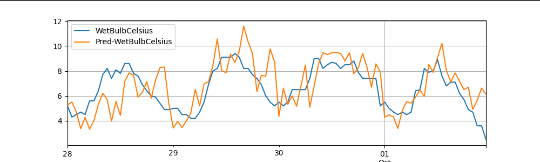
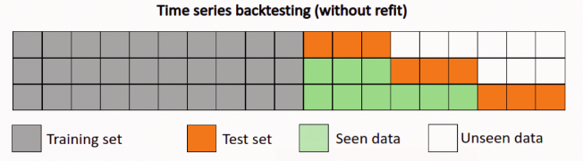
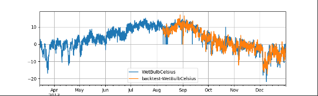

# NBEATS
### 模型介绍
Nbeats开创了一个全新的时间序列预测backbone，仅通过全连接实现时间序列预测。Nbeats的核心思路是，通过多层全连接进行时间序列分解，每层拟合时间序列部分信息（之前层拟合的残差）。其中每个block的输入，是上一层block的输入减去上一层block的输出。通过这种方式，模型每层需要处理的是之前层无法正确拟合的残差，也起到了一个将时间序列进行逐层分解，每层预测时间序列一部分的作用。

#### 原模型特性

* 基础架构：多层堆栈，双向残差连接，并具有可解释性生成器的网络结构。

* 多层堆栈：多栈与多模块循环堆叠，各栈用来提取不同的可解释特性，比如趋势性与季节性。

* 双向残差串联结构：向后残差连接用来计算历史残差信号，并传递至下一层网络；向前差残连接累加计算得到最终模型预测。

#### 升级模型特性

* 多目标变量：支持多目标建模。

* 协变量：支持可预知协变量特征与观测协变量特征。

NBEATS模型的参数如下：

1. `in_chunk_len`必选参数

模型输入的时间序列长度。
    
Type int
	
2. `out_chunk_len`必选参数

模型输出的序列长度。

Type int
	
3. `generic_architecture`

布尔类型变量，指示是否使用普通网络结构，如不使用则使用可解释性网络结构。

Type bool, Optional
	
4. `num_stacks`

stack数量，当generic_architecture为True时生效。

Type int, Optional
	
5. `num_blocks`

每个stack中block的数量，如果传入一个list，它的长度必须与`num_stack`一致，其中的每个元素对应于各stack中block的数量。如果传入一个整数，每个stack中的block数量一致。

Type Union[int, List[int]], Optional

6. `num_layers`

每个block中分叉结构前的全连接层数量，仅当generic_architecture为True时生效。

Type int, Optional
	
7. `layer_widths`

每个block中全连接层的神经元数量，如果传入list，则list长度必须等于num_stacks，且list中每个元素对应于当前层的神经元数量。如果传入整数，则每个stack中的block中具有相同的神经元数量。
	
Type Union[int, List[int]], Optional
	
8. `expansion_coefficient_dim`

波形生成器参数个数，仅当generic_architecture为True时生效。

Type int, Optional
	
9. `trend_polynomial_degree`

季节性波形生成器的多项式次数，仅当generic_architecture为False时生效。

Type int, Optional
	
10. `skip_chunk_len`

可选变量， 输入序列与输出序列之间跳过的序列长度，既不作为特征也不作为预测目标使用，默认值为0。

Type int, Optional
	
11. `sampling_stride`

相邻两个样本的采样间隔。
	
Type int, optional
	
12. `loss_fn`

损失函数。

Type Callable, Optional

13. `optimizer_fn`

优化器算法。

Type Callable, Optional
	
14. `optimizer_params`

优化器参数。

Type Dict, Optional
	
15. `eval_metrics`

模型评估指标。

Type List[str], Optional
	
16. `callbacks`

自定义的callback函数。

Type List[Callback], Optional
	
17. `batch_size`

每个batch中的样本数量。
	
Type int, Optional

18. `max_epochs`

训练过程中最大迭代轮数。
	
Type int, Optional

19. `verbose`

模型日志模式。

Type int, Optional
	
20. `patience`

训练过程中学习率降低所需的效果不再提升的轮数。

Type int, Optional
	
21. `seed`

全局随机种子。默认为0

Type int, Optional


## PaddleTS使用NBEATS模型

### 数据介绍与处理
使用内置数据集'UNI_WTH'作为训练数据

构建训练、验证以及测试数据集
````
from paddlets.datasets.repository import get_dataset, dataset_list
from matplotlib import pyplot as plt

dataset = get_dataset('UNI_WTH')
train_dataset, val_test_dataset = dataset.split(0.8)
val_dataset, test_dataset = val_test_dataset.split(0.5)
train_dataset.plot(add_data=[val_dataset,test_dataset], labels=['Val', 'Test'])
plt.show()
````


### 模型训练

初始化模型，模型输入的时间序列长度为7*24，模型输出的时间序列长度为24，最大迭代轮数250，不再减小（或增大）的累计次数设置为20,每个batch中的样本数量，学习率设置为1e-5
````
# 构建模型
from paddlets.models.forecasting import NBEATSModel

nbeats =NBEATSModel(in_chunk_len=24 * 7,
                    out_chunk_len=24,
                    max_epochs=250,
                    batch_size=64,
                    patience=20,
                    optimizer_params=dict(learning_rate=1e-5)
                    )

# 模型训练

nbeats.fit(train_dataset,val_dataset)
    
````

### 模型预测

#### 单步预测

预测只能预测长度为长度为out_chunk_len的数据
将使用验证集进行预测，得到的结果如下，橙色为预测结果，蓝色为真实数据：
````
subset_test_pred_dataset = nbeats.predict(val_dataset)
subset_test_dataset, _ = test_dataset.split(len(subset_test_pred_dataset.target))
subset_test_dataset.plot(add_data=subset_test_pred_dataset, labels=['Pred'])
plt.show()
````


#### 递归多步预测

对模型进行递归多步预测,将predict改为recursive_predict，其支持指定想要输出的预测长度.
想要预测未来96个小时的 WetBulbCelsuis , 我们可以通过调用 recursive_predict 通过如下方法实现

````
from paddlets.models.forecasting import NBEATSModel

nbeats =NBEATSModel(in_chunk_len=24 * 7,
                out_chunk_len=24,
                max_epochs=250,
                batch_size=64,
                patience=20,
                optimizer_params=dict(learning_rate=1e-5)
                )
nbeats.fit(train_dataset,val_dataset)
subset_test_pred_dataset = nbeats.recursive_predict(val_dataset,24*4)
subset_test_dataset, _ = test_dataset.split(len(subset_test_pred_dataset.target))
subset_test_dataset.plot(add_data=subset_test_pred_dataset, labels=['Pred'])
plt.show()
````
结果如下：




### 模型评估

有了预测数据和真实数据后，可以计算相应的metrics指标
使用PaddleTS中的MSE和MAE
````
from paddlets.metrics import MSE, MAE

mae = MAE()
print(mae(subset_test_dataset, subset_test_pred_dataset))
mse = MSE()
print(mse(subset_test_dataset, subset_test_pred_dataset))
````
结果如下：
````
{'WetBulbCelsius': 0.754759629567464}#MAE
{'WetBulbCelsius': 0.9194268777454724}#MSE
````
上面，我们只计算了测试集中部分数据的metrics指标，我们可以通过 backtest 实现对整个测试集的metrics指标计算。
以MAE为例：
回测用给定模型获得的历史上的模拟预测,是用来评测模型预测准确率的重要工具。



回测是一个迭代过程，回测用固定预测窗口在数据集上进行重复预测，然后通过固定步长向前移动到训练集的末尾。如上图所示，桔色部分是长度为3的预测窗口。在每次迭代中，预测窗口会向前移动3个长度，同样训练集也会向后扩张三个长度。这个过程会持续到窗口移动到数据末尾。
````
from paddlets.utils import backtest

score , pred_data= backtest(
    data=val_test_dataset,
    model=nbeats,
    start=0.5, #start 可以控制回测的起始点如果设置 start 为0.5,那么回测将会在数据的中间位置开始。
    predict_window=24, # predict_window 是每次预测的窗口长度
    stride=24, # stride 是两次连续预测之间的移动步长
    return_predicts = True, #如果设置 return_predicts 为True，回测函数会同时返回指标结果和预测值 。
    metric=mae
)
print(f"mae: {score}")
val_test_dataset.plot(add_data=pred_data,labels="backtest")
plt.show()

````




### 模型持久化

模型训练完成后，我们需将训练完成的模型持久化，以便在未来使用该模型时无需对其重复训练。
同时，也可以加载一个已经被保存在硬盘上的PaddleBaseModel模型。
保存模型：
````
nbeats.save("/G:/pycharm/pythonProject7")
````
加载模型：
````
loaded_nbeats_reg = load("/G:/pycharm/pythonProject7")
````
#### 保存静态图模型
PaddleTS所有时序预测以及异常检测模型的save接口都新增了 network_model 以及 dygraph_to_static 的参数设置;其中, network_model默认是False, 表示仅导出只支持PaddleTS.predict推理的模型文件, 当network_model设置为True的时候, 在此基础上，会新增对paddle 原始network 的模型以及参数的导出, 可用于 Paddle Inference进行推理; dygraph_to_static参数仅当当network_model为True的时候起作用，表示将导出的模型从动态图转换成静态图, 参考 动转静.

````
model.save("./nbeats", network_model=True, dygraph_to_static=True)

# 包含以下文件
# ./nbeats.pdmodel
# ./nbeats.pdiparams
# ./nbeats_model_meta

````
其中nbeats.pdmodel以及nbeats.pdiparams作为paddle 原生模型以及模型参数, 可用于Paddle Inference的应用;同时PaddleTS生成了nbeats_model_meta文件用于模型的描述, 里面包含了模型的输入数据类型以及shape的各种元信息, 便于用户对模型进行正确的部署应用.

静态图模型可以用于paddleinference进行快速推理


