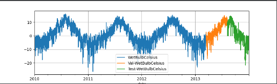
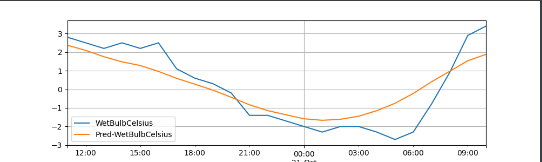
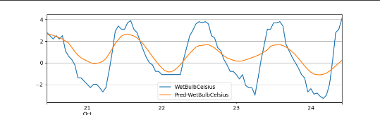
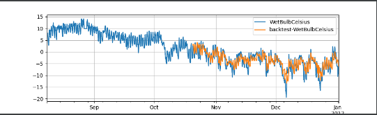

# TS2Vec

TS2Vec是2021年提出的一种时序表征模型(一种在任意语义级别学习时序表征的通用框架), 它以层级的方式在不同的下文视角进行对比学习, 为每个时间戳得学习鲁棒的上下文表征。

## PaddleTS中TS2Vec
### 模型介绍

表征模型属于自监督模型里的一种，主要是希望能够学习到一种通用的特征表达用于下游任务；当前主流的自监督学习主要有基于生成式和基于对比学习的方法，当前案例使用的TS2Vec模型是一种基于对比学习的自监督模型。

#### 自监督模型的使用一般分为两个阶段

* 不涉及任何下游任务，使用无标签的数据进行预训练

* 使用带标签的数据在下游任务上 Fine-tune

#### 表征模型结合下游任务的使用同样遵循自监督模型的使用范式，分为2个阶段：

* 表征模型训练

* 将表征模型的输出用于下游任务(当前案例的下游任务为预测任务)

#### 为兼顾初学者和有一定的经验的开发者，本文给出两种表征任务的使用方法:

* 表征模型和下游任务相结合的pipeline，初学者容易上手使用

* 表征模型和下游任务解耦，详细展示表征模型和下游任务如何相结合使用
PaddleTS中TS2Vec的参数如下：

1. `segment_size`

时序片段的长度.

Type int
	
2. `sampling_stride`

相邻样本间的采样间隔.

Type int
	
3. `optimizer_fn`

优化算法.

Type Callable[..., Optimizer]
	
4. `optimizer_params`

优化器参数.

Type Dict[str, Any]
	
5. `callbacks`

自定义callback函数.

Type List[Callback]
	
6. `batch_size`

训练数据的批大小

Type int
	
7. `max_epochs`

训练的最大轮数.

Type int
	
8. `verbose`

模型训练过程中打印日志信息的间隔.

Type int
	
9. `seed`

全局随机数种子, 注: 保证每次模型参数初始化一致.

Type int|None
	
10. `repr_dims`

表征维度。

Type int
	
11. `hidden_dims`

隐藏层的channel数。

Type int
	
12. `num_layers`

空洞卷积网络的层数.

Type int
	
13. `temporal_unit`

完成时间比较的最小单元。

Type int

## 表征模型TS2Vec使用

## 方法一：内部集成的表征模型任务


### 数据介绍与处理

使用内置数据集'UNI_WTH'作为训练数据

构建训练、验证以及测试数据集
````
from paddlets.datasets.repository import get_dataset, dataset_list
from matplotlib import pyplot as plt

dataset = get_dataset('UNI_WTH')
dataset, __ = dataset.split(0.5)
train_dataset, val_test_dataset = dataset.split(0.8)
val_dataset, test_dataset = val_test_dataset.split(0.5)
````



### 模型训练

初始化模型

表征模型参数为：时序片段的长度为200，表征维度为320，最大迭代轮数150，训练数据数据的批大小为32，相邻样本间的采样间隔为200。

下游任务预测模型参数为：模型输入的时间序列长度为7*24，模型输出的时间序列长度为24，相邻样本间的采样间隔为1
````
# 构建模型
from paddlets.models.representation import TS2Vec, ReprForecasting

ts2vec_params = {"segment_size": 200,
                 "repr_dims": 320,
                 "batch_size": 32,
                 "sampling_stride": 200,
                 "max_epochs": 150}
model = ReprForecasting(in_chunk_len=24*7,
                        out_chunk_len=24,
                        sampling_stride=1,
                        repr_model=TS2Vec,
                        repr_model_params=ts2vec_params)

    


# 模型训练

model.fit(train_dataset)

````
### 模型预测

#### 单步预测

预测只能预测长度为长度为out_chunk_len的数据
将使用验证集进行预测，得到的结果如下，橙色为预测结果，蓝色为真实数据：
````
subset_test_pred_dataset = model.predict(val_dataset)
subset_test_dataset, _ = test_dataset.split(len(subset_test_pred_dataset.target))
subset_test_dataset.plot(add_data=subset_test_pred_dataset, labels=['Pred'])
plt.show()
````


#### 递归多步预测

对模型进行递归多步预测,将predict改为recursive_predict，其支持指定想要输出的预测长度.
想要预测未来96个小时的 WetBulbCelsuis , 我们可以通过调用 recursive_predict 通过如下方法实现

````
from paddlets.models.representation import TS2Vec, ReprForecasting

ts2vec_params = {"segment_size": 200,
                 "repr_dims": 320,
                 "batch_size": 32,
                 "sampling_stride": 200,
                 "max_epochs": 150}
model = ReprForecasting(in_chunk_len=24*7,
                        out_chunk_len=24,
                        sampling_stride=1,
                        repr_model=TS2Vec,
                        repr_model_params=ts2vec_params)
model.fit(train_dataset)
subset_test_pred_dataset = model.predict(val_dataset)
subset_test_dataset, _ = test_dataset.split(len(subset_test_pred_dataset.target))
subset_test_dataset.plot(add_data=subset_test_pred_dataset, labels=['Pred'])
plt.show()
````

结果如下：



### 模型评估

有了预测数据和真实数据后，可以计算相应的metrics指标
使用PaddleTS中的MSE和MAE
````
from paddlets.metrics import MSE, MAE

mae = MAE()
print(mae(subset_test_dataset, subset_test_pred_dataset))
mse = MSE()
print(mse(subset_test_dataset, subset_test_pred_dataset))
````

结果如下：
````
{'WetBulbCelsius': 0.776622486114502}#MAE
{'WetBulbCelsius': 0.9130450070633916}#MSE
````
上面，我们只计算了测试集中部分数据的metrics指标，我们可以通过 backtest 实现对整个测试集的metrics指标计算。
以MAE为例：
回测用给定模型获得的历史上的模拟预测,是用来评测模型预测准确率的重要工具。


回测是一个迭代过程，回测用固定预测窗口在数据集上进行重复预测，然后通过固定步长向前移动到训练集的末尾。如上图所示，桔色部分是长度为3的预测窗口。在每次迭代中，预测窗口会向前移动3个长度，同样训练集也会向后扩张三个长度。这个过程会持续到窗口移动到数据末尾。
````
from paddlets.utils import backtest

score, pred_data = backtest(
    data=val_test_dataset,
    model=model,
    start=0.5, #start 可以控制回测的起始点如果设置 start 为0.5,那么回测将会在数据的中间位置开始。
    predict_window=24, # predict_window 是每次预测的窗口长度
    stride=24, # stride 是两次连续预测之间的移动步长
    return_predicts = True,
    metric=mae#如果设置 return_predicts 为True，回测函数会同时返回指标结果和预测值 。
    )

print(f"mae: {score}")

val_test_dataset.plot(add_data=pred_data,labels="backtest")
plt.show()


````


### 模型持久化

模型训练完成后，我们需将训练完成的模型持久化，以便在未来使用该模型时无需对其重复训练。
同时，也可以加载一个已经被保存在硬盘上的PaddleBaseModel模型。
保存模型：
````
TS2Vec.save("/G:/pycharm/pythonProject7")
````
加载模型：
````
loaded_TS2Vec_reg = load("/G:/pycharm/pythonProject7")
````
#### 保存静态图模型
PaddleTS所有时序预测以及异常检测模型的save接口都新增了 network_model 以及 dygraph_to_static 的参数设置;其中, network_model默认是False, 表示仅导出只支持PaddleTS.predict推理的模型文件, 当network_model设置为True的时候, 在此基础上，会新增对paddle 原始network 的模型以及参数的导出, 可用于 Paddle Inference进行推理; dygraph_to_static参数仅当当network_model为True的时候起作用，表示将导出的模型从动态图转换成静态图, 参考 动转静.

````
model.save("./TS2Vec", network_model=True, dygraph_to_static=True)

# 包含以下文件
# ./TS2Vec.pdmodel
# ./TS2Vec.pdiparams
# ./TS2Vec_model_meta

````
其中TS2Vec.pdmodel以及TS2Vec.pdiparams作为paddle 原生模型以及模型参数, 可用于Paddle Inference的应用;同时PaddleTS生成了TS2Vec_model_meta文件用于模型的描述, 里面包含了模型的输入数据类型以及shape的各种元信息, 便于用户对模型进行正确的部署应用.

静态图模型可以用于paddleinference进行快速推理


## 方法二：表征模型和下游回归任务解耦

分为两个阶段，第一阶段是表征模型的训练和预测，第二阶段是下游任务模型的训练和预测

第一阶段:

* 表征模型训练

* 输出训练集和测试集的表征结果

第二阶段:

* 构建回归模型的训练和测试样本

* 训练和预测

### 数据处理
````
from paddlets.datasets.repository import get_dataset

dataset = get_dataset('UNI_WTH')
dataset, __ = dataset.split(0.1)
train_dataset, test_dataset = dataset.split(0.8)
````
### 表征模型训练
表征模型参数为：时序片段的长度为200，表征维度为320，最大迭代轮数30，训练数据数据的批大小为32，相邻样本间的采样间隔为200。

````
# 构建模型
from paddlets.models.representation import TS2Vec

ts2vec = TS2Vec(
  segment_size=200,
  repr_dims=320,
  batch_size=32,
  max_epochs=30,
)

# 训练模型
ts2vec.fit(train_dataset)
````

### 输出训练集和测试集的表征结果
````
sliding_len = 200 # 使用过去的sliding_len长度点来推断当前时间点的表示
all_reprs = ts2vec.encode(dataset, sliding_len=sliding_len)
split_tag = len(train_dataset['WetBulbCelsius'])
train_reprs = all_reprs[:, :split_tag]
test_reprs = all_reprs[:, split_tag:]
````

### 构建回归模型的训练和测试样本
````
# 生成样本
def generate_pred_samples(features, data, pred_len, drop=0):
    n = data.shape[1]
    features = features[:, :-pred_len]
    labels = np.stack([ data[:, i:1+n+i-pred_len] for i in range(pred_len)], axis=2)[:, 1:]
    features = features[:, drop:]
    labels = labels[:, drop:]
    return features.reshape(-1, features.shape[-1]), \
             labels.reshape(-1, labels.shape[2]*labels.shape[3])

pre_len = 24 # prediction lengths

# 生成训练样本
train_to_numpy = train_dataset.to_numpy()
train_to_numpy = np.expand_dims(train_to_numpy, 0) # keep the same dimensions as the encode output
train_features, train_labels = generate_pred_samples(train_reprs, train_to_numpy, pre_len, drop=sliding_len)

# 生成测试样本
test_to_numpy = test_dataset.to_numpy()
test_to_numpy = np.expand_dims(test_to_numpy, 0)
test_features, test_labels = generate_pred_samples(test_reprs, test_to_numpy, pre_len)

````
### 训练和预测
````
# 训练
from sklearn.linear_model import Ridge

lr = Ridge(alpha=0.1)
lr.fit(train_features, train_labels)

# 预测
subset_test_pred_dataset = lr.predict(test_features)
````

### 评估
````
from paddlets.metrics import MSE, MAE
subset_test_pred_dataset = subset_test_pred_dataset[0]
subset_test_dataset = test_to_numpy.flatten()[:24]

mae = MAE()
print(mae.metric_fn(subset_test_dataset, subset_test_pred_dataset))
mse = MSE()
print(mse.metric_fn(subset_test_dataset, subset_test_pred_dataset))

# 结果
0.7927651186784109#MAE
0.8614681673455912#MSE

````

