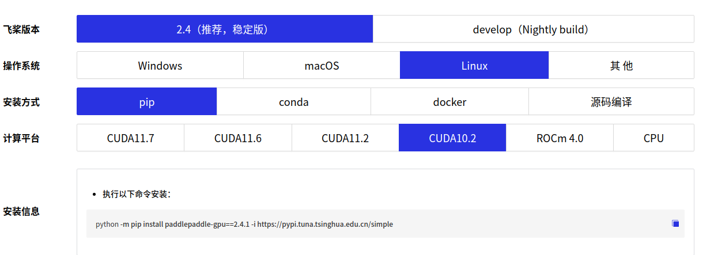
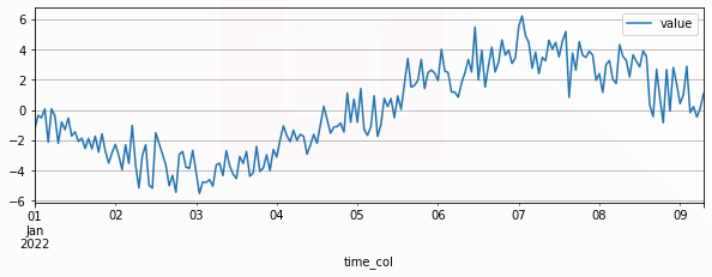
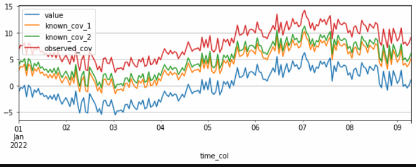
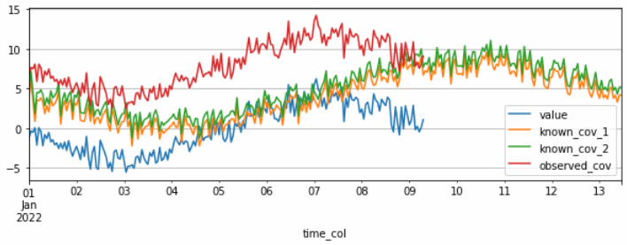
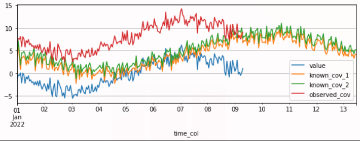
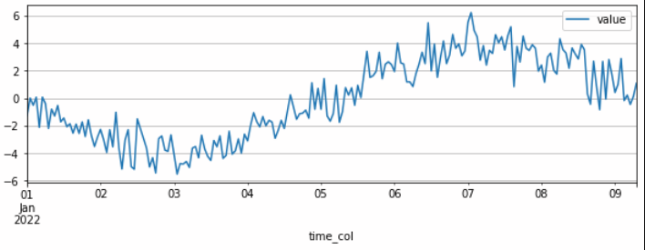
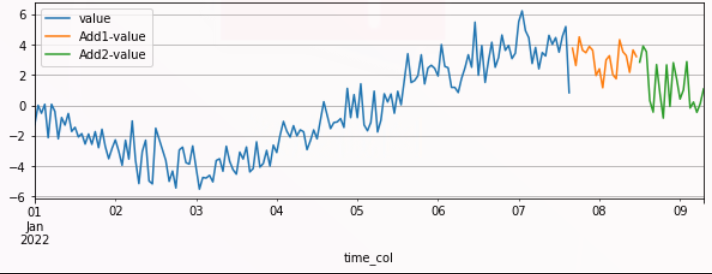

# PaddleTS库使用准备
## 1. 安装PaddleTS
### 前置条件
* python >= 3.7
* paddlepaddle >= 2.3
* System: Windows/MacOS/Ubuntu/CentOS
#### 创建新的虚拟环境
    conda create -n paddlets python=3.7
    conda activate paddlets

#### 安装 paddlepaddle

PaddleTS 提供的时序模型均基于 [PaddlePaddle](https://www.paddlepaddle.org.cn/) 开发。  
建议在安装PaddleTS之前先安装PaddlePaddle 。注意PaddleTS最低要求paddlepaddle的版本大于2.3.0
请根据您的系统、cuda版本选择合适的paddle版本进行安装
  
复制下方的安装命令。如果你已经安装了 `PaddlePaddle` ，请跳过此步骤

    python -m pip install paddlepaddle-gpu==2.4.1 -i https://pypi.tuna.tsinghua.edu.cn/simple  
你也可以通过前往PaddlePaddle官方网站获取更多安装指南:
[PaddlePaddle安装指南](https://www.paddlepaddle.org.cn/install/quick?docurl=/documentation/docs/zh/install/pip/windows-pip.html)

##### 确认PaddlePaddle版本
    python -c "import paddle; print(paddle.__version__)"

#### 如果您的paddle版本< 2.3.1时，需要更新protobuf版本

Protobuf的版本要求为 3.19.x - 3.20.x, 如果你的版本不符合则需要更新

检查protobuf版本  

	pip list
更新protobuf

	pip install protobuf == 3.19.0

#### 安装 PaddleTS
* （1） 利用wheel包进行安装

接下来，我们可以使用pip命令安装`PaddleTS` 。  

    pip install paddlets


控制台输出如下：  

     2.4.1

* （2）使用原始库安装,能够获得最新的版本  
```
# 克隆PaddleDetection仓库
cd <path/to/clone/PaddleDetection>
git clone https://github.com/PaddlePaddle/PaddleTS.git

# 安装其他依赖
cd PaddleTS
pip install -r requirements/autots.txt -i https://pypi.tuna.tsinghua.edu.cn/simple
pip install -r requirements/core.txt -i https://pypi.tuna.tsinghua.edu.cn/simple  
pip install -r requirements/docs.txt -i https://pypi.tuna.tsinghua.edu.cn/simple

# 编译安装paddlets
python setup.py install
```
* （3）查看padlets版本
安装成功后，就可以import PaddleTS并且使用了。


* 输出padlets版本。
````
  python -c "import paddlets; print(paddlets.__version__)"
````

## 2. 构建TSDataset
### 2.1 TSDtaset
`TSDataset `是` PaddleTS `中一个主要的类结构，用于表示绝大多数的时序样本数据，并作为`PaddleTS`其他算子的输入以及输出对象。
`TSDataset `包含两类时序数据：

	1.待预测目标：表示希望被预测的时序序列
	2.协变量：无需被预测的时间序列，协变量的加入通常用于辅助提高模型预测的效果

`TSDataset`支持的时序样本数据可以分为：

	1.单变量数据，只包含单列的预测目标，同时可以包含单列或者多列协变量
	2.多变量数据，包含多列预测目标，同时可以包含单列或者多列协变量

`TSDataset `需要包含`time_index`属性，`time_index`支持 `pandas.DatetimeIndex` 和 `pandas.RangeIndex` 两种类型。

我们将非预测目标变量定义为协变量，在时序数据中，协变量可分为以下三种：

	1.观测协变量 (observed_cov):

	指只能在历史中观察到的变量数据，例如测量的温度

	2.可预知协变量 (known_cov):

	指可在预测未来时间已知的变量，例如天气预报

	3.静态协变量 (static_cov):

	指整个时间范围内保持不变的变量

一个 `TSDataset` 对象由一个或者多个` TimeSeries` 对象构成，每个 `TimeSeries `可分别代表target（待预测目标）， observed_covariate（观测协变量）以及known_covariate（可预知协变量）。
### 2.2 TimeSeries
`TimeSeries `是用于表示时序数据的最小粒度；可以分别代表target, observed_covariate 或者known_covariate 其中一种类型。`TimeSeries`本身可以是单变量或者多变量。

`TimeSeries `需要转换成 `TSDataset` 对象才能在 `PaddleTS` 中使用
###  2.3 用户数据构建数据集使用示例  
#### 构建TSDataset
基于 `pandas.DataFrame `或者CSV文件构建一个只包含 `target` 序列的TSDataset：

````
import pandas as pd
import numpy as np
from paddlets import TSDataset

x = np.linspace(-np.pi, np.pi, 200)
sinx = np.sin(x) * 4 + np.random.randn(200)

df = pd.DataFrame(
    {
        'time_col': pd.date_range('2022-01-01', periods=200, freq='1h'),
        'value': sinx
    }
)
target_dataset = TSDataset.load_from_dataframe(
    df,  #Also can be path to the CSV file
    time_col='time_col',
    target_cols='value',
    freq='1h'
)
target_dataset.plot()
from matplotlib import pyplot as plt
plt.show()
````
结果如图：



构建一个既包含target序列，也包含协变量序列的TSDataset：

方法1：
````
import pandas as pd
from paddlets import TSDataset
df = pd.DataFrame(
    {
        'time_col': pd.date_range('2022-01-01', periods=200, freq='1h'),
        'value': sinx,
        'known_cov_1': sinx + 4,
        'known_cov_2': sinx + 5,
        'observed_cov': sinx + 8,
        'static_cov': [1 for i in range(200)],
    }
)
target_cov_dataset = TSDataset.load_from_dataframe(
    df,
    time_col='time_col',
    target_cols='value',
    known_cov_cols=['known_cov_1', 'known_cov_2'],
    observed_cov_cols='observed_cov',
    static_cov_cols='static_cov',
    freq='1h'
)
target_cov_dataset.plot(['value', 'known_cov_1', 'known_cov_2', 'observed_cov'])
````
结果如图：



方法2：
````	
import pandas as pd
from paddlets import TSDataset
x_l = np.linspace(-np.pi, np.pi, 300)
sinx_l = np.sin(x_l) * 4 + np.random.randn(300)

df = pd.DataFrame(
    {
        'time_col': pd.date_range('2022-01-01', periods=300, freq='1h'),
        'known_cov_1': sinx_l + 4,
        'known_cov_2': sinx_l + 5
    }
)
known_cov_dataset = TSDataset.load_from_dataframe(
    df,
    time_col='time_col',
    known_cov_cols=['known_cov_1', 'known_cov_2'],
    freq='1h'
)
df = pd.DataFrame(
    {
        'time_col': pd.date_range('2022-01-01', periods=200, freq='1h'),
        'observed_cov': sinx + 8
    }
)
observed_cov_dataset = TSDataset.load_from_dataframe(
    df,
    time_col='time_col',
    observed_cov_cols='observed_cov',
    freq='1h'
)
target_cov_dataset = TSDataset.concat([target_dataset, known_cov_dataset, observed_cov_dataset])
target_cov_dataset.plot(['value', 'known_cov_1', 'known_cov_2', 'observed_cov'])
````
结果如图：



方法3：
````	
import pandas as pd
from paddlets import TSDataset
from paddlets import TimeSeries
df = pd.DataFrame(
    {
        'time_col': pd.date_range('2022-01-01', periods=300, freq='1h'),
        'known_cov_1': sinx_l + 4,
        'known_cov_2': sinx_l + 5,
    }
)
known_cov_dataset = TimeSeries.load_from_dataframe(
    df,
    time_col='time_col',
    value_cols=['known_cov_1', 'known_cov_2'],
    freq='1h'
)
df = pd.DataFrame(
    {
        'time_col': pd.date_range('2022-01-01', periods=200, freq='1h'),
        'observed_cov': sinx + 8
    }
)
observed_cov_dataset = TimeSeries.load_from_dataframe(
    df,
    time_col='time_col',
    value_cols='observed_cov',
    freq='1h'
)
target_cov_dataset = target_dataset.copy()
target_cov_dataset.known_cov = known_cov_dataset
target_cov_dataset.observed_cov = observed_cov_dataset
target_cov_dataset.plot(['value', 'known_cov_1', 'known_cov_2', 'observed_cov'])
````
结果如图：



如果提供的原始样本数据存在缺失值，我们可以通过TSDataset构建时的自动填充功能实现缺失值的填充，目前支持7种填充方式。


先自定义TSDataset：
````
import pandas as pd
import numpy as np
from paddlets import TSDataset
df = pd.DataFrame(
    {
        'time_col': pd.date_range('2022-01-01', periods=200, freq='1h'),
        'value': sinx,
        'known_cov_1': sinx + 4,
        'known_cov_2': sinx + 5,
        'observed_cov': sinx + 8,
        'static_cov': [1 for i in range(200)],
    }
)

#使数据缺失
df.loc[1, 'value'] = np.nan
````
通过TSDataset构建自动填充缺失值：
````
target_cov_dataset = TSDataset.load_from_dataframe(
    df,
    time_col='time_col',
    target_cols='value',
    known_cov_cols=['known_cov_1', 'known_cov_2'],
    observed_cov_cols='observed_cov',
    static_cov_cols='static_cov',
    freq='1h',
    fill_missing_dates=True,
    fillna_method='zero' #七种方式：max, min, avg, median, pre, back, zero（）这里使用的是zero
)
print(target_cov_dataset['value'][1]) #结果为：0.0
````
需要注意的是，这里的fillna_method默认为pre前项补全。共有7种补全数据缺失值的方法，包括:max: 使用局部窗口最大值补全缺失值信息。min: 使用局部窗口最小值补全缺失值信息。avg: 使用局部窗口均值补全缺失值信息。median: 使用局部窗口中位数数值补全缺失值信息。pre: 使用前向数据补全数据信息。back: 使用后项数据补全数据信息。zero: 使用0值补全数据信息

#### 数据查看与分析
数据画图展示
````
target_cov_dataset.plot(['value'])
````


通过调用` TSDataset.summary `方法即可实现对数据统计信息的查看。
````
target_cov_dataset.summary()
print(target_cov_dataset.summary())
````
输出结果：

|       | value      | observed_cov | known_cov_1 | known_cov_2|
| ---------- | ---------- | ---------- | ---------- | ---------- |
|missing    |0.000000    |  0.000000    | 0.000000    | 0.000000   |
|count      |200.000000  |  200.000000  | 200.000000  | 200.000000 |
|mean       |0.099232    |  8.094577    | 4.094577    | 5.094577   |
|std        |3.000933    |  3.001809    | 3.001809    | 3.001809   |
|min        |-6.316020   |   1.683980   | -2.316020   | -1.316020  |
|25%        |-2.518724   |   5.481276   |  1.481276   |  2.481276  |
|50%        |0.128883    |  8.128883    | 4.128883    | 5.128883   |
|75%        |2.683689    | 10.683689    | 6.683689    | 7.683689   |
|max        |6.069291    | 14.069291    |10.069291    |11.069291   |

### 构建训练、验证以及测试数据集
````	
train_dataset, val_test_dataset = target_cov_dataset.split(0.8) 
# 训练集占比0.8，val_test（验证测试集占比0.2）
val_dataset, test_dataset = val_test_dataset.split(0.5)
# 验证测试集分别占比0.5，即占原始数据的0.2/2=0.1
train_dataset.plot(add_data=[val_dataset,test_dataset])
# 画图展示
````

蓝色为训练集，橙色为验证集，绿色为测试集


