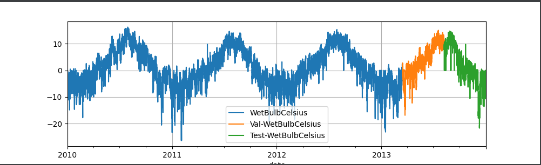
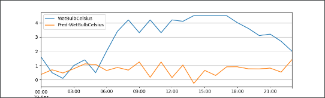
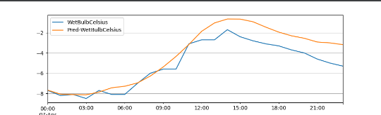
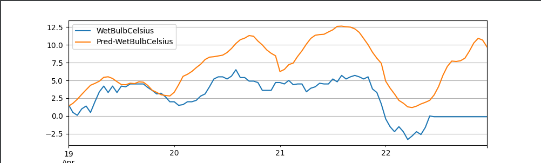
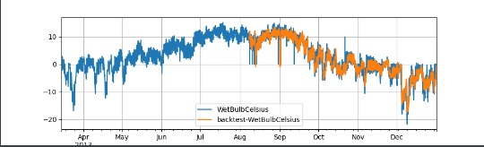

# RnnBlockRegressor（RNN）
循环神经网络（Recurrent Neural Network, RNN）是一类以序列（sequence）数据为输入，在序列的演进方向进行递归（recursion）且所有节点（循环单元）按链式连接的递归神经网络（recursive neural network）循环神经网络具有记忆性、参数共享并且图灵完备（Turing completeness），因此在对序列的非线性特征进行学习时具有一定优势。循环神经网络在自然语言处理（Natural Language Processing, NLP），例如语音识别、语言建模、机器翻译等领域有应用，也被用于各类时间序列预报。引入了卷积神经网络（Convolutional Neural Network,CNN）构筑的循环神经网络可以处理包含序列输入的计算机视觉问题。

### 使用PaddleTS内置的RnnBlockRegressor模型


PaddleBaseModel 是所有基于PaddlePaddle框架构建的时序模型的基类。 下方展示了一个简化版的 PaddleBaseModel 类声明， 此处略去了源代码中冗长的实现细节， 旨在于展示最重要的接口定义部分。
可以参考文档 [PaddleBaseModel API](https://paddlets.readthedocs.io/zh_CN/stable/source/api/paddlets.models.forecasting.dl.paddle_base.html) 查看完整代码。

### 模型介绍

RnnBlockRegressor构造方法的参数如下：

1. `in_chunk_len ` 必选参数

模型输入的时间序列长度

Type int

2. `out_chunk_len ` 必选参数

模型输出的时间序列长度

Type int

3. `rnn_type_or_module `

指定具体的RNN模型（”SimpleRNN”, “GRU” 或 “LSTM”）默认为SimpleRNN

Type str, Optional

4. `fcn_out_config`

全连接层的各层神经元数量列表。默认为none

Type List[int], Optional

5. `hidden_size`

RNN模型隐藏状态h大小。默认为128

Type int, Optional

6. `embedding_size`

embedding向量的维度大小。默认为128

Type int, Optional

7. `num_layers_recurrent`

循环网络的层数。默认为1

Type int, Optional

8. `dropout` 

dropout概率，除第一层外每层输入时的dropout概率。默认为0.0

Type float, Optional

9. `pooling` 

是否使用平均池化聚合embedding向量，如果false，concat每个embedding。默认为true

Type bool, Optional

10. `skip_chunk_len`

可选变量， 输入序列与输出序列之间跳过的序列长度，既不作为特征也不作为预测目标使用，默认值为0。

Type int, Optional

11. `sampling_stride`

相邻两个样本的采样间隔。默认为1

Type int, optional

12. `loss_fn`

损失函数。默认为F.mse_loss

Type Callable, Optional

13. `optimizer_fn`

优化器算法。默认为paddle.optimizer.Adam

Type Callable, Optional

14. `optimizer_params`

优化器参数。默认为dict(learning_rate=1e-4)

Type Dict, Optional

15. `eval_metrics`

模型评估指标。

Type List[str], Optional

16. `callbacks`

自定义的callback函数。

Type List[Callback], Optional

17. `batch_size`

每个batch中的样本数量。默认为128

Type int, Optional

18. `max_epochs`

训练过程中最大迭代轮数。默认为10

Type int, Optional

19. `verbose`

模型日志模式。默认为1

Type int, Optional

20. `patience`

训练停止所需的效果不再提升的轮数。默认为4

Type int, Optional

21. `seed`

全局随机种子。默认为0

Type int, Optional


### 数据介绍与处理

使用内置数据集'UNI_WTH'作为训练数据

构建训练、验证以及测试数据集
````
from paddlets.datasets.repository import get_dataset, dataset_list
from matplotlib import pyplot as plt

dataset = get_dataset('UNI_WTH')
train_dataset, val_test_dataset = dataset.split(0.8)
val_dataset, test_dataset = val_test_dataset.split(0.5)
train_dataset.plot(add_data=[val_dataset,test_dataset], labels=['Val', 'Test'])
plt.show()
````



其中蓝色为训练数据，橙色为验证数据，绿色为测试数据

### 模型训练

初始化模型，模型输入的时间序列长度为7*24，模型输出的时间序列长度为24，最大迭代轮数1000，不再减小（或增大）的累计次数设置为150,学习率设置为5e-4
````
# 构建模型
from paddlets.models.forecasting import RNNBlockRegressor

rnn = RNNBlockRegressor(
                    in_chunk_len=24 * 7,
                    out_chunk_len=24,
                    max_epochs=1000,
                    patience=150,
                    optimizer_params=dict(learning_rate=5e-4),
)
# 模型训练
rnn.fit(train_dataset, val_dataset)
subset_test_pred_dataset = rnn.predict(val_dataset)
````
### 预测

#### 单步预测
预测只能预测长度为长度为out_chunk_len的数据
将使用验证集进行预测，得到的结果如下，橙色为预测结果，蓝色为真实数据：
````
subset_test_dataset, _ = test_dataset.split(len(subset_test_pred_dataset.target))
subset_test_dataset.plot(add_data=subset_test_pred_dataset, labels=['Pred'])
plt.show()
````


可见效果不理想，修改patience为20，max_epochs为5000，得到结果
````
from paddlets.models.forecasting import RNNBlockRegressor

rnn = RNNBlockRegressor(
        in_chunk_len = 7 * 24,
        out_chunk_len = 24,
        max_epochs=5000,
        patience=20,
    )
rnn.fit(train_dataset)
subset_test_pred_dataset = rnn.predict(val_dataset)
subset_test_dataset, _ =test_dataset.split(len(subset_test_pred_dataset.target))
subset_test_dataset.plot(add_data=subset_test_pred_dataset, labels=['Pred'])
plt.show()
````


#### 递归多步预测

对模型进行递归多步预测,将predict改为recursive_predict，其支持指定想要输出的预测长度.
想要预测未来96个小时的 WetBulbCelsuis , 我们可以通过调用 recursive_predict 通过如下方法实现
````
subset_test_pred_dataset = rnn.recursive_predict(val_dataset,24*4)
subset_test_dataset, _ = test_dataset.split(len(subset_test_pred_dataset.target))
subset_test_dataset.plot(add_data=subset_test_pred_dataset, labels=['Pred'])
plt.show()
````
结果如下：



### 模型评估

有了预测数据和真实数据后，可以计算相应的metrics指标
使用PaddleTS中的MSE和MAE
````
from paddlets.metrics import MSE, MAE

mae = MAE()
print(mae(subset_test_dataset, subset_test_pred_dataset))
mse = MSE()
print(mse(subset_test_dataset, subset_test_pred_dataset))
````
结果如下：
````
{'WetBulbCelsius': 1.0686063120762506}#MAE
{'WetBulbCelsius': 1.566020938161751}#MSE
````
上面，我们只计算了测试集中部分数据的metrics指标，我们可以通过 backtest 实现对整个测试集的metrics指标计算。
以MAE为例：
回测用给定模型获得的历史上的模拟预测,是用来评测模型预测准确率的重要工具。


回测是一个迭代过程，回测用固定预测窗口在数据集上进行重复预测，然后通过固定步长向前移动到训练集的末尾。如上图所示，桔色部分是长度为3的预测窗口。在每次迭代中，预测窗口会向前移动3个长度，同样训练集也会向后扩张三个长度。这个过程会持续到窗口移动到数据末尾。
````
from paddlets.utils import backtest

score , pred_data= backtest(
    data=val_test_dataset,
    model=rnn,
    start=0.5, #start 可以控制回测的起始点如果设置 start 为0.5,那么回测将会在数据的中间位置开始。
    predict_window=24, # predict_window 是每次预测的窗口长度
    stride=24, # stride 是两次连续预测之间的移动步长
    return_predicts = True, #如果设置 return_predicts 为True，回测函数会同时返回指标结果和预测值 。
    metric=mae
)
print(f"mae: {score}")
val_test_dataset.plot(add_data=pred_data,labels="backtest")
plt.show()
````


### 模型持久化

模型训练完成后，我们需将训练完成的模型持久化，以便在未来使用该模型时无需对其重复训练。
同时，也可以加载一个已经被保存在硬盘上的PaddleBaseModel模型。
保存模型
````
rnn.save("/G:/pycharm/pythonProject7")
````
加载模型：
````
loaded_rnn_reg = load("/G:/pycharm/pythonProject7")
````
#### 保存静态图模型
PaddleTS所有时序预测以及异常检测模型的save接口都新增了 network_model 以及 dygraph_to_static 的参数设置;其中, network_model默认是False, 表示仅导出只支持PaddleTS.predict推理的模型文件, 当network_model设置为True的时候, 在此基础上，会新增对paddle 原始network 的模型以及参数的导出, 可用于 Paddle Inference进行推理; dygraph_to_static参数仅当当network_model为True的时候起作用，表示将导出的模型从动态图转换成静态图, 参考 动转静.

````
model.save("./rnn2", network_model=True, dygraph_to_static=True)

# 包含以下文件
# ./rnn.pdmodel
# ./rnn.pdiparams
# ./rnn_model_meta

````
其中rnn.pdmodel以及rnn.pdiparams作为paddle 原生模型以及模型参数, 可用于Paddle Inference的应用;同时PaddleTS生成了rnn_model_meta文件用于模型的描述, 里面包含了模型的输入数据类型以及shape的各种元信息, 便于用户对模型进行正确的部署应用.

静态图模型可以用于paddleinference进行快速推理


