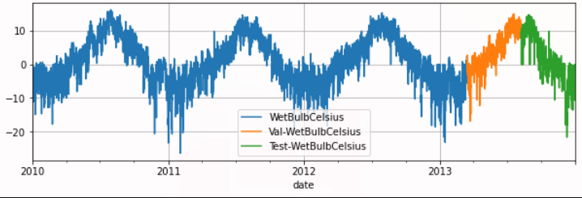
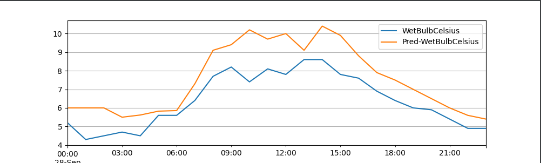
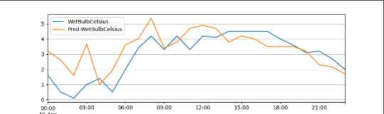
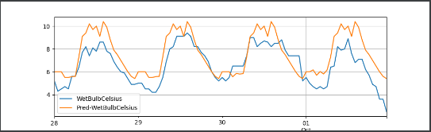
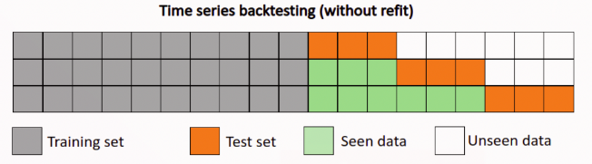
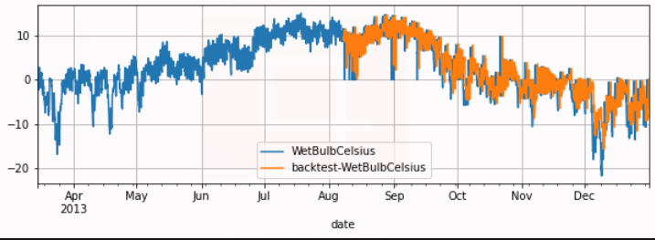

# TCNRegressor
   到目前为止，深度学习背景下的序列建模主题主要与递归神经网络架构(如LSTM和GRU)有关。S.  Bai等人(*)认为，这种思维方式已经过时，在对序列数据进行建模时，应该将卷积网络作为主要候选者之一加以考虑。他们能够表明，在许多任务中，卷积网络可以取得比RNNs更好的性能，同时避免了递归模型的常见缺陷，如梯度爆炸/消失问题或缺乏内存保留。此外，使用卷积网络而不是递归网络可以提高性能，因为它允许并行计算输出。他们提出的架构称为时间卷积网络(TCN)，将在下面的部分中进行解释。

TCN是指时间卷积网络，一种新型的可以用来解决时间序列预测的算法。

该算法于2016年由Lea等人首先提出，当时他们在做视频动作分割的研究，一般而言此常规过程包括两个步骤：首先，使用（通常）对时空信息进行编码的CNN来计算低级特征，其次，将这些低级特征输入到使用（通常是）捕获高级时域信息的分类器中）RNN。这种方法的主要缺点是需要两个单独的模型。

## PaddleTS内置的TCNRegressor

### 模型介绍

TCNRegressor构造方法的参数如下：   
***参数说明请按照下面格式进行整理***
1. `in_chunk_len` 必选参数 
 
***把下划线删除***  
模型输入的时间序列长度.  
Type: int

2. `out_chunk_len` 必选参数 

模型输出的时间序列长度.  
Type: int

3. `skip_chunk_len`

可选变量, 输入序列与输出序列之间跳过的序列长度, 既不作为特征也不作为序测目标使用, 默认值为0

Type: int

4. `sampling_stride`

相邻样本间的采样间隔.默认值为1

Type:int

5. `loss_fn`

损失函数.默认值为F.mse_loss  
Type:Callable[…, paddle.Tensor]

6. `optimizer_fn`

优化算法.默认值为paddle.optimizer.Adam  
Type: Callable[…, Optimizer]

7. `optimizer_params`

优化器参数.默认值为dict(learning_rate=1e-3)

Type: Dict[str, Any]

8.`eval_metrics`

模型训练过程中的需要观测的评估指标.  
Type: List[str]

9. `callbacks`

自定义callback函数.

Type: List[Callback]

10. `batch_size`

训练数据或评估数据的批大小.默认值为32

Type: int

11. `max_epochs`

训练的最大轮数.默认值为100

Type: int

12. `verbose`

模型训练过程中打印日志信息的间隔.默认值为1

Type: int

13. `patience`

模型训练过程中, 当评估指标超过一定轮数不再变优，模型提前停止训练.默认值为10

Type: int

14. `seed`

全局随机数种子, 注: 保证每次模型参数初始化一致.

Type: int|None

15. `stop_training`

Type: bool

16. `hidden_config`

多层TemporalBlock结构, 列表第i个元素标识第i层通道的维度.

Type: List[int]|None

17. `kernel_size`

卷积核大小.默认值为3

Type: int

18. `dropout_rate`

神经元丢弃概率.默认值为0.2

Type: float


### 数据介绍与处理

这里选取内置数据集'UNI_WTH'作为训练数据

构建训练、验证以及测试数据集  
***请添加import的相关内容,直接使用完整数据进行说明即可，部分数据仅用于个人练习***
````
from paddlets.datasets.repository import get_dataset, dataset_list
from matplotlib import pyplot as plt

dataset = get_dataset('UNI_WTH')
train_dataset, val_test_dataset = dataset.split(0.8)
val_dataset, test_dataset = val_test_dataset.split(0.5)
train_dataset.plot(add_data=[val_dataset,test_dataset], labels=['Val', 'Test'])
plt.show()
````
结果如下：

其中蓝色为训练数据，橙色为验证数据，绿色为测试数据

### 模型训练

初始化模型，模型输入的时间序列长度为7*24，模型输出的时间序列长度为24，最大迭代轮数1000，不再减小（或增大）的累计次数设置为30
````
from paddlets.models.forecasting import TCNRegressor
# 构建模型
model = TCNRegressor(
    in_chunk_len = 7 * 24,
    out_chunk_len = 24,
    max_epochs = 1000,
    patience = 100,
    batch_size=256,
    optimizer_params= {'learning_rate':5e-3}
                        )
#模型训练
model.fit(train_dataset, val_dataset)
````
得到结果如下：



### 预测
#### 单步预测
预测只能预测长度为长度为out_chunk_len的数据
将使用验证集进行预测，得到的结果如下，橙色为预测结果，蓝色为真实数据：
````
# 训练结果可视化
subset_test_pred_dataset = model.predict(val_dataset)
plt.show()
subset_test_dataset, _ = test_dataset.split(len(subset_test_pred_dataset.target))
subset_test_dataset.plot(add_data=subset_test_pred_dataset, labels=['Pred'])
plt.show()
````


换成完整数据集的数据后再次梳理数据并训练模型

#### 递归多步预测
如果我们希望预测更长的数据，可以多次使用单步预测，采用递归的方式进行预测更长的结果
对模型进行递归多步预测,将model.predict改为model.recursive_predict，其支持指定想要输出的预测长度.
想要预测未来96个小时的 WetBulbCelsuis , 我们可以通过调用 recursive_predict 通过如下方法实现

````
subset_test_pred_dataset = model.recursive_predict(val_dataset,24*4)
subset_test_dataset, _ = test_dataset.split(len(subset_test_pred_dataset.target))
subset_test_dataset.plot(add_data=subset_test_pred_dataset, labels=['Pred'])
plt.show()
````
结果如下：



### 模型评估

有了预测数据和真实数据后，可以计算相应的metrics指标
分别使用使用PaddleTS中的MSE和MAE两个评价标准

````
from paddlets.metrics import MAE,MSE
mae = MAE()
print(mae(subset_test_dataset, subset_test_pred_dataset))
mse = MSE()
print(mse(subset_test_dataset, subset_test_pred_dataset))
````
得到结果

    {'WetBulbCelsius': 1.1499828298886616}#MAE
    {'WetBulbCelsius': 1.7185793443537047}#MSE


上面，我们只计算了测试集中部分数据的metrics指标，我们可以通过 backtest 实现对整个测试集的metrics指标计算。
以MAE为例：
回测用给定模型获得的历史上的模拟预测,是用来评测模型预测准确率的重要工具。


回测是一个迭代过程，回测用固定预测窗口在数据集上进行重复预测，然后通过固定步长向前移动到训练集的末尾。如上图所示，桔色部分是长度为3的预测窗口。在每次迭代中，预测窗口会向前移动3个长度，同样训练集也会向后扩张三个长度。这个过程会持续到窗口移动到数据末尾。

````
from paddlets.utils import backtest
score , pred_data= backtest(
    data=val_test_dataset,
    model=model,
    start=0.5, #start 可以控制回测的起始点如果设置 start 为0.5,那么回测将会在数据的中间位置开始。
    predict_window=24, # predict_window 是每次预测的窗口长度
    stride=24, # stride 是两次连续预测之间的移动步长
    return_predicts = True, #如果设置 return_predicts 为True，回测函数会同时返回指标结果和预测值 。
    metric=mae
)
print(f"mae: {score}")
val_test_dataset.plot(add_data=pred_data,labels="backtest")
````



### 保存模型并进行使用

模型训练完成后，我们需将训练完成的模型持久化，以便在未来使用该模型时无需对其重复训练。
同时，也可以加载一个已经被保存在硬盘上的PaddleBaseModel模型。
保存模型：
````
model.save("tcn1")
````
加载模型：
````
from paddlets.models.model_loader import load
model_tcn = load("tcn1")
````
#### 保存静态图模型
PaddleTS所有时序预测以及异常检测模型的save接口都新增了 network_model 以及 dygraph_to_static 的参数设置;其中, network_model默认是False, 表示仅导出只支持PaddleTS.predict推理的模型文件, 当network_model设置为True的时候, 在此基础上，会新增对paddle 原始network 的模型以及参数的导出, 可用于 Paddle Inference进行推理; dygraph_to_static参数仅当当network_model为True的时候起作用，表示将导出的模型从动态图转换成静态图, 参考 动转静.

````
model.save("./tcn2", network_model=True, dygraph_to_static=True)

# 包含以下文件
# ./rnn.pdmodel
# ./rnn.pdiparams
# ./rnn_model_meta

````
其中rnn.pdmodel以及rnn.pdiparams作为paddle 原生模型以及模型参数, 可用于Paddle Inference的应用;同时PaddleTS生成了rnn_model_meta文件用于模型的描述, 里面包含了模型的输入数据类型以及shape的各种元信息, 便于用户对模型进行正确的部署应用.

静态图模型可以用于paddleinference进行快速推理
 