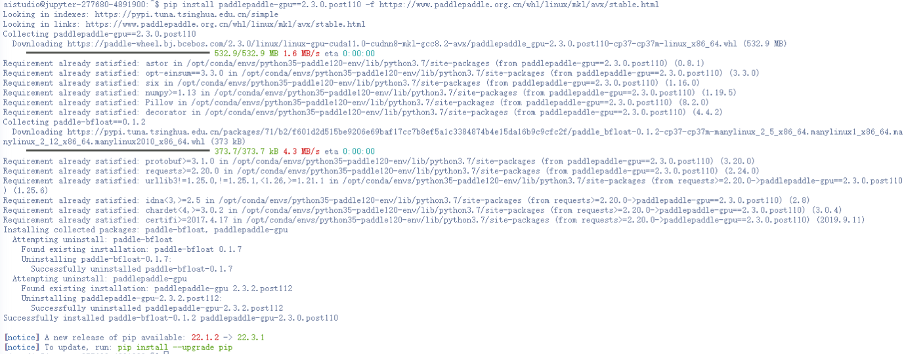
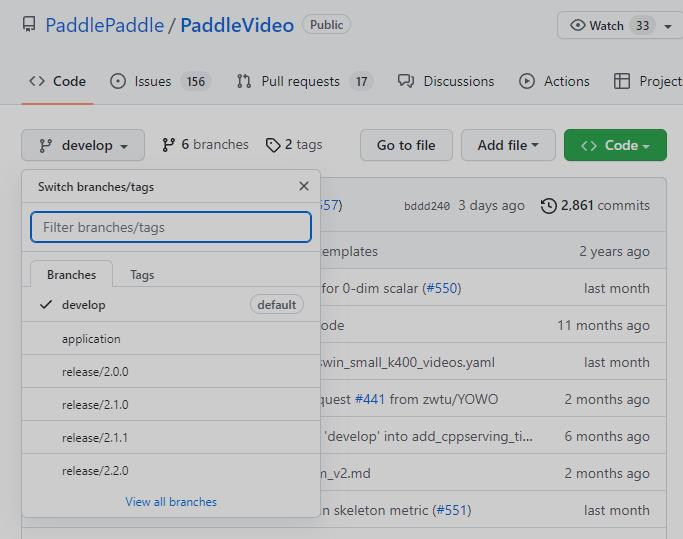

# 项目概述


​	   递归神经网络（RNN）常用于序列数据的处理，可建模视频连续多帧的时序信息，在视频分类领域为基础常用方法。本案例采用的是YouTube-8M 2018年更新之后的数据集。使用官方数据集，并将TFRecord文件转化为pickle文件以便PaddlePaddle进行视频分类。


​		**关键词: 动作分类、YouTube-8M、PaddleVideo**、AttentionLSTM

## 文档目录结构

- (1) 模型简述
- (2) 环境安装
  - (2.1) `PaddlePaddle`安装
    - (2.1.1) 安装对应版本`PaddlePaddle`
    - (2.1.2) 验证安装是否成功
  - (2.2) `PaddleVideo`安装
    - (2.2.1) 下载`PaddleVideo`代码
    - (2.2.2) 安装依赖项目
    - (2.2.3) 验证安装是否成功
- (3) 数据准备
  - (3.1) 数据标注
    - (3.1.1) 精灵标注安装
    - (3.1.2) 精灵标注的使用
  - (3.2) 数据格式转化
  - (3.3) 数据划分
- (4) 模型训练
  - (4.1) 训练前数据准备
  - (4.2) 开始训练
  - (4.3) 主要训练参数说明
  - (4.4) 多卡训练
  - (4.5) 恢复训练
  - (4.6) 训练可视化
- (5) 模型验证与预测
  - (5.1) 开始验证
  - (5.2) 主要验证参数说明
  - (5.3) 评估指标说明
  - (5.4) 开始预测
  - (5.5) 输出说明
- (6) 模型部署与转化
- (7) 配置文件的说明
  - (7.1) 整体配置文件格式综述
  - (7.2) 数据路径与数据预处理说明
  - (7.3) 模型说明
  - (7.4) 优化器和损失函数说明
  - (7.5) 其它参数说明
- (8) 部分参数值推荐说明
  - (8.1) 训练批大小
  - (8.2) 训练轮次大小
  - (8.3) 训练学习率大小
  - (8.4) 训练预热迭代轮次

# (1) 模型简述

​       循环神经网络（RNN）常用于序列数据的处理，可建模视频连续多帧的时序信息，在视频分类领域为基础常用方法。该模型采用了双向长短时记忆网络（LSTM），将视频的所有帧特征依次编码。与传统方法直接采用LSTM最后一个时刻的输出不同，该模型增加了一个Attention层，每个时刻的隐状态输出都有一个自适应权重，然后线性加权得到最终特征向量。参考论文中实现的是两层LSTM结构，而本代码实现的是带Attention的双向LSTM，Attention层可参考论文[AttentionCluster](https://arxiv.org/abs/1711.09550)。

详细内容请参考[Beyond Short Snippets: Deep Networks for Video Classification](https://arxiv.org/abs/1503.08909)。

# (2) 环境安装

## (2.1) `PaddlePaddle`安装

### (2.1.1) 安装对应版本`PaddlePaddle`

​		根据系统和设备的`cuda`环境，选择对应的安装包，这里默认使用`pip`在`linux`设备上进行安装。


​		在终端中执行:

```bash
pip install paddlepaddle-gpu==2.3.0.post110 -f https://www.paddlepaddle.org.cn/whl/linux/mkl/avx/stable.html
```

​		安装效果:



### (2.1.2) 验证安装是否成功

```bash
# 安装完成后您可以使用 python进入python解释器，
python
# 继续输入
import paddle 
# 再输入 
paddle.utils.run_check()
```

​		如果出现`PaddlePaddle is installed successfully!`，说明您已成功安装。


## (2.2) `PaddleVideo`安装

### (2.2.1) 下载`PaddleVideo`代码

​		用户可以通过使用`github`或者`gitee`的方式进行下载，我们当前版本为`PaddleVideo`的`release v2.5`版本。后续在使用时，需要对应版本进行下载。



```bash
# github下载
git clone -b release/2.5 https://github.com/PaddlePaddle/PaddleVideo.git
# gitee下载
git clone -b release/2.5 https://gitee.com/PaddlePaddle/PaddleVideo.git
```

### (2.2.2) 安装依赖项目

* 方式一：
  通过直接`pip install` 安装，可以最高效率的安装依赖

``` bash
pip install ppvideo
```

* 方式二：
  下载`PaddleVideo`代码后，进入`PaddleVideo`代码文件夹目录下面

``` bash
cd PaddleVideo
pip install -r requirements.txt
```

### (2.2.3) 验证安装是否成功

​		如果采用方式一安装依赖项目，则使用以下脚本内容验证是否安装成功，否则无需执行以下验证步骤——无报错即安装成功。

```bash
ppvideo --model_name='ppTSM_v2' --use_gpu=False --video_file='data/example.avi'
```

# (3) 数据准备


​         AttentionLSTM模型使用2nd-Youtube-8M数据集，关于数据部分请参考[数据说明](../../data/dataset/README.md)../../data/dataset/ctcn/README.md)

​         这里用到的是YouTube-8M 2018年更新之后的数据集。使用官方数据集，并将TFRecord文件转化为pickle文件以便PaddlePaddle使用。Youtube-8M数据集官方提供了frame-level和video-level的特征，这里只需使用到frame-level的特征。

## (3.1) 数据下载

请使用Youtube-8M官方链接分别下载[训练集](http://us.data.yt8m.org/2/frame/train/index.html)和[验证集](http://us.data.yt8m.org/2/frame/validate/index.html)。每个链接里各提供了3844个文件的下载地址，用户也可以使用官方提供的[下载脚本](https://research.google.com/youtube8m/download.html)下载数据。数据下载完成后，将会得到3844个训练数据文件和3844个验证数据文件（TFRecord格式）。
假设存放视频模型代码库PaddleVideo的主目录为: Code\_Root，进入data/dataset/youtube8m目录

    cd data/dataset/youtube8m

在youtube8m下新建目录tf/train和tf/val

    mkdir tf && cd tf
    
    mkdir train && mkdir val

并分别将下载的train和validate数据存放在其中。

## (3.2) 数据格式转化

为了适用于PaddlePaddle训练，需要离线将下载好的TFRecord文件格式转成了pickle格式，转换脚本请使用[dataset/youtube8m/tf2pkl.py](./youtube8m/tf2pkl.py)。

在data/dataset/youtube8m 目录下新建目录pkl/train和pkl/val

    cd data/dataset/youtube8m
    
    mkdir pkl && cd pkl
    
    mkdir train && mkdir val


转化文件格式(TFRecord -> pkl)，进入data/dataset/youtube8m目录，运行脚本

    python tf2pkl.py ./tf/train ./pkl/train

和

    python tf2pkl.py ./tf/val ./pkl/val

分别将train和validate数据集转化为pkl文件。tf2pkl.py文件运行时需要两个参数，分别是数据源tf文件存放路径和转化后的pkl文件存放路径。

备注：由于TFRecord文件的读取需要用到Tensorflow，用户要先安装Tensorflow，或者在安装有Tensorflow的环境中转化完数据，再拷贝到data/dataset/youtube8m/pkl目录下。为了避免和PaddlePaddle环境冲突，建议先在其他地方转化完成再将数据拷贝过来。

## (3.3) 生成文件列表

进入data/dataset/youtube8m目录

    cd $Code_Root/data/dataset/youtube8m
    
    ls $Code_Root/data/dataset/youtube8m/pkl/train/* > train.list
    
    ls $Code_Root/data/dataset/youtube8m/pkl/val/* > val.list
    
    ls $Code_Root/data/dataset/youtube8m/pkl/val/* > test.list
    
    ls $Code_Root/data/dataset/youtube8m/pkl/val/* > infer.list

此处Code\_Root是PaddleVideo目录所在的绝对路径，比如/ssd1/user/models/PaddleCV/PaddleVideo，在data/dataset/youtube8m目录下将生成四个文件，train.list，val.list，test.list和infer.list，每一行分别保存了一个pkl文件的绝对路径，示例如下：

    /ssd1/user/models/PaddleCV/PaddleVideo/data/dataset/youtube8m/pkl/train/train0471.pkl
    /ssd1/user/models/PaddleCV/PaddleVideo/data/dataset/youtube8m/pkl/train/train0472.pkl
    /ssd1/user/models/PaddleCV/PaddleVideo/data/dataset/youtube8m/pkl/train/train0473.pkl
    ...

或者

    /ssd1/user/models/PaddleCV/PaddleVideo/data/dataset/youtube8m/pkl/val/validate3666.pkl
    /ssd1/user/models/PaddleCV/PaddleVideo/data/dataset/youtube8m/pkl/val/validate3666.pkl
    /ssd1/user/models/PaddleCV/PaddleVideo/data/dataset/youtube8m/pkl/val/validate3666.pkl
    ...

- 备注：由于Youtube-8M数据集中test部分的数据没有标签，所以此处使用validate数据做模型评估。


# (4)模型训练
 随机初始化开始训练

数据准备完毕后，可以通过如下两种方式启动训练：

    export CUDA_VISIBLE_DEVICES=0,1,2,3,4,5,6,7
    python train.py --model_name=AttentionLSTM \
                    --config=./configs/attention_lstm.yaml \
                    --log_interval=10 \
                    --valid_interval=1 \
                    --use_gpu=True \
                    --save_dir=./data/checkpoints \
                    --fix_random_seed=False
    
    bash run.sh train AttentionLSTM ./configs/attention_lstm.yaml

- AttentionLSTM模型使用8卡Nvidia Tesla P40来训练的，总的batch size数是1024。

# (5) 模型验证

​		可通过如下两种方式进行模型评估:

```python
python eval.py --model_name=AttentionLSTM \
               --config=./configs/attention_lstm.yaml \
               --log_interval=1 \
               --weights=$PATH_TO_WEIGHTS \
               --use_gpu=True

bash run.sh eval AttentionLSTM ./configs/attention_lstm.yaml
```

​	

- 使用`run.sh`进行评估时，需要修改脚本中的`weights`参数指定需要评估的权重。

- 若未指定`weights`参数，脚本会下载已发布模型[model](https://paddlemodels.bj.bcebos.com/video_classification/AttentionLSTM.pdparams)进行评估

- 评估结果以log的形式直接打印输出GAP、Hit@1等精度指标

- 使用CPU进行评估时，请将`use_gpu`设置为False

模型参数列表如下：

|      参数       | 取值 |
| :-------------: | :--: |
| embedding\_size | 512  |
|   lstm\_size    | 1024 |
|   drop\_rate    | 0.5  |


计算指标列表如下：

| 精度指标 | 模型精度 |
| :------: | :------: |
|  Hit@1   |  0.8885  |
|   PERR   |  0.8012  |
|   GAP    |  0.8594  |

# (6) 模型推理

- 可通过如下两种方式启动模型推断：

```python
python predict.py --model_name=AttentionLSTM \
                  --config=configs/attention_lstm.yaml \
                  --log_interval=1 \
                  --weights=$PATH_TO_WEIGHTS \
                  --filelist=$FILELIST \
                  --use_gpu=True

bash run.sh predict AttentionLSTM ./configs/attention_lstm.yaml
```

- 使用python命令行启动程序时，`--filelist`参数指定待推断的文件列表，如果不设置，默认为data/dataset/youtube8m/infer.list。`--weights`参数为训练好的权重参数，如果不设置，程序会自动下载已训练好的权重。这两个参数如果不设置，请不要写在命令行，将会自动使用默
  认值。

- 使用`run.sh`进行评估时，请修改脚本中的`weights`参数指定需要用到的权重。

- 若未指定`--weights`参数，脚本会下载已发布模型[model](https://paddlemodels.bj.bcebos.com/video_classification/AttentionLSTM.pdparams)进行推断

- 模型推断结果以log的形式直接打印输出，可以看到每个测试样本的分类预测概率。

- 使用CPU进行预测时，请将`use_gpu`设置为False
