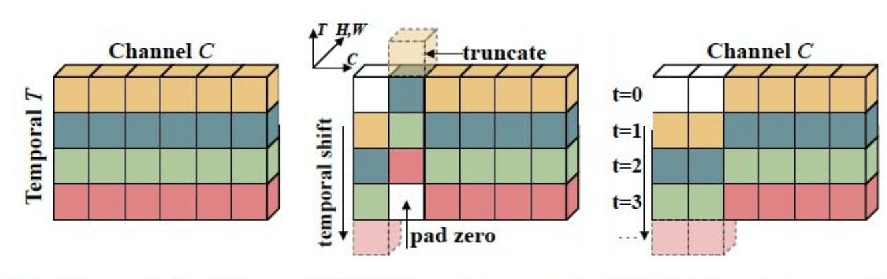

# 项目概述


​	   时序动作定位(提案生成)是计算机视觉和视频分析领域一个具有的挑战性的任务。本次项目不同于以往的ActivityNet-TAL，FineAction等视频时序检测动作定位比赛，我们采用了更精细的动作数据集--乒乓球转播画面，该数据集具有动作时间跨度短，分布密集等特点，给传统模型精确定位细粒度动作带来了很大挑战。本次比赛的任务即针对乒乓球转播画面视频面对镜头的运动员定位其挥拍动作(时序动作提案生成)。


​		**关键词: 时序动作定位、乒乓球转播、PaddleVideo**、C-TCN

## 文档目录结构

- (1) 模型简述
- (2) 环境安装
  - (2.1) `PaddlePaddle`安装
    - (2.1.1) 安装对应版本`PaddlePaddle`
    - (2.1.2) 验证安装是否成功
  - (2.2) `PaddleVideo`安装
    - (2.2.1) 下载`PaddleVideo`代码
    - (2.2.2) 安装依赖项目
    - (2.2.3) 验证安装是否成功
- (3) 数据准备
  - (3.1) 数据标注
    - (3.1.1) 精灵标注安装
    - (3.1.2) 精灵标注的使用
  - (3.2) 数据格式转化
  - (3.3) 数据划分
- (4) 模型训练
  - (4.1) 训练前数据准备
  - (4.2) 开始训练
  - (4.3) 主要训练参数说明
  - (4.4) 多卡训练
  - (4.5) 恢复训练
  - (4.6) 训练可视化
- (5) 模型验证与预测
  - (5.1) 开始验证
  - (5.2) 主要验证参数说明
  - (5.3) 评估指标说明
  - (5.4) 开始预测
  - (5.5) 输出说明
- (6) 模型部署与转化
- (7) 配置文件的说明
  - (7.1) 整体配置文件格式综述
  - (7.2) 数据路径与数据预处理说明
  - (7.3) 模型说明
  - (7.4) 优化器和损失函数说明
  - (7.5) 其它参数说明
- (8) 部分参数值推荐说明
  - (8.1) 训练批大小
  - (8.2) 训练轮次大小
  - (8.3) 训练学习率大小
  - (8.4) 训练预热迭代轮次

# (1) 模型简述

​       C-TCN动作定位模型是百度自研，2018年ActivityNet夺冠方案，在PaddlePaddle上首次开源，为开发者提供了处理视频动作定位问题的解决方案。此模型引入了concept-wise时间卷积网络，对每个concept先用卷积神经网络分别提取时间维度的信息，然后再将每个concept的信息进行组合。主体结构是残差网络+FPN，采用类似SSD的单阶段目标检测算法对时间维度的anchor box进行预测和分类。https://arxiv.org/abs/1608.00859)



# (2) 环境安装

## (2.1) `PaddlePaddle`安装

### (2.1.1) 安装对应版本`PaddlePaddle`

​		根据系统和设备的`cuda`环境，选择对应的安装包，这里默认使用`pip`在`linux`设备上进行安装。


​		在终端中执行:

```bash
pip install paddlepaddle-gpu==2.3.0.post110 -f https://www.paddlepaddle.org.cn/whl/linux/mkl/avx/stable.html
```

​		安装效果:


### (2.1.2) 验证安装是否成功

```bash
# 安装完成后您可以使用 python进入python解释器，
python
# 继续输入
import paddle 
# 再输入 
paddle.utils.run_check()
```

​		如果出现`PaddlePaddle is installed successfully!`，说明您已成功安装。


## (2.2) `PaddleVideo`安装

### (2.2.1) 下载`PaddleVideo`代码

​		用户可以通过使用`github`或者`gitee`的方式进行下载，我们当前版本为`PaddleVideo`的`release v2.5`版本。后续在使用时，需要对应版本进行下载。


```bash
# github下载
git clone -b release/2.5 https://github.com/PaddlePaddle/PaddleVideo.git
# gitee下载
git clone -b release/2.5 https://gitee.com/PaddlePaddle/PaddleVideo.git
```

### (2.2.2) 安装依赖项目

* 方式一：
  通过直接`pip install` 安装，可以最高效率的安装依赖

``` bash
pip install ppvideo
```

* 方式二：
  下载`PaddleVideo`代码后，进入`PaddleVideo`代码文件夹目录下面

``` bash
cd PaddleVideo
pip install -r requirements.txt
```

### (2.2.3) 验证安装是否成功

​		如果采用方式一安装依赖项目，则使用以下脚本内容验证是否安装成功，否则无需执行以下验证步骤——无报错即安装成功。

```bash
ppvideo --model_name='ppTSM_v2' --use_gpu=False --video_file='data/example.avi'
```

# (3) 数据准备

## 

​         C-TCN的训练数据采用ActivityNet1.3提供的数据集，数据下载及准备请参考[数据说明](../../data/dataset/ctcn/README.md)

​         C-TCN模型使用ActivityNet 1.3数据集，具体下载方法请参考官方[下载说明](http://activity-net.org/index.html)。在训练此模型时，需要先对mp4源文件抽取RGB和Flow特征，然后再用训练好的TSN模型提取出抽象的特征数据，并存储为pickle文件格式。我们使用百度云提供转化后的数据[下载链接](https://paddlemodels.bj.bcebos.com/video_detection/CTCN_data.tar.gz)。转化后的数据文件目录结构为：

```python
data
  |
  |----senet152-201cls-flow-60.9-5seg-331data\_train
  |----senet152-201cls-rgb-70.3-5seg-331data\_331img\_train
  |----senet152-201cls-flow-60.9-5seg-331data\_val
  |----senet152-201cls-rgb-70.3-5seg-331data\_331img\_val
```
- 同时需要下载如下几个数据文件Activity1.3\_train\_rgb.listformat, Activity1.3\_val\_rgb.listformat, labels.txt, val\_duration\_frame.list，并放到dataset/ctcn目录下。

# (4)模型训练
## (4.1) 模型训练

 数据准备完毕后，可以通过如下两种方式启动训练：


```python
export CUDA_VISIBLE_DEVICES=0,1,2,3,4,5,6,7
export FLAGS_fast_eager_deletion_mode=1
export FLAGS_eager_delete_tensor_gb=0.0
export FLAGS_fraction_of_gpu_memory_to_use=0.98
python train.py --model_name=CTCN \
                --config=./configs/ctcn.yaml \
                --log_interval=10 \
                --valid_interval=1 \
                --use_gpu=True \
                --save_dir=./data/checkpoints \
                --fix_random_seed=False \
                --pretrain=$PATH_TO_PRETRAIN_MODEL

bash run.sh train CTCN ./configs/ctcn.yaml
```
- 从头开始训练，使用上述启动命令行或者脚本程序即可启动训练，不需要用到预训练模型
- 可下载已发布模型[model](https://paddlemodels.bj.bcebos.com/video_detection/CTCN.pdparams)通过`--resume`指定权重存放路径进行finetune等开发

**数据读取器说明：** 模型读取Kinetics-400数据集中的`mp4`数据，每条数据抽取`seg_num`段，每段抽取1帧图像，对每帧图像做随机增强后，缩放至`target_size`。

## (4.2) 训练策略

*  采用Momentum优化算法训练，momentum=0.9
*  权重衰减系数为1e-4
*  学习率在迭代次数达到9000的时候做一次衰减

# (5) 模型验证

​		可通过如下两种方式进行模型评估:

```python
python eval.py --model_name=CTCN \
               --config=./configs/ctcn.yaml \
               --log_interval=1 \
               --weights=$PATH_TO_WEIGHTS \
               --use_gpu=True

bash run.sh eval CTCN ./configs/ctcn.yaml
```

​	

- 使用`run.sh`进行评估时，需要修改脚本中的`weights`参数指定需要评估的权重。

- 若未指定`--weights`参数，脚本会下载已发布模型[model](https://paddlemodels.bj.bcebos.com/video_detection/CTCN.pdparams)进行评估

- 运行上述程序会将测试结果保存在json文件中，默认存储在data/evaluate\_results目录下，程序根据所使用的超参数自动生成文件名，例如：CTCN\_test\_res\_decode\_0.001\_0.8\_0.9\_0.004.json。使用ActivityNet官方提供的测试脚本，即可计算MAP。具体计算过程请参考[指标计算](../../metrics/detections/README.md)

- 使用CPU进行评估时，请将上面的命令行或者run.sh脚本中的`use_gpu`设置为False

当取如下参数时，在ActivityNet1.3数据集下评估精度如下:

| score\_thresh | nms\_thresh | soft\_sigma | soft\_thresh | MAP  |
| :-----------: | :---------: | :---------: | :----------: | :--: |
|     0.001     |     0.8     |     0.9     |    0.004     | 31%  |

# (6) 模型推理

- 可通过如下两种方式启动模型推断：

```python
python predict.py --model_name=CTCN \
                  --config=./configs/ctcn.yaml \
                  --log_interval=1 \
                  --weights=$PATH_TO_WEIGHTS \
                  --filelist=$FILELIST \
                  --use_gpu=True

bash run.sh predict CTCN ./configs/ctcn.yaml
```

- 使用python命令行启动程序时，`--filelist`参数指定待推断的文件列表，如果不设置，默认为data/dataset/youtube8m/infer.list。`--weights`参数为训练好的权重参数，如果不设置，程序会自动下载已训练好的权重。这两个参数如果不设置，请不要写在命令行，将会自动使用默
  认值。

- 使用`run.sh`进行评估时，需要修改脚本中的`weights`参数指定需要用到的权重。

- 若未指定`--weights`参数，脚本会下载已发布模型[model](https://paddlemodels.bj.bcebos.com/video_detection/CTCN.pdparams)进行推断


- 模型推断结果存储于json文件中，默认存储在`data/dataset/inference_results`目录下，程序根据所使用的超参数自动生成文件名，例如：CTCN\_infer\_res\_decode\_0.001\_0.8\_0.9\_0.004.json。同时也会以log的形式打印输出，显示每个视频的预测片段起止时间和类别

- 使用CPU进行推断时，请将命令行或者run.sh脚本中的`use_gpu`设置为False
