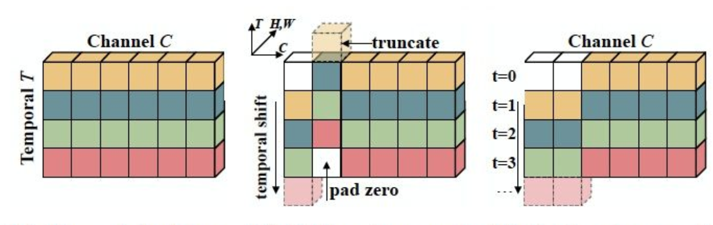
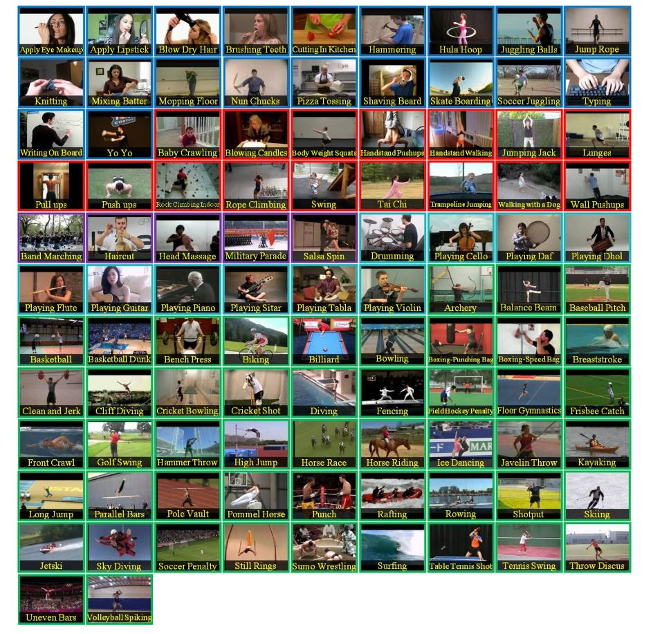

# 项目概述


​		随着互联网上视频的规模日益庞大，人们急切需要研究视频相关算法帮助人们更加容易地找到感兴趣内容的视频。而视频分类算法能够实现自动分析视频所包含的语义信息、理解其内容，对视频进行自动标注、分类和描述，达到与人媲美的准确率。视频分类是继图像分类问题后下一个急需解决的关键任务。

​		视频分类的主要目标是理解视频中包含的内容，确定视频对应的几个关键主题。视频分类（Video Classification）算法将基于视频的语义内容如人类行为和复杂事件等，将视频片段自动分类至单个或多个类别。视频分类不仅仅是要理解视频中的每一帧图像，更重要的是要识别出能够描述视频的少数几个最佳关键主题。本实验将在视频分类数据集上给大家介绍经典的视频分类模型 [TSN（Temporal Segment Networks）](https://arxiv.org/abs/1608.00859)。

​		**关键词: 视频分类、TSN、PaddleVideo**

## 文档目录结构

- (1) 模型简述
- (2) 环境安装
  - (2.1) `PaddlePaddle`安装
    - (2.1.1) 安装对应版本`PaddlePaddle`
    - (2.1.2) 验证安装是否成功
  - (2.2) `PaddleVideo`安装
    - (2.2.1) 下载`PaddleVideo`代码
    - (2.2.2) 安装依赖项目
    - (2.2.3) 验证安装是否成功
- (3) 数据准备
  - (3.1) 数据标注
    - (3.1.1) 精灵标注安装
    - (3.1.2) 精灵标注的使用
  - (3.2) 数据格式转化
  - (3.3) 数据划分
- (4) 模型训练
  - (4.1) 训练前数据准备
  - (4.2) 开始训练
  - (4.3) 主要训练参数说明
  - (4.4) 多卡训练
  - (4.5) 恢复训练
  - (4.6) 训练可视化
- (5) 模型验证与预测
  - (5.1) 开始验证
  - (5.2) 主要验证参数说明
  - (5.3) 评估指标说明
  - (5.4) 开始预测
  - (5.5) 输出说明
- (6) 模型部署与转化
- (7) 配置文件的说明
  - (7.1) 整体配置文件格式综述
  - (7.2) 数据路径与数据预处理说明
  - (7.3) 模型说明
  - (7.4) 优化器和损失函数说明
  - (7.5) 其它参数说明
- (8) 部分参数值推荐说明
  - (8.1) 训练批大小
  - (8.2) 训练轮次大小
  - (8.3) 训练学习率大小
  - (8.4) 训练预热迭代轮次

# (1) 模型简述

​       Temporal Segment Network (TSN) 是视频分类领域经典的基于2D-CNN的解决方案。该方法主要解决视频的长时间行为判断问题，通过稀疏采样视频帧的方式代替稠密采样，既能捕获视频全局信息，也能去除冗余，降低计算量。最终将每帧特征平均融合后得到视频的整体特征，并用于分类。本代码实现的模型为基于单路RGB图像的TSN网络结构，Backbone采用ResNet-50结构。

​       详细内容请参考ECCV 2016年论文[Temporal Segment Networks: Towards Good Practices for Deep Action Recognition](https://arxiv.org/abs/1608.00859)



# (2) 环境安装

## (2.1) `PaddlePaddle`安装

### (2.1.1) 安装对应版本`PaddlePaddle`

​		根据系统和设备的`cuda`环境，选择对应的安装包，这里默认使用`pip`在`linux`设备上进行安装。


​		在终端中执行:

```bash
pip install paddlepaddle-gpu==2.3.0.post110 -f https://www.paddlepaddle.org.cn/whl/linux/mkl/avx/stable.html
```

​		安装效果:


### (2.1.2) 验证安装是否成功

```bash
# 安装完成后您可以使用 python进入python解释器，
python
# 继续输入
import paddle 
# 再输入 
paddle.utils.run_check()
```

​		如果出现`PaddlePaddle is installed successfully!`，说明您已成功安装。


## (2.2) `PaddleVideo`安装

### (2.2.1) 下载`PaddleVideo`代码

​		用户可以通过使用`github`或者`gitee`的方式进行下载，我们当前版本为`PaddleVideo`的`release v2.5`版本。后续在使用时，需要对应版本进行下载。


```bash
# github下载
git clone -b release/2.5 https://github.com/PaddlePaddle/PaddleVideo.git
# gitee下载
git clone -b release/2.5 https://gitee.com/PaddlePaddle/PaddleVideo.git
```

### (2.2.2) 安装依赖项目

* 方式一：
  通过直接`pip install` 安装，可以最高效率的安装依赖

``` bash
pip install ppvideo
```

* 方式二：
  下载`PaddleVideo`代码后，进入`PaddleVideo`代码文件夹目录下面

``` bash
cd PaddleVideo
pip install -r requirements.txt
```

### (2.2.3) 验证安装是否成功

​		如果采用方式一安装依赖项目，则使用以下脚本内容验证是否安装成功，否则无需执行以下验证步骤——无报错即安装成功。

```bash
ppvideo --model_name='ppTSM_v2' --use_gpu=False --video_file='data/example.avi'
```

# (3) 数据准备

## (3.1)      Kinetics数据集

- TSN的训练数据采用由DeepMind公布的Kinetics-400动作识别数据集。数据下载及准备请参考[数据说明](../../data/dataset/README.md)

- Kinetics数据集是DeepMind公开的大规模视频动作识别数据集，有Kinetics400与Kinetics600两个版本。这里使用Kinetics400数据集，具体的数据预处理过程如下。


##  (3.2)     mp4视频下载 

在Code\_Root目录下创建文件夹

    cd $Code_Root/data/dataset && mkdir kinetics
    
    cd kinetics && mkdir data_k400 && cd data_k400
    
    mkdir train_mp4 && mkdir val_mp4

ActivityNet官方提供了Kinetics的下载工具，具体参考其[官方repo ](https://github.com/activitynet/ActivityNet/tree/master/Crawler/Kinetics)即可下载Kinetics400的mp4视频集合。将kinetics400的训练与验证集合分别下载到data/dataset/kinetics/data\_k400/train\_mp4与data/dataset/kinetics/data\_k400/val\_mp4。

##  (3.3)mp4文件预处理

为提高数据读取速度，提前将mp4文件解帧并打pickle包，dataloader从视频的pkl文件中读取数据（该方法耗费更多存储空间）。pkl文件里打包的内容为(video-id,[frame1, frame2,...,frameN],label)。

在 data/dataset/kinetics/data\_k400目录下创建目录train\_pkl和val\_pkl

    cd $Code_Root/data/dataset/kinetics/data_k400
    
    mkdir train_pkl && mkdir val_pkl

进入$Code\_Root/data/dataset/kinetics目录，使用video2pkl.py脚本进行数据转化。首先需要下载[train](https://github.com/activitynet/ActivityNet/tree/master/Crawler/Kinetics/data/kinetics-400_train.csv)和[validation](https://github.com/activitynet/ActivityNet/tree/master/Crawler/Kinetics/data/kinetics-400_val.csv)数据集的文件列表。

首先生成预处理需要的数据集标签文件

    python generate_label.py kinetics-400_train.csv kinetics400_label.txt

然后执行如下程序：

    python video2pkl.py kinetics-400_train.csv $Source_dir $Target_dir  8 #以8个进程为例

- 该脚本依赖`ffmpeg`库，请预先安装`ffmpeg`

对于train数据，

    Source_dir = $Code_Root/data/dataset/kinetics/data_k400/train_mp4
    
    Target_dir = $Code_Root/data/dataset/kinetics/data_k400/train_pkl

对于val数据，

    Source_dir = $Code_Root/data/dataset/kinetics/data_k400/val_mp4
    
    Target_dir = $Code_Root/data/dataset/kinetics/data_k400/val_pkl

这样即可将mp4文件解码并保存为pkl文件。

##  (3.4)生成训练和验证集list

    cd $Code_Root/data/dataset/kinetics
    
    ls $Code_Root/data/dataset/kinetics/data_k400/train_pkl/* > train.list
    
    ls $Code_Root/data/dataset/kinetics/data_k400/val_pkl/* > val.list
    
    ls $Code_Root/data/dataset/kinetics/data_k400/val_pkl/* > test.list
    
    ls $Code_Root/data/dataset/kinetics/data_k400/val_pkl/* > infer.list

即可生成相应的文件列表，train.list和val.list的每一行表示一个pkl文件的绝对路径，示例如下：

    /ssd1/user/models/PaddleCV/PaddleVideo/data/dataset/kinetics/data_k400/train_pkl/data_batch_100-097
    /ssd1/user/models/PaddleCV/PaddleVideo/data/dataset/kinetics/data_k400/train_pkl/data_batch_100-114
    /ssd1/user/models/PaddleCV/PaddleVideo/data/dataset/kinetics/data_k400/train_pkl/data_batch_100-118
    ...

或者

    /ssd1/user/models/PaddleCV/PaddleVideo/data/dataset/kinetics/data_k400/val_pkl/data_batch_102-085
    /ssd1/user/models/PaddleCV/PaddleVideo/data/dataset/kinetics/data_k400/val_pkl/data_batch_102-086
    /ssd1/user/models/PaddleCV/PaddleVideo/data/dataset/kinetics/data_k400/val_pkl/data_batch_102-090
    ...


  

* Human-Object Interaction
* Body-Motion Only
* Human-Human Interaction
* Playing Musical Instruments
* Sports
<center></center>
<center><br>图4 数据集</br></center>

# (4) 模型训练

数据准备完毕后，可以通过如下两种方式启动训练：


```python
export CUDA_VISIBLE_DEVICES=0,1,2,3,4,5,6,7
export FLAGS_fast_eager_deletion_mode=1
export FLAGS_eager_delete_tensor_gb=0.0
export FLAGS_fraction_of_gpu_memory_to_use=0.98
python train.py --model_name=TSN \
                --config=./configs/tsn.yaml \
                --log_interval=10 \
                --valid_interval=1 \
                --use_gpu=True \
                --save_dir=./data/checkpoints \
                --fix_random_seed=False \
                --pretrain=$PATH_TO_PRETRAIN_MODEL

bash run.sh train TSN ./configs/tsn.yaml
```
- 从头开始训练，需要加载在ImageNet上训练的ResNet50权重作为初始化参数，请下载此模型参数并解压，将上面启动命令行或者run.sh脚本中的pretrain参数设置为解压之后的模型参数
存放路径。如果没有手动下载并设置pretrain参数，则程序会自动下载并将参数保存在~/.paddle/weights/ResNet50_pretrained目录下面
- 可下载已发布模型model通过--resume指定权重存
放路径进行finetune等开发

**数据读取器说明：** 模型读取Kinetics-400数据集中的`mp4`数据，每条数据抽取`seg_num`段，每段抽取1帧图像，对每帧图像做随机增强后，缩放至`target_size`。

## (4.1) 训练策略

*  采用Momentum优化算法训练，momentum=0.9
*  权重衰减系数为1e-4
*  学习率在训练的总epoch数的1/3和2/3时分别做0.1的衰减

## (4.2)训练速度优化

*  使用GPU解码优化视频源文件读取和预处理速度，需要预先安装NVIDIA/DALI
*  DALI的安装方式请参考NVIDIA/DALI[官方文档](https://docs.nvidia.com/deeplearning/sdk/dali-developer-guide/docs/compilation.html#)。由于NVIDIA/DALI提供的VideoReader OP不支持TSN模型的采样方式，请使用[SunGaofeng/DALI](https://github.com/SunGaofeng/DALI)提供的源码，提供了时间维度的稀疏采样方式
*  使用分布式训练的方式提升多卡加速比

启动脚本为：

``` bash
bash run_dist.sh train TSN ./configs/tsn_dist_and_dali.yaml
```

## 


```python
class Recognizer2D(paddle.nn.Layer):
    def __init__(self, backbone=None, head=None):
        super().__init__()
        self.backbone = backbone
        self.backbone.init_weights()
        self.head = head
        self.head.init_weights()
    
    def extract_feature(self, imgs):
        """Extract features through a backbone.

        Args:
        imgs (paddle.Tensor) : The input images.

        Returns:
            feature (paddle.Tensor) : The extracted features.
        """
        feature = self.backbone(imgs)
        return feature
    
    def forward(self, imgs, **kwargs):
        """Define how the model is going to run, from input to output.
        """
        batches = imgs.shape[0]  # 批次大小
        num_segs = imgs.shape[1]  # 分割的帧数
        # 对 imgs 进行 reshape，[N,T,C,H,W]->[N*T,C,H,W]
        imgs = paddle.reshape(imgs, [-1] + list(imgs.shape[2:]))
        feature = self.extract_feature(imgs)
        cls_score = self.head(feature, num_segs)
        return cls_score

    """2D recognizer model framework."""

    def train_step(self, data_batch, reduce_sum=False):
        """Define how the model is going to train, from input to output.
        """
        # NOTE: As the num_segs is an attribute of dataset phase, and didn't pass to build_head phase,
        # should obtain it from imgs(paddle.Tensor) now, then call self.head method.

        # labels = labels.squeeze()
        # XXX: unsqueeze label to [label] ?

        imgs = data_batch[0]  # 从批次中取出训练数据
        labels = data_batch[1:]  # 从批次中取出数据对应的标签
        cls_score = self(imgs)  # 计算预测分数
        loss_metrics = self.head.loss(cls_score, labels, reduce_sum)  # 计算损失
        return loss_metrics
    
    def val_step(self, data_batch, reduce_sum=True):
        return self.train_step(data_batch, reduce_sum=reduce_sum)

    def test_step(self, data_batch, reduce_sum=False):
        """Define how the model is going to test, from input to output."""
        # NOTE: (shipping) when testing, the net won't call head.loss,
        # we deal with the test processing in /paddlevideo/metrics
        imgs = data_batch[0]  # 从批次中取出训练数据
        cls_score = self(imgs)  # 计算预测分数
        return cls_score
```


我们可以通过`PaddleVideo`提供的脚本对模型进行训练，在本小节中我们使用`HRNet`模型与`KTH-TIPS`工业材料表面纹理数据集展示训练过程。 在训练之前，最重要的修改自己的数据情况，确保能够正常训练。

​		在本项目中，我们使用`PaddleVideo/ppcls/configs/ImageNet/HRNet/HRNet_W18_C.yaml`进行训练。

​		我们需要修改`PaddleVideo/ppcls/configs/ImageNet/HRNet/HRNet_W18_C.yaml`中数据集的路径、模型的分类数（`class_num`）、模型类别id与实际类别映射文件以及预测后处理输出类别（设置每张图像只输出1个类别），修改为如下内容。

```yaml
# model architecture
Arch:
  name: HRNet_W18_C
  class_num: 10

# data loader for train and eval
DataLoader:
  Train:
    dataset:
      name: ImageNetDataset
      image_root: ./dataset/KTH_TIPS/
      cls_label_path: ./dataset/KTH_TIPS/train_list.txt
      transform_ops:
        - DecodeImage:
            to_rgb: True
            channel_first: False
        - RandCropImage:
            size: 224
        - RandFlipImage:
            flip_code: 1
        - NormalizeImage:
            scale: 1.0/255.0
            mean: [0.485, 0.456, 0.406]
            std: [0.229, 0.224, 0.225]
            order: ''

    sampler:
      name: DistributedBatchSampler
      batch_size: 128
      drop_last: False
      shuffle: True
    loader:
      num_workers: 4
      use_shared_memory: True

  Eval:
    dataset: 
      name: ImageNetDataset
      image_root: ./dataset/KTH_TIPS/
      cls_label_path: ./dataset/KTH_TIPS/val_list.txt
      transform_ops:
        - DecodeImage:
            to_rgb: True
            channel_first: False
        - ResizeImage:
            resize_short: 256
        - CropImage:
            size: 224
        - NormalizeImage:
            scale: 1.0/255.0
            mean: [0.485, 0.456, 0.406]
            std: [0.229, 0.224, 0.225]
            order: ''
    sampler:
      name: DistributedBatchSampler
      batch_size: 64
      drop_last: False
      shuffle: False
    loader:
      num_workers: 4
      use_shared_memory: True
...
Infer:
  infer_imgs: docs/images/inference_deployment/whl_demo.jpg
  ...
  PostProcess:
    name: Topk
    topk: 1
    class_id_map_file: ./dataset/KTH_TIPS/labels.txt
```

* 关键是改动配置中的路径，这一个涉及相对路径，安照提示一步步来，确保最终能够完成。
* 本次项目中使用到的`KTH-TIPS`工业材料表面纹理数据集包含了810张图片，共10种分类，获取数据集的[链接](https://aistudio.baidu.com/aistudio/datasetdetail/179849) :
  * 下载好数据集后，先进入`PaddleVideo`的`dataset`目录下，然后创建`KTH_TIPS`文件夹，接着再把下载好的数据集放在该文件夹内，在该文夹内进行解压提取文件。
  * 解压好数据集后，执行以下脚本将数据按照`70%`用于训练、`20%`用于验证、`10%`用于测试进行划分。

```bash
paddlex --split_dataset --format ImageNet --dataset_dir ./dataset/KTH_TIPS --val_value 0.2 --test_value 0.1
```

- 以上脚本要保证工作目录已进入到`PaddleVideo`目录

- 数据集解压并划分好后的效果:

  - 

  - 另外还需修改`labels.txt`内容如下:

  - ```txt
    0 aluminium_foil
    1 brown_bread
    2 corduroy
    3 cotton
    4 cracker
    5 linen
    6 orange_peel
    7 sandpaper
    8 sponge
    9 styrofoam
    ```

# (5) 模型验证

​		可通过如下两种方式进行模型评估:

```python
python eval.py --model_name=TSN \
               --config=./configs/tsn.yaml \
               --log_interval=1 \
               --weights=$PATH_TO_WEIGHTS \
               --use_gpu=True

bash run.sh eval TSN ./configs/tsn.yaml
```

​	

- 使用`run.sh`进行评估时，需要修改脚本中的`weights`参数指定需要评估的权重

- 若未指定`--weights`参数，脚本会下载已发布模型[model](https://paddlemodels.bj.bcebos.com/video_classification/TSN.pdparams)进行评估

- 评估结果以log的形式直接打印输出TOP1\_ACC、TOP5\_ACC等精度指标

- 使用CPU进行评估时，请将上面的命令行或者run.sh脚本中的`use_gpu`设置为False

当取如下参数时，在Kinetics400的validation数据集下评估精度如下:

| seg\_num | target\_size | Top-1 |
| :------: | :----------: | :---: |
|    3     |     224      | 0.66  |
|    7     |     224      | 0.67  |

# (6) 模型推理

- 可通过如下两种方式启动模型推断：

```python
python predict.py --model_name=TSN \
                  --config=./configs/tsn.yaml \
                  --log_interval=1 \
                  --weights=$PATH_TO_WEIGHTS \
                  --filelist=$FILELIST \
                  --use_gpu=True \
                  --video_path=$VIDEO_PATH

bash run.sh predict TSN ./configs/tsn.yaml
```

- 使用`run.sh`进行评估时，需要修改脚本中的`weights`参数指定需要用到的权重。

- 如果video\_path为'', 则忽略掉此参数。如果video\_path != ''，则程序会对video\_path指定的视频文件进行预测，而忽略掉filelist的值，预测结果为此视频的分类概率。

- 若未指定`--weights`参数，脚本会下载已发布模型[model](https://paddlemodels.bj.bcebos.com/video_classification/TSN.pdparams)进行推断

- 模型推断结果以log的形式直接打印输出，可以看到测试样本的分类预测概率。

- 使用CPU进行推断时，请将命令行或者run.sh脚本中的`use_gpu`设置为False
