# 项目概述

​		本文重点介绍如何利用飞桨目标检测套件`PaddleDetection`在人体检测和人体关键点检测数据集上，使用当前`PaddleDetection`的`PP-TinyPose`模型完成视觉领域中的关键点检测的任务。关键点检测技术通过对人体关键点检测识别实现前方路标的自动检测，从而辅助智能驾驶等应用领域。

​		**关键词: 智慧交通、目标检测、PaddleDetection**

## 文档目录结构

- (1) 模型简述
- (2) 环境安装
  - (2.1) `PaddlePaddle`安装
    - (2.1.1) 安装对应版本`PaddlePaddle`
    - (2.1.2) 验证安装是否成功
  - (2.2) `PaddleDetection`安装
    - (2.2.1) 下载`PaddleDetection`代码
    - (2.2.2) 安装依赖项目
    - (2.2.3) 验证安装是否成功
- (3) 数据准备
  - (3.1) COCO数据集
    - (3.1.1) COCO数据集的准备
    - (3.1.2) COCO数据集（KeyPoint）说明
  - (3.2) MPII数据集
	  - (3.2.1) MPII数据集的准备
    - (3.2.2) MPII数据集的说明
  - (3.3) 其他数据集
- (4) 模型训练
  - (4.1) 训练前数据准备
  - (4.2) 开始训练
  - (4.3) 主要训练参数说明
  - (4.4) 多卡训练
  - (4.5) 恢复训练
  - (4.6) 训练可视化
- (5) 模型验证与预测
  - (5.1) 开始验证
  - (5.2) 主要验证参数说明
  - (5.3) 评估指标说明
  - (5.4) 开始预测
  - (5.5) 主要预测参数说明
  - (5.6) 输出说明
- (6) 模型部署与转化
- (7) 配置文件的说明
  - (7.1) 整体配置文件格式综述
  - (7.2) 数据路径与数据预处理说明
  - (7.3) 模型与损失函数说明
  - (7.4) 优化器说明
  - (7.5) 其它参数说明
- (8) 部分参数值推荐说明
  - (8.1) 训练批大小
  - (8.2) 训练轮次大小
  - (8.3) 训练学习率大小
  - (8.4) 训练预热迭代次数

# (1) 模型简述

​		PP-TinyPose是PaddleDetecion针对移动端设备优化的实时关键点检测模型，可流畅地在移动端设备上执行多人姿态估计任务。借助PaddleDetecion自研的优秀轻量级检测模型[PicoDet](https://gitee.com/paddlepaddle/PaddleDetection/blob/release/2.4/configs/picodet/README.md)，我们同时提供了特色的轻量级垂类行人检测模型。:

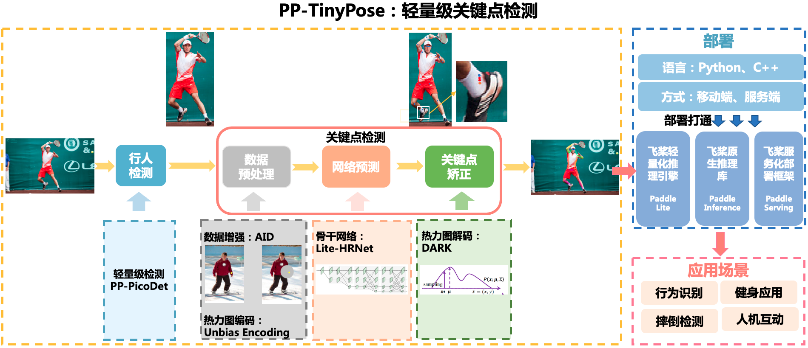

# (2) 环境安装

## (2.1) `PaddlePaddle`安装

### (2.1.1) 安装对应版本`PaddlePaddle`

​		根据系统和设备的`cuda`环境，选择对应的安装包，这里默认使用`pip`在`linux`设备上进行安装。


​		在终端中执行:

```bash
pip install paddlepaddle-gpu==2.3.0.post110 -f https://www.paddlepaddle.org.cn/whl/linux/mkl/avx/stable.html
```

​		安装效果:


### (2.1.2) 验证安装是否成功

```bash
# 安装完成后您可以使用 python进入python解释器，
python
# 继续输入
import paddle 
# 再输入 
paddle.utils.run_check()
```

​		如果出现`PaddlePaddle is installed successfully!`，说明您已成功安装。


## (2.2) `PaddleDetection`安装

### (2.2.1) 下载`PaddleDetection`代码

​		用户可以通过使用`github`或者`gitee`的方式进行下载，我们当前版本为`PaddleDetection`的release v2.5版本。后续在使用时，需要对应版本进行下载。


```bash
# github下载
git clone -b release/2.5 https://github.com/PaddlePaddle/PaddleDetection.git
# gitee下载
git clone -b release/2.5 https://gitee.com/PaddlePaddle/PaddleDetection.git
```

### (2.2.2) 安装依赖项目

* 方式一：
  通过直接`pip install` 安装，可以最高效率的安装依赖

``` bash
pip install paddledet
```

* 方式二：
  下载`PaddleDetection`代码后，进入`PaddleDetection`代码文件夹目录下面

``` bash
cd PaddleDetection
pip install -r requirements.txt
```

### (2.2.3) 验证安装是否成功

​		在`PaddleDetection`目录下执行如下命令，会进行简单的单卡训练和单卡预测。等待模型下载以及查看执行日志，若没有报错，则验证安装成功。

```bash
python tools/infer.py -c configs/ppyolo/ppyolo_r50vd_dcn_1x_coco.yml -o use_gpu=true weights=https://paddledet.bj.bcebos.com/models/ppyolo_r50vd_dcn_1x_coco.pdparams --infer_img=demo/000000014439.jpg
```


# (3) 数据准备

​		无论是语义分割，实例分割，还是目标检测，我们都需要充足的训练数据。下面提供三种数据。

## (3.1) COCO数据集

### (3.1.1) COCO数据集的准备

我们提供了一键脚本来自动完成COCO2017数据集的下载及准备工作，请参考[COCO数据集下载](https://github.com/PaddlePaddle/PaddleDetection/blob/f0a30f3ba6095ebfdc8fffb6d02766406afc438a/docs/tutorials/PrepareDataSet.md#COCO%E6%95%B0%E6%8D%AE)。

### (3.1.2) COCO数据集（KeyPoint）说明
在COCO中，关键点序号与部位的对应关系为：

```
COCO keypoint indexes:
        0: 'nose',
        1: 'left_eye',
        2: 'right_eye',
        3: 'left_ear',
        4: 'right_ear',
        5: 'left_shoulder',
        6: 'right_shoulder',
        7: 'left_elbow',
        8: 'right_elbow',
        9: 'left_wrist',
        10: 'right_wrist',
        11: 'left_hip',
        12: 'right_hip',
        13: 'left_knee',
        14: 'right_knee',
        15: 'left_ankle',
        16: 'right_ankle'
```
与Detection任务不同，KeyPoint任务的标注文件为`person_keypoints_train2017.json`和`person_keypoints_val2017.json`两个json文件。json文件中包含的`info`、`licenses`和`images`字段的含义与Detection相同，而`annotations`和`categories`则是不同的。
在`categories`字段中，除了给出类别，还给出了关键点的名称和互相之间的连接性。
在`annotations`字段中，标注了每一个实例的ID与所在图像，同时还有分割信息和关键点信息。其中与关键点信息较为相关的有：
- `keypoints`：`[x1,y1,v1 ...]`,是一个长度为17*3=51的List,每组表示了一个关键点的坐标与可见性，`v=0, x=0, y=0`表示该点不可见且未标注，`v=1`表示该点有标注但不可见，`v=2`表示该点有标注且可见。
- `bbox`: `[x1,y1,w,h]`表示该实例的检测框位置。
- `num_keypoints`: 表示该实例标注关键点的数目。

## (3.2) MPII数据集

### (3.2.1) MPII数据集的准备

请先通过[MPII Human Pose Dataset](http://human-pose.mpi-inf.mpg.de/#download)下载MPII数据集的图像与对应标注文件，并存放到`dataset/mpii`路径下。标注文件可以采用[mpii_annotations](https://download.openmmlab.com/mmpose/datasets/mpii_annotations.tar),已对应转换为json格式，完成后的目录结构为：
```
mpii
|── annotations
|   |── mpii_gt_val.mat
|   |── mpii_test.json
|   |── mpii_train.json
|   |── mpii_trainval.json
|   `── mpii_val.json
`── images
    |── 000001163.jpg
    |── 000003072.jpg
```


###  (3.2.2)MPII数据集的说明
在MPII中，关键点序号与部位的对应关系为：
```
MPII keypoint indexes:
        0: 'right_ankle',
        1: 'right_knee',
        2: 'right_hip',
        3: 'left_hip',
        4: 'left_knee',
        5: 'left_ankle',
        6: 'pelvis',
        7: 'thorax',
        8: 'upper_neck',
        9: 'head_top',
        10: 'right_wrist',
        11: 'right_elbow',
        12: 'right_shoulder',
        13: 'left_shoulder',
        14: 'left_elbow',
        15: 'left_wrist',
```
下面以一个解析后的标注信息为例，说明标注的内容，其中每条标注信息标注了一个人物实例：
```
{
    'joints_vis': [0, 0, 0, 0, 0, 0, 0, 1, 1, 1, 1, 1, 1, 1, 1, 1],
    'joints': [
        [-1.0, -1.0],
        [-1.0, -1.0],
        [-1.0, -1.0],
        [-1.0, -1.0],
        [-1.0, -1.0],
        [-1.0, -1.0],
        [-1.0, -1.0],
        [1232.0, 288.0],
        [1236.1271, 311.7755],
        [1181.8729, -0.77553],
        [692.0, 464.0],
        [902.0, 417.0],
        [1059.0, 247.0],
        [1405.0, 329.0],
        [1498.0, 613.0],
        [1303.0, 562.0]
    ],
    'image': '077096718.jpg',
    'scale': 9.516749,
    'center': [1257.0, 297.0]
}
```
- `joints_vis`：分别表示16个关键点是否标注，若为0，则对应序号的坐标也为`[-1.0, -1.0]`。
- `joints`：分别表示16个关键点的坐标。
- `image`：表示对应的图片文件。
- `center`：表示人物的大致坐标，用于定位人物在图像中的位置。
- `scale`：表示人物的比例，对应200px。

## (3.3) 其他数据集

这里我们以`AIChallenger`数据集为例，展示如何将其他数据集对齐到COCO格式并加入关键点模型训练中。

`AI challenger`的标注格式如下：
```
AI Challenger Description:
        0: 'Right Shoulder',
        1: 'Right Elbow',
        2: 'Right Wrist',
        3: 'Left Shoulder',
        4: 'Left Elbow',
        5: 'Left Wrist',
        6: 'Right Hip',
        7: 'Right Knee',
        8: 'Right Ankle',
        9: 'Left Hip',
        10: 'Left Knee',
        11: 'Left Ankle',
        12: 'Head top',
        13: 'Neck'
```
1. 将`AI Challenger`点位序号，调整至与`COCO`数据集一致，（如`Right Shoulder`的序号由`0`调整到`13`。
2. 统一是否标注/可见的标志位信息，如`AI Challenger`中`标注且可见`需要由`1`调整到`2`。
3. 在该过程中，舍弃该数据集特有的点位（如`Neck`)；同时该数据集中没有的COCO点位（如`left_eye`等），对应设置为`v=0, x=0, y=0`，表示该未标注。
4. 为了避免不同数据集ID重复的问题，需要重新排列图像的`image_id`和`annotation id`。
5. 整理图像路径`file_name`，使其能够被正确访问到。

我们提供了整合`COCO`训练集和`AI Challenger`数据集的[标注文件](https://bj.bcebos.com/v1/paddledet/data/keypoint/aic_coco_train_cocoformat.json)，供您参考调整后的效果。


# (4) 模型训练

## (4.1) 训练前准备

​		我们可以通过`PaddleDetection`提供的脚本对模型进行训练，在本小节中我们使用 `PP-TinyPose` 模型与`coco_val_person_mini`关键点数据数据集展示训练过程。 在训练之前，最重要的是修改自己的数据情况，确保能够正常训练。

​		在本项目中，涉及到 picodet 和 tiny_pose 两个模型配置文件，具体如下：

- 使用```configs/picodet/application/pedestrian_detection/picodet_s_320_lcnet_pedestrian.yml```训练PicoDet行人检测模型 ；
- 使用```configs/keypoint/tiny_pose/tinypose_128x96.yml``` 训练TinyPose关键点检测模型。

​		在这里改动训练配置文件中数据集路径，修改为如下内容。

- configs/keypoint/tiny_pose/tinypose_128x96.yml

```yaml
TrainDataset:
  !KeypointTopDownCocoDataset
    image_dir: ""
    anno_path: aic_coco_train_cocoformat.json
    dataset_dir: dataset
    num_joints: *num_joints
    trainsize: *trainsize
    pixel_std: *pixel_std
    use_gt_bbox: True


EvalDataset:
  !KeypointTopDownCocoDataset
    image_dir: val2017
    anno_path: annotations/person_keypoints_val2017.json
    dataset_dir: dataset/coco
    num_joints: *num_joints
    trainsize: *trainsize
    pixel_std: *pixel_std
    use_gt_bbox: True
    image_thre: 0.5

TestDataset:
  !ImageFolder
    anno_path: dataset/coco/keypoint_imagelist.txt
```

**Note**

* 关键改动的配置中的路径，这一个涉及相对路径，安照提示一步步来，确保最终能够完成。
* 本次项目中使用到的数据[下载链接](https://paddlemodels.bj.bcebos.com/object_detection/roadsign_voc.tar)，本章节将使用路标检测（`Road Sign Detection`）数据集进行训练，路标检测是一组不同路标组成的`VOC`格式数据集，包含了701张训练图片、176张验证图片、0张测试图片，包含4个类别: `crosswalk`，`speedlimit`，`stop`，`trafficlight`.(以下是目录结构)

```bash
|--roadsign_voc
|	|--annotations
|		|--image1.xml
|		|--...
|	|--images
|		|--image1.png
|		|--...
|	|--label_list.txt
|	|--train.txt
|	|--valid.txt
```

## (4.2) 开始训练

​		请确保已经完成了`PaddleDetection`的安装工作，并且当前位于`PaddleDetection`目录下，执行以下脚本：

```bash
export CUDA_VISIBLE_DEVICES=0 # 设置1张可用的卡

# 训练PicoDet行人检测模型
python tools/train.py -c configs/picodet/application/pedestrian_detection/picodet_s_320_lcnet_pedestrian.yml \
        --use_vdl=True \
        --vdl_log_dir=./output/vdl_log_dir/scalar

#训练TinyPose关键点检测模型
python tools/train.py -c configs/keypoint/tiny_pose/tinypose_128x96.yml \
        --use_vdl=True \
        --vdl_log_dir=./output/vdl_log_dir/scalar
```

​	执行效果:

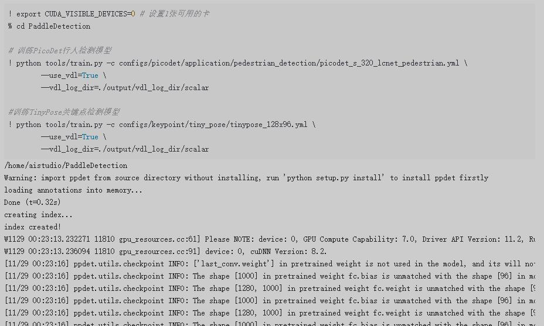

## (4.3) 主要训练参数说明

| 主要参数名    | 用途                                                         | 是否必选项 | 默认值             |
| :------------ | :----------------------------------------------------------- | :--------- | :----------------- |
| -c            | 指定训练模型的yaml文件                                       | 是         | 无                 |
| -o            | 修改yaml中的一些训练参数值                                   | 否         | 无                 |
| -r            | 指定模型参数进行继续训练                                     | 否         | 无                 |
| -o save_dir   | 修改yaml中模型保存的路径(不使用该参数，默认保存在output目录下) | 否         | output             |
| --eval        | 指定训练时是否边训练边评估                                   | 否         | -                  |
| --use_vdl     | 指定训练时是否使用visualdl记录数据                           | 否         | False              |
| --vdl_log_dir | 指定visualdl日志文件的保存路径                               | 否         | vdl_log_dir/scalar |
| --slim_config | 指定裁剪/蒸馏等模型减小的配置                                | 否         | 无                 |
| --amp         | 启动混合精度训练                                             | 否         | False              |

## (4.4) 多卡训练

​		如果想要使用多卡训练的话，需要将环境变量`CUDA_VISIBLE_DEVICES`指定为多卡（不指定时默认使用所有的`gpu`)，并使用`paddle.distributed.launch`启动训练脚本（`windows`下由于不支持`nccl`，无法使用多卡训练）:

```bash
export CUDA_VISIBLE_DEVICES=0,1,2,3 # 设置4张可用的卡
python tools/train.py -c configs/keypoint/tiny_pose/tinypose_128x96.yml \
    -o save_dir=./output \
    --eval \
    --use_vdl=True \
    --vdl_log_dir=./output/vdl_log_dir/scalar
```

​		执行效果:

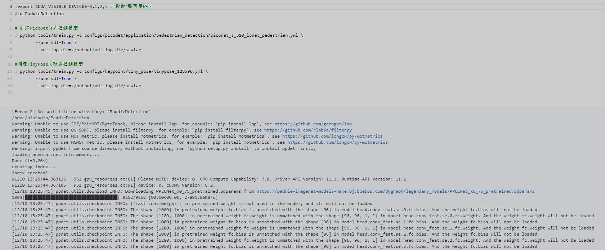

## (4.5) 恢复训练

```bash
# 训练PicoDet行人检测模型
! python tools/train.py -c configs/picodet/application/pedestrian_detection/picodet_s_320_lcnet_pedestrian.yml \
	-r ./output/picodet_s_320_lcnet_pedestrian/19 \
    -o save_dir=./output \
    --eval \
    --use_vdl=True \
    --vdl_log_dir=./output/vdl_log_dir/scalar

#训练TinyPose关键点检测模型
! python tools/train.py -c configs/keypoint/tiny_pose/tinypose_128x96.yml \
	-r ./output/tinypose_128x96/19 \
    -o save_dir=./output \
    --eval \
    --use_vdl=True \
    --vdl_log_dir=./output/vdl_log_dir/scalar
```

​		执行效果:

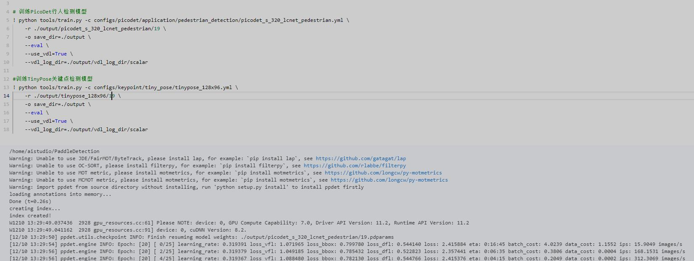

## (4.6) 训练可视化

​		`PaddleDetection`会将训练过程中的数据写入`VisualDL`文件，并实时的查看训练过程中的日志，记录的数据包括：

1. 当前计算各种损失的变化趋势
2. 日志记录时间
3. `mAP`变化趋势（当打开了`do_eval`开关后生效）

使用如下命令启动`VisualDL`查看日志

```bash
# 下述命令会在127.0.0.1上启动一个服务，支持通过前端web页面查看，可以通过--host这个参数指定实际ip地址
visualdl --logdir ./output/vdl_log_dir/scalar
```

在浏览器输入提示的网址，效果如下：

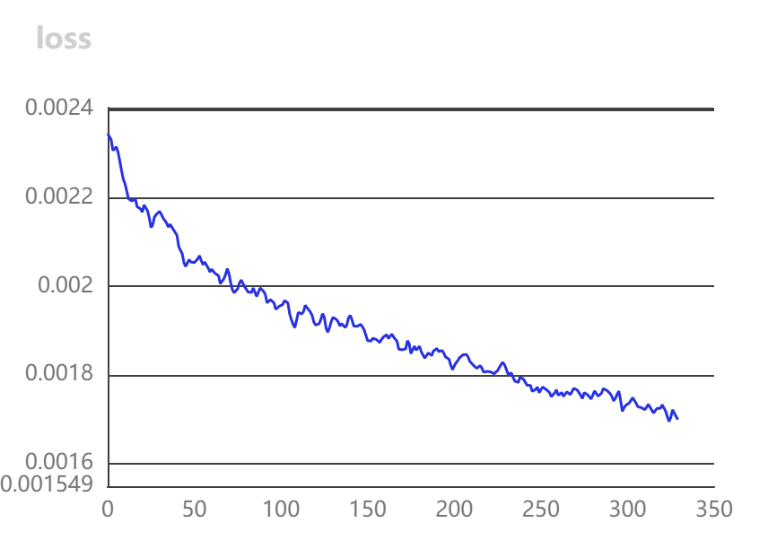

# (5) 模型验证与预测

## (5.1) 开始验证

​		训练完成后，用户可以使用评估脚本`tools/eval.py`来评估模型效果。假设训练过程中迭代轮次（`epoch`）为20，保存模型的间隔为10，即每迭代10次数据集保存1次训练模型。因此一共会产生2个定期保存的模型，加上保存的最佳模型`best_model`，一共有3个模型，可以通过`-o weights`指定期望评估的模型文件。

```bash
# 行人检测模型
!python tools/eval.py -c configs/picodet/application/pedestrian_detection/picodet_s_320_lcnet_pedestrian.yml \
  -o weights=./output/picodet_s_320_lcnet_pedestrian/19 \

#关键点检测模型
!python tools/eval.py -c configs/keypoint/tiny_pose/tinypose_128x96.yml \
  -o weights=-o weights=./output/tinypose_128x96/19
```

​		执行效果:

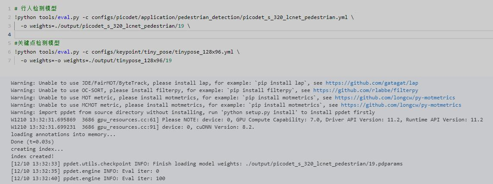

​		如果获取评估后各个类别的`PR`曲线图像，可通过传入`--classwise`进行开启。使用示例如下：

```bash
python tools/eval.py -c configs/keypoint/tiny_pose/tinypose_128x96.yml \
	-o use_gpu=true \
	-o weights=./output/tinypose_128x96/39 \
	--classwise
```

​		图像保存在`PaddleDetection/voc_pr_curve`目录下，以下是其中一个类别的`PR`曲线图:

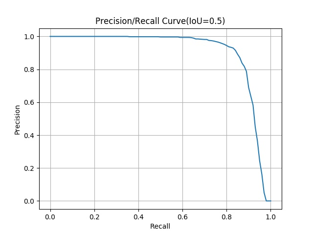

## (5.2) 主要验证参数说明

| 主要参数名             | 用途                                       | 是否必选项 | 默认值 |
| ---------------------- | ------------------------------------------ | ---------- | ------ |
| -c                     | 指定训练模型的yaml文件                     | 是         | 无     |
| -o                     | 修改yaml中的一些训练参数值                 | 是         | 无     |
| -o use_gpu             | 指定评估时是否采用gpu                      | 否         | false  |
| -o weights             | 指定评估时模型采用的模型参数               | 否         | 无     |
| --output_eval          | 指定一个目录保存评估结果                   | 否         | None   |
| --json_eval            | 指定一个bbox.json/mask.json用于评估        | 否         | False  |
| --slim_config          | 指定裁剪/蒸馏等模型减小的配置              | 否         | None   |
| --bias                 | 对于取得w和h结果加上一个偏置值             | 否         | 无     |
| --classwise            | 指定评估结束后绘制每个类别的AP以及PR曲线图 | 否         | -      |
| --save_prediction_only | 指定评估仅保存评估结果                     | 否         | False  |
| --amp                  | 指定评估时采用混合精度                     | 否         | False  |

**注意** 如果你想提升显存利用率，可以适当的提高 `num_workers` 的设置，以防`GPU`工作期间空等。

## (5.3) 评估指标说明

​		在目标检测领域中，评估模型质量主要是通过1个指标进行判断：`mAP`(平均精度)。

- `IOU`: 预测目标与真实目标的交并比

  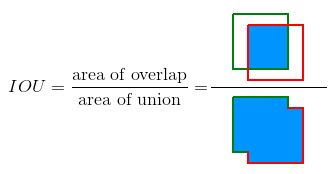

- `AP`: 单个类别PR曲线下的面积，其中`P`为精确度，`R`为召回率。

  

- `TP`: 预测目标的IOU>设定的某一个`IOU`阈值且预测正确时的检测框数量

- `FP`: 预测目标的IOU<设定的某一个`IOU`阈值且预测正确时/与单个真实框匹配后多余出来满足阈值的检测框数量

- `FN`: 没有检测到的真实框的数量

- `mAP`: 所有类别的AP的平均值

随着评估脚本的运行，最终打印的评估日志如下。(此时`VOC`指标计算的`IOU`阈值为0.5)

```bash
 Average Precision  (AP) @[ IoU=0.50:0.95 | area=   all | maxDets= 20 ] = 0.607
 Average Precision  (AP) @[ IoU=0.50      | area=   all | maxDets= 20 ] = 0.842
 Average Precision  (AP) @[ IoU=0.75      | area=   all | maxDets= 20 ] = 0.678
 Average Precision  (AP) @[ IoU=0.50:0.95 | area=medium | maxDets= 20 ] = 0.573
 Average Precision  (AP) @[ IoU=0.50:0.95 | area= large | maxDets= 20 ] = 0.619
 Average Recall     (AR) @[ IoU=0.50:0.95 | area=   all | maxDets= 20 ] = 0.644
 Average Recall     (AR) @[ IoU=0.50      | area=   all | maxDets= 20 ] = 0.852
 Average Recall     (AR) @[ IoU=0.75      | area=   all | maxDets= 20 ] = 0.707
 Average Recall     (AR) @[ IoU=0.50:0.95 | area=medium | maxDets= 20 ] = 0.611
 Average Recall     (AR) @[ IoU=0.50:0.95 | area= large | maxDets= 20 ] = 0.654
| AP | Ap .5 | AP .75 | AP (M) | AP (L) | AR | AR .5 | AR .75 | AR (M) | AR (L) |
|---|---|---|---|---|---|---|---|---|---|---|
| 0.607 | 0.842 | 0.678 | 0.573 | 0.619 | 0.644 | 0.852 | 0.707 | 0.611 | 0.654 |
[12/10 13:35:46] ppdet.engine INFO: Total sample number: 921, averge FPS: 67.6847899829663
```

## (5.4) 开始预测

​		除了可以分析模型的准确率指标之外，我们还可以对一些具体样本的预测效果，从`Bad Case`启发进一步优化的思路。

​		`tools/infer.py`脚本是专门用来可视化预测案例的，命令格式如下所示：

```bash
!python deploy/python/det_keypoint_unite_infer.py --det_model_dir=output_inference/picodet_s_320_lcnet_pedestrian \
        --keypoint_model_dir=output_inference/tinypose_128x96 \
        --image_file=demo/000000570688.jpg --device=GPU --keypoint_threshold=0.35
```

​		执行效果:

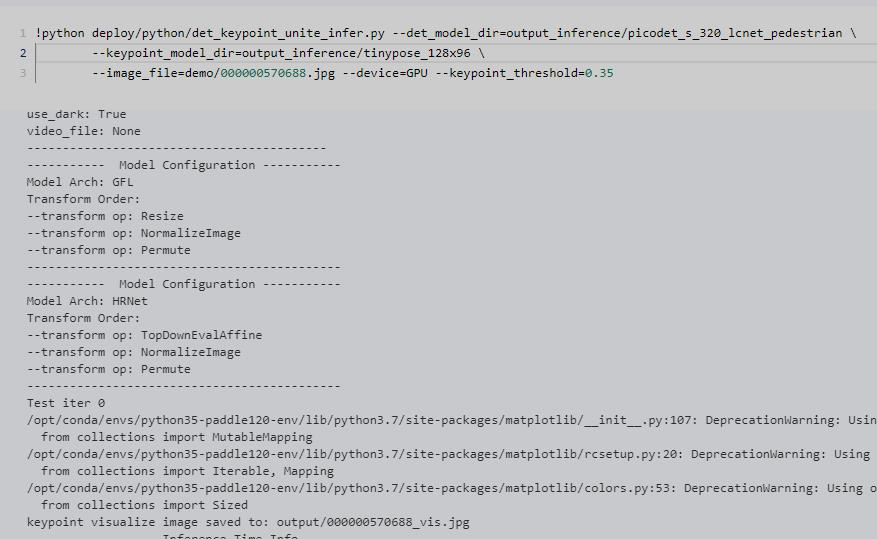

​		其中`--infer_img`是一张图片的路径，还可以用`--infer_dir`指定一个包含图片的目录，这时候将对该图片或文件列表或目录内的所有图片进行预测并保存可视化结果图。以下是预测的效果图:

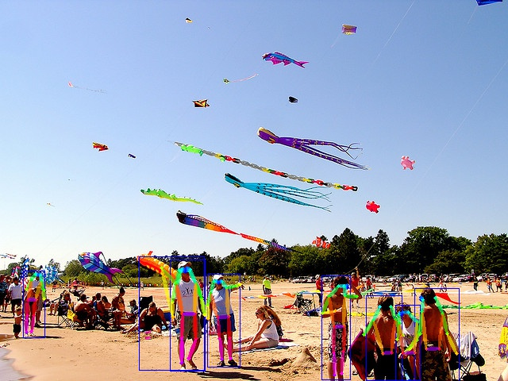

如果需要保存预测结果`json`文件，可以使用以下指令:

```bash
!python deploy/python/det_keypoint_unite_infer.py --det_model_dir=output_inference/picodet_s_320_lcnet_pedestrian \
        --keypoint_model_dir=output_inference/tinypose_128x96 \
        --image_file=demo/000000570688.jpg \
        --device=GPU --keypoint_threshold=0.35 \
    	--save_res=True
```

另外如果需平滑每个帧的关键点，确保关键点更稳定，可以通过以下指令进行:

```bash
!python deploy/python/det_keypoint_unite_infer.py --det_model_dir=output_inference/picodet_s_320_lcnet_pedestrian \
        --keypoint_model_dir=output_inference/tinypose_128x96 \
        --image_file=demo/000000570688.jpg \
        --device=GPU --keypoint_threshold=0.35 \
    	--smooth=True
```

其中`--slice_infer`开启切片，`--slice_size`设置切片大小。

## (5.5) 主要预测参数说明

| 主要参数名        | 用途                                                         | 是否必选项 | 默认值            |
| ----------------- | ------------------------------------------------------------ | ---------- | ----------------- |
| -c                | 指定训练模型的yaml文件                                       | 是         | 无                |
| -o                | 修改yaml中的一些训练参数值                                   | 是         | 无                |
| -o use_gpu        | 指定评估时是否采用gpu                                        | 否         | False             |
| -o weights        | 指定评估时模型采用的模型参数                                 | 否         | 无                |
| --visualize       | 指定预测结果要进行可视化                                     | 否         | True              |
| --output_dir      | 指定预测结果保存的目录                                       | 否         | None              |
| --draw_threshold  | 指定预测绘图时的得分阈值                                     | 否         | 0.5               |
| --slim_config     | 指定裁剪/蒸馏等模型减小的配置                                | 否         | None              |
| --use_vdl         | 指定预测时利用visualdl将预测结果(图像)进行记录               | 否         | False             |
| --vdl_log_dir     | 指定visualdl日志文件保存目录                                 | 否         | vdl_log_dir/image |
| --save_results    | 指定预测结果要进行保存                                       | 否         | False             |
| --slice_infer     | 指定评估时采用切片进行预测评估(对于smalldet采用)             | 否         | -                 |
| --slice_size      | 指定评估时的切片大小(以下指令均上一个指令使用时有效)         | 否         | [640,640]         |
| --overlap_ratio   | 指定评估时的切片图像的重叠高度比率(上一个指令使用时有效)     | 否         | [0.25,0.25]       |
| --combine_method  | 指定评估时的切片图像检测结果的整合方法，支持: nms, nmm, concat | 否         | nms               |
| --match_threshold | 指定评估时的切片图像检测结果的整合匹配的阈值，支持: 0-1.0    | 否         | 0.6               |
| --match_metric    | 指定评估时的切片图像检测结果的整合匹配的指标(支持)，支持: iou,ios | 否         | ios               |


## (5.6) 输出说明

- 当你指定输出位置`--output_dir ./output`后，在默认文件夹`output`下将生成与预测图像同名的预测结果图像:

```bash
# 预测图像image1.png
|--output
|	|--模型权重输出文件夹
|		|...
|	|...
|	|--bbox.json
|	|--image1.png
```

# (6) 模型部署与转化

```python
# 导出行人检测模型
!python tools/export_model.py -c configs/picodet/application/pedestrian_detection/picodet_s_320_lcnet_pedestrian.yml \
        -o weights=https://paddledet.bj.bcebos.com/models/picodet_s_320_lcnet_pedestrian.pdparams

# 导出关键点检测模型
!python tools/export_model.py -c configs/keypoint/tiny_pose/tinypose_128x96.yml \
        -o weights=https://bj.bcebos.com/v1/paddledet/models/keypoint/tinypose_128x96.pdparams
```


# (7) 配置文件说明

​		正是因为有配置文件的存在，我们才可以使用更便捷的进行消融实验。在本章节中我们选择
```configs/keypoint/tiny_pose/tinypose_128x96.yml```文件来进行配置文件的详细解读。

## (7.1) 整体配置文件格式综述

我们将```tinypose_128x96.yml```进行拆分解释

* **tinypose** 表示模型的名称
* **128x96** 表示模型训练的目标图像大小

**配置文件示例说明**

当前`PaddleDetection`为了降低配置冗余，将配置文件打散。要实现一个模型的训练，往往需要多个配置文件才可运行，如，我们现在选择的```picodet_s_416_coco_lcnet.yml```，需要逐层依赖`../datasets/coco_detection.yml`、`_base_/picodet_v2.yml`、`_base_/optimizer_300e.yml` 、`_base_/picodet_416_reader.yml`、`../runtime.yml`。

如果遇到相同的配置项，则直接使用的文件的地位最高，依赖文件越往后地位递减——即主配置文件优先级最高。

由于每个模型对于依赖文件的情况大致相同，因此以`yolov3`模型的所有配置文件展开示意图为例对本文所实验的模型进行说明:

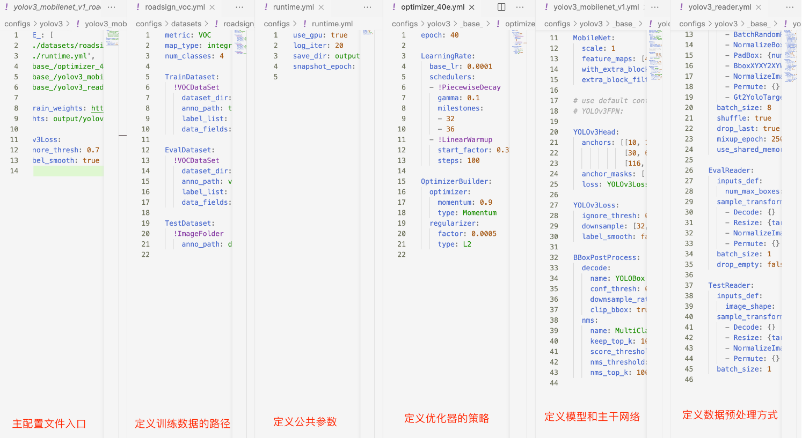

一个模型的配置文件按功能可以分为:

- **主配置文件入口**: `tinypose_128x96.yml`

## (7.2) 数据路径与数据预处理说明

​		这一小节主要是说明数据部分，当准备好数据，如何进行配置文件修改，以及该部分的配置文件有什么内容。

**首先是进行数据路径配置

```yaml
weights: output/tinypose_128x96/model_final
epoch: 420
num_joints: &num_joints 17  # 预测的点数与定义点数量一致
pixel_std: &pixel_std 200
metric: KeyPointTopDownCOCOEval # VOC数据集评价指标: KeyPointTopDownCOCOEval
num_classes: 1  # 数据的分类数(不包含类别背景)

# 保证dataset_dir + anno_path 能正确定位到标注文件位置
# 保证dataset_dir + image_dir + 标注文件中的图片路径能正确定位到图片
TrainDataset:
  !KeypointTopDownCocoDataset
    image_dir: ""
    anno_path: aic_coco_train_cocoformat.json
    dataset_dir: dataset
    num_joints: *num_joints
    trainsize: *trainsize
    pixel_std: *pixel_std
    use_gt_bbox: True


EvalDataset:
  !KeypointTopDownCocoDataset
    image_dir: val2017
    anno_path: annotations/person_keypoints_val2017.json
    dataset_dir: dataset/coco
    num_joints: *num_joints
    trainsize: *trainsize
    pixel_std: *pixel_std
    use_gt_bbox: True
    image_thre: 0.5

TestDataset:
  !ImageFolder
    anno_path: dataset/coco/keypoint_imagelist.txt
```

## (7.3) 模型与损失函数说明

当我们配置好数据后，下面在看关于模型和主干网络的选择

``` yaml
architecture: TopDownHRNet# 模型架构名称
pretrain_weights:  https://paddle-imagenet-models-name.bj.bcebos.com/dygraph/legendary_models/PPLCNet_x0_75_pretrained.pdparams # 预训练模型路径

# 模型架构的配置
TopDownHRNet:
  backbone: LiteHRNet # 骨干网络
  post_process: HRNetPostProcess # 后处理
  flip_perm: *flip_perm
  num_joints: *num_joints
  width: &width 40
  loss: KeyPointMSELoss # 关键点检测损失函数
  use_dark: true # 是否启动dark检测模式

# LiteHRNet 网络配置
LiteHRNet:
  network_type: wider_naive
  freeze_at: -1
  freeze_norm: false
  return_idx: [0]

# 关键点检测损失函数配置
KeyPointMSELoss:
  use_target_weight: true
  loss_scale: 1.0


```

  **Note**

* 我们模型的`architecture`是`PicoDet`。
* 主干网络是 `LCNet`，在这里我们可以自由更换，比如换成`ResNet50_vd`, 不同的主干网络需要选择不同的参数。
* `nms` 此部分内容是预测与评估的后处理，一般可以根据需要调节`threshold`参数来优化处理效果。

## (7.4) 优化器说明

当我们配置好数据与模型后，下面再看关于优化器的选择

``` yaml
epoch: 300 # 训练轮次
# 学习率
LearningRate:
  base_lr: 0.008 # 基础学习率大小——单卡GPU需要除以4
  schedulers:  # 学习率策略
  - !PiecewiseDecay # PiecewiseDecay衰减策略
    milestones: [380, 410]
    gamma: 0.1
  - !LinearWarmup # 线性预热策略
    start_factor: 0.001
    steps: 500  # 预热步数为500次迭代
```

## (7.5) 其它参数说明

``` yaml
use_gpu: true # 使用GPU
log_iter: 20 # 日志输出间隔
save_dir: output # 模型文件保存路径
snapshot_epoch: 1 # 快照输出频率(包括模型保存与评估)
flip_perm: &flip_perm [[1, 2], [3, 4], [5, 6], [7, 8], [9, 10], [11, 12], [13, 14], [15, 16]] # 镜像翻转
```

# (8) 部分参数值推荐说明

## (8.1) 训练批大小

```yaml
batch_size: 64
```

​		批大小(batch_size)通常取值: **32, 64, 128, 256, 512**。

​		一般可以按照数据集中训练的样本(图像)数量大小以及期望一轮训练迭代次数来大致取值。

- 如果数据集训练样本数量为: `N`
- 期望一轮训练迭代次数为: `I`
- 得到大致`batch_size`大小: `B = N/I`

如果B大于32小于64，则可以选32；以此类推。

**Note**

- `batch_size`会收显存大小影响，因此过大的批大小可能大致运行训练失败——因为GPU显存不够。
- `batch_size` 是训练神经网络中的一个重要的超参数，该值决定了一次将多少数据送入神经网络参与训练。论文 [Accurate, Large Minibatch SGD: Training ImageNet in 1 Hour](https://arxiv.org/abs/1706.02677)，当 `batch size` 的值与学习率的值呈线性关系时，收敛精度几乎不受影响。在训练 ImageNet 数据时，大部分的神经网络选择的初始学习率为 0.1，`batch size` 是 256，所以根据实际的模型大小和显存情况，可以将学习率设置为 0.1*k, batch_size 设置为 256*k。在实际任务中，也可以将该设置作为初始参数，进一步调节学习率参数并获得更优的性能。

## (8.2) 训练轮次大小

```bash
epoch: 300
```

​		轮次(`epochs`)通常取值: **300, 500, 650, 1300。**

​		如果取300轮效果不理想，可以用350轮尝试，如果效果有提升则可以用大的训练轮次进行训练。

## (8.3) 训练学习率大小

```yaml
base_lr: 0.32
```

​		学习率(`learning_rate`)通常取配置文件的默认值，如果性能不好，可以尝试调小或调大，公式: $new\_lr=lr * ratio$。其中调小时: `ratio`可以取`0.5`或者`0.1`；而调大时:  `ratio`可以取或`1.0`者`2.0`。但学习率一般不超过1.0，否则容易训练不稳定。

​		如果配置文件所对应的模型默认为N卡训练的模型，则需要对学习率除以卡数N: $new\_lr=lr / N$。

​		由于本模型默认为4卡训练的，因此如果是在单卡上训练该模型需要修改学习率为`0.08`。

## (8.4) 训练预热迭代次数

```yaml
- !LinearWarmup
    start_factor: 0.1
    steps: 300
```

​		预热迭代次数(`steps`)一般取总迭代轮次的`1/20`或`1/15`所对应的迭代次数。
