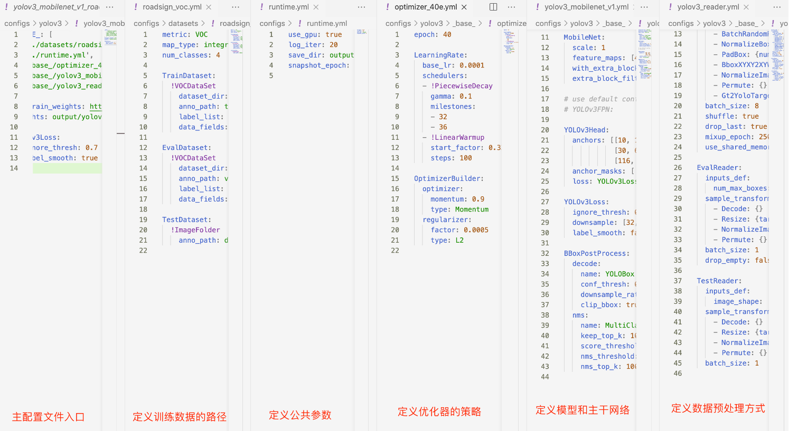

# 项目概述

​		本文重点介绍如何利用飞桨目标检测套件`PaddleDetection`在人体多目标跟踪数据集上，使用当前`PaddleDetection`的`FairMOT`模型完成视觉领域中的多目标跟踪的任务。多目标跟踪技术通过对人体多目标跟踪实现前行人跟踪。

​		**关键词: 智慧交通、目标检测、PaddleDetection**

## 文档目录结构

- (1) 模型简述
- (2) 环境安装
  - (2.1) `PaddlePaddle`安装
    - (2.1.1) 安装对应版本`PaddlePaddle`
    - (2.1.2) 验证安装是否成功
  - (2.2) `PaddleDetection`安装
    - (2.2.1) 下载`PaddleDetection`代码
    - (2.2.2) 安装依赖项目
    - (2.2.3) 验证安装是否成功
- (3) 数据准备
  - (3.1) COCO数据集
    - (3.1.1) COCO数据集的准备
    - (3.1.2) COCO数据集（KeyPoint）说明
  - (3.2) MPII数据集
	  - (3.2.1) MPII数据集的准备
    - (3.2.2) MPII数据集的说明
  - (3.3) 其他数据集
- (4) 模型训练
  - (4.1) 训练前数据准备
  - (4.2) 开始训练
  - (4.3) 主要训练参数说明
  - (4.4) 多卡训练
  - (4.5) 恢复训练
  - (4.6) 训练可视化
- (5) 模型验证与预测
  - (5.1) 开始验证
  - (5.2) 主要验证参数说明
  - (5.3) 评估指标说明
  - (5.4) 开始预测
  - (5.5) 主要预测参数说明
  - (5.6) 输出说明
- (6) 模型部署与转化
- (7) 配置文件的说明
  - (7.1) 整体配置文件格式综述
  - (7.2) 数据路径与数据预处理说明
  - (7.3) 模型与损失函数说明
  - (7.4) 优化器说明
  - (7.5) 其它参数说明
- (8) 部分参数值推荐说明
  - (8.1) 训练批大小
  - (8.2) 训练轮次大小
  - (8.3) 训练学习率大小
  - (8.4) 训练预热迭代次数

# (1) 模型简述

​        [FairMOT](https://arxiv.org/abs/2004.01888)以Anchor Free的CenterNet检测器为基础，克服了Anchor-Based的检测框架中anchor和特征不对齐问题，深浅层特征融合使得检测和ReID任务各自获得所需要的特征，并且使用低维度ReID特征，提出了一种由两个同质分支组成的简单baseline来预测像素级目标得分和ReID特征，实现了两个任务之间的公平性，并获得了更高水平的实时多目标跟踪精度。

​        FairMOT属于JDE（Jointly learns the Detector and Embedding model ）的一种。实验证明了现有的JDE方法存在一些不足，FairMOT根据这些不足进行了相关的改进。

- Encoder-decoder网络提取的（stride=4）高分辨率特征图将被作为四个分支的特征图。其中三个被用来检测物体（Detection），一个被用来输出物体的Re-ID信息(Re-ID)。
- 每个分支都被称为一个head分支。每个head除了最后输出通道维度的不同，其组成都类似，每个head由一个3x3卷积层后面接一个1x1卷积层实现的。


# (2) 环境安装

## (2.1) `PaddlePaddle`安装

### (2.1.1) 安装对应版本`PaddlePaddle`

​		根据系统和设备的`cuda`环境，选择对应的安装包，这里默认使用`pip`在`linux`设备上进行安装。


​		在终端中执行:

```bash
pip install paddlepaddle-gpu==2.3.0.post110 -f https://www.paddlepaddle.org.cn/whl/linux/mkl/avx/stable.html
```

​		安装效果:


### (2.1.2) 验证安装是否成功

```bash
# 安装完成后您可以使用 python进入python解释器，
python
# 继续输入
import paddle 
# 再输入 
paddle.utils.run_check()
```

​		如果出现`PaddlePaddle is installed successfully!`，说明您已成功安装。


## (2.2) `PaddleDetection`安装

### (2.2.1) 下载`PaddleDetection`代码

​		用户可以通过使用`github`或者`gitee`的方式进行下载，我们当前版本为`PaddleDetection`的release v2.5版本。后续在使用时，需要对应版本进行下载。


```bash
# github下载
git clone -b release/2.5 https://github.com/PaddlePaddle/PaddleDetection.git
# gitee下载
git clone -b release/2.5 https://gitee.com/PaddlePaddle/PaddleDetection.git
```

### (2.2.2) 安装依赖项目

* 方式一：
  通过直接`pip install` 安装，可以最高效率的安装依赖

``` bash
pip install paddledet
```

* 方式二：
  下载`PaddleDetection`代码后，进入`PaddleDetection`代码文件夹目录下面

``` bash
cd PaddleDetection
pip install -r requirements.txt
```

### (2.2.3) 验证安装是否成功

​		在`PaddleDetection`目录下执行如下命令，会进行简单的单卡训练和单卡预测。等待模型下载以及查看执行日志，若没有报错，则验证安装成功。

```bash
python tools/infer.py -c configs/ppyolo/ppyolo_r50vd_dcn_1x_coco.yml -o use_gpu=true weights=https://paddledet.bj.bcebos.com/models/ppyolo_r50vd_dcn_1x_coco.pdparams --infer_img=demo/000000014439.jpg
```


# (3) 数据准备

​		目前许多团队提供了众多公开数据集或整理后数据集的下载链接，参考[数据集下载汇总可以自行下载使用。

​       根据模型选型总结，MOT数据集可以分为两类：一类纯检测框标注的数据集，仅SDE系列可以使用；另一类是同时有检测和ReID标注的数据集，SDE系列和JDE系列都可以使用。

## (3.1) SDE数据集

### (3.1.1) MOT16数据集的准备

SDE数据集是纯检测标注的数据集，用户自定义数据集可以参照[DET数据准备文档](../../docs/tutorials/data/PrepareDetDataSet.md)准备。

以MOT16数据集为例，下载并解压放在`PaddleDetection/dataset/mot`目录下：

```bash
wget https://bj.bcebos.com/v1/paddledet/data/mot/MOT16.zip
```


### (3.1.2) MOT16数据集说明
以MOT16数据集为例，下载并解压放在`PaddleDetection/dataset/mot`目录下：

```bash
MOT16
  └——————train
  └——————test

## 整理之后：  
MOT16
   |——————images
   |        └——————train
   |        └——————test
   └——————labels_with_ids
            └——————train
```


## (3.2) JDE数据集

### (3.2.1) JDE数据集的准备

JDE数据集是同时有检测和ReID标注的数据集，首先按照以下命令`image_lists.zip`并解压放在`PaddleDetection/dataset/mot`目录下：

```
wget https://bj.bcebos.com/v1/paddledet/data/mot/image_lists.zip
```

然后按照以下命令可以快速下载各个公开数据集，也解压放在`PaddleDetection/dataset/mot`目录下：

```
# MIX数据，同JDE,FairMOT论文使用的数据集
wget https://bj.bcebos.com/v1/paddledet/data/mot/MOT16.zip
wget https://bj.bcebos.com/v1/paddledet/data/mot/Caltech.zip
wget https://bj.bcebos.com/v1/paddledet/data/mot/CUHKSYSU.zip
wget https://bj.bcebos.com/v1/paddledet/data/mot/PRW.zip
wget https://bj.bcebos.com/v1/paddledet/data/mot/Cityscapes.zip
wget https://bj.bcebos.com/v1/paddledet/data/mot/ETHZ.zip
wget https://bj.bcebos.com/v1/paddledet/data/mot/MOT16.zip
```


###  (3.2.2)MPII数据集的说明
数据集目录为：
```
dataset/mot
  |——————image_lists
            |——————caltech.all  
            |——————citypersons.train  
            |——————cuhksysu.train  
            |——————eth.train  
            |——————mot16.train  
            |——————MOT16.train  
            |——————prw.train  
  |——————Caltech
  |——————Cityscapes
  |——————CUHKSYSU
  |——————ETHZ
  |——————MOT16
  |——————MOT16
  |——————PRW
```
下面以一个解析后的标注信息为例，说明标注的内容，其中每条标注信息标注了一个人物实例：
```
{
    'joints_vis': [0, 0, 0, 0, 0, 0, 0, 1, 1, 1, 1, 1, 1, 1, 1, 1],
    'joints': [
        [-1.0, -1.0],
        [-1.0, -1.0],
        [-1.0, -1.0],
        [-1.0, -1.0],
        [-1.0, -1.0],
        [-1.0, -1.0],
        [-1.0, -1.0],
        [1232.0, 288.0],
        [1236.1271, 311.7755],
        [1181.8729, -0.77553],
        [692.0, 464.0],
        [902.0, 417.0],
        [1059.0, 247.0],
        [1405.0, 329.0],
        [1498.0, 613.0],
        [1303.0, 562.0]
    ],
    'image': '077096718.jpg',
    'scale': 9.516749,
    'center': [1257.0, 297.0]
}
```
- #### JDE数据集的格式

  这几个相关数据集都遵循以下结构：

  ```
  MOT16
     |——————images
     |        └——————train
     |        └——————test
     └——————labels_with_ids
              └——————train
  ```

  所有数据集的标注是以统一数据格式提供的。各个数据集中每张图片都有相应的标注文本。给定一个图像路径，可以通过将字符串`images`替换为`labels_with_ids`并将`.jpg`替换为`.txt`来生成标注文本路径。在标注文本中，每行都描述一个边界框，格式如下：

  ```
  [class] [identity] [x_center] [y_center] [width] [height]
  ```

    - `class`为类别id，支持单类别和多类别，从`0`开始计，单类别即为`0`。
    - `identity`是从`1`到`num_identities`的整数(`num_identities`是数据集中所有视频或图片序列的不同物体实例的总数)，如果此框没有`identity`标注，则为`-1`。
    - `[x_center] [y_center] [width] [height]`是中心点坐标和宽高，注意他们的值是由图片的宽度/高度标准化的，因此它们是从0到1的浮点数。


  **注意：**

    - MIX数据集是[JDE](https://github.com/Zhongdao/Towards-Realtime-MOT)和[FairMOT](https://github.com/ifzhang/FairMOT)原论文使用的数据集，包括**Caltech Pedestrian, CityPersons, CUHK-SYSU, PRW, ETHZ, MOT16和MOT16**。使用前6者作为联合数据集参与训练，MOT16作为评测数据集。如果您想使用这些数据集，请**遵循他们的License**。
    - MIX数据集以及其子数据集都是单类别的行人跟踪数据集，可认为相比于行人检测数据集多了id号的标注。
    - 更多场景的垂类模型例如车辆行人人头跟踪等，垂类数据集也需要处理成与MIX数据集相同的格式，参照[数据集下载汇总](DataDownload.md)、[车辆跟踪](vehicle/README_cn.md)、[人头跟踪](headtracking21/README_cn.md)以及更通用的[行人跟踪](pedestrian/README_cn.md)。
    - 用户自定义数据集可参照[MOT数据集准备教程](../../docs/tutorials/PrepareMOTDataSet_cn.md)去准备。

## (3.3) 用户自定义数据集准备

用户自定义数据集准备请参考[MOT数据集准备教程](../../docs/tutorials/PrepareMOTDataSet_cn.md)去准备。


# (4) 模型训练

## (4.1) 训练前准备

​		我们可以通过`PaddleDetection`提供的脚本对模型进行训练，在本小节中我们使用 `FairMOT` 模型与`MOT16数据数据集展示训练过程。 在训练之前，最重要的是修改自己的数据情况，确保能够正常训练。

​		在本项目中，涉及到 picodet 和 tiny_pose 两个模型配置文件，具体如下：

- 使用```PaddleDetection/configs/mot/fairmot/fairmot_dla34_30e_1088x608.yml ```配置文件 ；

​		在这里改动训练配置文件中数据集路径，修改为如下内容。

```yaml
... ...
# for MOT training
# for MOT training
TrainDataset:
  !MOTDataSet
    dataset_dir: dataset/mot
    image_lists: ['mot16.train']
    data_fields: ['image', 'gt_bbox', 'gt_class', 'gt_ide']

# for MOT evaluation
# If you want to change the MOT evaluation dataset, please modify 'data_root'
EvalMOTDataset:
  !MOTImageFolder
    dataset_dir: dataset/mot
    data_root: MOT16/images/train
    keep_ori_im: False # set True if save visualization images or video, or used in DeepSORT

# for MOT video inference
TestMOTDataset:
  !MOTImageFolder
    dataset_dir: dataset/mot
    keep_ori_im: True # set True if save visualization images or video
```

**Note**

* 关键改动的配置中的路径，这一个涉及相对路径，安照提示一步步来，确保最终能够完成。
* 使用MOT16-02序列作为训练数据。


## (4.2) 开始训练

​		请确保已经完成了`PaddleDetection`的安装工作，并且当前位于`PaddleDetection`目录下，执行以下脚本：

```bash
export CUDA_VISIBLE_DEVICES=0 # 设置1张可用的卡

!python -m paddle.distributed.launch --log_dir=./fairmot_dla34_30e_1088x608/ --gpus 0 tools/train.py -c configs/mot/fairmot/fairmot_dla34_30e_1088x608.yml
```

​	执行效果:


## (4.3) 主要训练参数说明

| 主要参数名    | 用途                                                         | 是否必选项 | 默认值             |
| :------------ | :----------------------------------------------------------- | :--------- | :----------------- |
| -c            | 指定训练模型的yaml文件                                       | 是         | 无                 |
| -o            | 修改yaml中的一些训练参数值                                   | 否         | 无                 |
| -r            | 指定模型参数进行继续训练                                     | 否         | 无                 |
| -o save_dir   | 修改yaml中模型保存的路径(不使用该参数，默认保存在output目录下) | 否         | output             |
| --eval        | 指定训练时是否边训练边评估                                   | 否         | -                  |
| --use_vdl     | 指定训练时是否使用visualdl记录数据                           | 否         | False              |
| --vdl_log_dir | 指定visualdl日志文件的保存路径                               | 否         | vdl_log_dir/scalar |
| --slim_config | 指定裁剪/蒸馏等模型减小的配置                                | 否         | 无                 |
| --amp         | 启动混合精度训练                                             | 否         | False              |

## (4.4) 多卡训练

​		如果想要使用多卡训练的话，需要将环境变量`CUDA_VISIBLE_DEVICES`指定为多卡（不指定时默认使用所有的`gpu`)，并使用`paddle.distributed.launch`启动训练脚本（`windows`下由于不支持`nccl`，无法使用多卡训练）:

```bash
 # --gpus 0,1,2,3  设置4张可用的卡
 
!python -m paddle.distributed.launch --log_dir=./fairmot_dla34_30e_1088x608/ --gpus 0,1,2,3 tools/train.py -c configs/mot/fairmot/fairmot_dla34_30e_1088x608.yml
```

​		执行效果:


## (4.5) 恢复训练

```bash
%cd ~/PaddleDetection

!python -m paddle.distributed.launch --log_dir=./fairmot_dla34_30e_1088x608/ --gpus 0 tools/train.py \
    -c configs/mot/fairmot/fairmot_dla34_30e_1088x608.yml \
    -r  output/fairmot_dla34_30e_1088x608/10 \
    --vdl_log_dir=./output/vdl_log_dir/scalar
```

​		执行效果:


# (5) 模型验证与预测

## (5.1) 开始验证

​		训练完成后，用户可以使用评估脚本`tools/eval.py`来评估模型效果。假设训练过程中迭代轮次（`epoch`）为20，保存模型的间隔为10，即每迭代10次数据集保存1次训练模型。因此一共会产生2个定期保存的模型，加上保存的最佳模型`best_model`，一共有3个模型，可以通过`-o weights`指定期望评估的模型文件。

```bash
!export CUDA_VISIBLE_DEVICES=0 # 设置1张可用的卡

%cd ~/PaddleDetection/

!python tools/eval_mot.py -c configs/mot/fairmot/fairmot_dla34_30e_1088x608.yml -o weights=output/fairmot_dla34_30e_1088x608.pdparams
```

​		执行效果:


​		

## (5.2) 主要验证参数说明

| 主要参数名             | 用途                                       | 是否必选项 | 默认值 |
| ---------------------- | ------------------------------------------ | ---------- | ------ |
| -c                     | 指定训练模型的yaml文件                     | 是         | 无     |
| -o                     | 修改yaml中的一些训练参数值                 | 是         | 无     |
| -o use_gpu             | 指定评估时是否采用gpu                      | 否         | false  |
| -o weights             | 指定评估时模型采用的模型参数               | 否         | 无     |
| --output_eval          | 指定一个目录保存评估结果                   | 否         | None   |
| --json_eval            | 指定一个bbox.json/mask.json用于评估        | 否         | False  |
| --slim_config          | 指定裁剪/蒸馏等模型减小的配置              | 否         | None   |
| --bias                 | 对于取得w和h结果加上一个偏置值             | 否         | 无     |
| --classwise            | 指定评估结束后绘制每个类别的AP以及PR曲线图 | 否         | -      |
| --save_prediction_only | 指定评估仅保存评估结果                     | 否         | False  |
| --amp                  | 指定评估时采用混合精度                     | 否         | False  |

**注意** 如果你想提升显存利用率，可以适当的提高 `num_workers` 的设置，以防`GPU`工作期间空等。

## (5.3) 评估指标说明

​		在目标检测领域中，评估模型质量主要是通过1个指标进行判断：`mAP`(平均精度)。

- `IOU`: 预测目标与真实目标的交并比

  

- `AP`: 单个类别PR曲线下的面积，其中`P`为精确度，`R`为召回率。

  

- `TP`: 预测目标的IOU>设定的某一个`IOU`阈值且预测正确时的检测框数量

- `FP`: 预测目标的IOU<设定的某一个`IOU`阈值且预测正确时/与单个真实框匹配后多余出来满足阈值的检测框数量

- `FN`: 没有检测到的真实框的数量

- `mAP`: 所有类别的AP的平均值

随着评估脚本的运行，最终打印的评估日志如下。(此时`VOC`指标计算的`IOU`阈值为0.5)

```bash
 Average Precision  (AP) @[ IoU=0.50:0.95 | area=   all | maxDets= 20 ] = 0.607
 Average Precision  (AP) @[ IoU=0.50      | area=   all | maxDets= 20 ] = 0.842
 Average Precision  (AP) @[ IoU=0.75      | area=   all | maxDets= 20 ] = 0.678
 Average Precision  (AP) @[ IoU=0.50:0.95 | area=medium | maxDets= 20 ] = 0.573
 Average Precision  (AP) @[ IoU=0.50:0.95 | area= large | maxDets= 20 ] = 0.619
 Average Recall     (AR) @[ IoU=0.50:0.95 | area=   all | maxDets= 20 ] = 0.644
 Average Recall     (AR) @[ IoU=0.50      | area=   all | maxDets= 20 ] = 0.852
 Average Recall     (AR) @[ IoU=0.75      | area=   all | maxDets= 20 ] = 0.707
 Average Recall     (AR) @[ IoU=0.50:0.95 | area=medium | maxDets= 20 ] = 0.611
 Average Recall     (AR) @[ IoU=0.50:0.95 | area= large | maxDets= 20 ] = 0.654
| AP | Ap .5 | AP .75 | AP (M) | AP (L) | AR | AR .5 | AR .75 | AR (M) | AR (L) |
|---|---|---|---|---|---|---|---|---|---|---|
| 0.607 | 0.842 | 0.678 | 0.573 | 0.619 | 0.644 | 0.852 | 0.707 | 0.611 | 0.654 |
[12/10 13:35:46] ppdet.engine INFO: Total sample number: 921, averge FPS: 67.6847899829663
```

## (5.4) 开始预测

​		除了可以分析模型的准确率指标之外，我们还可以对一些具体样本的预测效果，从`Bad Case`启发进一步优化的思路。

​		`tools/infer.py`脚本是专门用来可视化预测案例的，命令格式如下所示：

```bash
!export CUDA_VISIBLE_DEVICES=0 # 设置1张可用的卡

%cd ~/PaddleDetection/
!export CUDA_VISIBLE_DEVICES=0 

!python tools/infer_mot.py -c configs/mot/fairmot/fairmot_dla34_30e_1088x608.yml \
    -o weights=output/fairmot_dla34_30e_1088x608.pdparams \
    --image_dir=dataset/mot/MOT16/images/test/MOT16-01/img1  --save_videos 
```

​		执行效果:


​		其中`--infer_img`是一张图片的路径，还可以用`--infer_dir`指定一个包含图片的目录，这时候将对该图片或文件列表或目录内的所有图片进行预测并保存可视化结果图。以下是预测的效果图:


同时保存预测结果`output/mot_results/img1.txt`文件如下:


## (5.5) 主要预测参数说明

| 主要参数名        | 用途                                                         | 是否必选项 | 默认值            |
| ----------------- | ------------------------------------------------------------ | ---------- | ----------------- |
| -c                | 指定训练模型的yaml文件                                       | 是         | 无                |
| -o                | 修改yaml中的一些训练参数值                                   | 是         | 无                |
| -o use_gpu        | 指定评估时是否采用gpu                                        | 否         | False             |
| -o weights        | 指定评估时模型采用的模型参数                                 | 否         | 无                |
| --visualize       | 指定预测结果要进行可视化                                     | 否         | True              |
| --output_dir      | 指定预测结果保存的目录                                       | 否         | None              |
| --draw_threshold  | 指定预测绘图时的得分阈值                                     | 否         | 0.5               |
| --slim_config     | 指定裁剪/蒸馏等模型减小的配置                                | 否         | None              |
| --use_vdl         | 指定预测时利用visualdl将预测结果(图像)进行记录               | 否         | False             |
| --vdl_log_dir     | 指定visualdl日志文件保存目录                                 | 否         | vdl_log_dir/image |
| --save_results    | 指定预测结果要进行保存                                       | 否         | False             |
| --slice_infer     | 指定评估时采用切片进行预测评估(对于smalldet采用)             | 否         | -                 |
| --slice_size      | 指定评估时的切片大小(以下指令均上一个指令使用时有效)         | 否         | [640,640]         |
| --overlap_ratio   | 指定评估时的切片图像的重叠高度比率(上一个指令使用时有效)     | 否         | [0.25,0.25]       |
| --combine_method  | 指定评估时的切片图像检测结果的整合方法，支持: nms, nmm, concat | 否         | nms               |
| --match_threshold | 指定评估时的切片图像检测结果的整合匹配的阈值，支持: 0-1.0    | 否         | 0.6               |
| --match_metric    | 指定评估时的切片图像检测结果的整合匹配的指标(支持)，支持: iou,ios | 否         | ios               |


## (5.6) 输出说明

- 当你指定输出位置`--output_dir ./output`后，在默认文件夹`output`下将生成与预测图像同名的预测结果图像:

```bash
# 预测图像image1.png
├── fairmot_dla34_30e_1088x608
│   ├── model_final.pdopt
│   └── model_final.pdparams
├── fairmot_dla34_30e_1088x608.pdparams
├── mot_outputs
│   ├── img1
│   │   ├── 00000.jpg
│   │   ├── 00001.jpg
│   │   ├── 00002.jpg
│   │   ├── 00003.jpg
│   │   ├── 00004.jpg
│   │   └── 00449.jpg
│   └── img1_vis.mp4
└── mot_results
    ├── img1.txt
```

# (6) 模型部署与转化

```python
!%cd ~/PaddleDetection
!export CUDA_VISIBLE_DEVICES=0 

!python tools/export_model.py -c configs/mot/fairmot/fairmot_dla34_30e_1088x608.yml \
    -o weights=output/fairmot_dla34_30e_1088x608.pdparams
```


# (7) 配置文件说明

​		正是因为有配置文件的存在，我们才可以使用更便捷的进行消融实验。在本章节中我们选择
```configs/mot/fairmot/fairmot_dla34_30e_1088x608.yml ```文件来进行配置文件的详细解读。

## (7.1) 整体配置文件格式综述

我们将```fairmot_dla34_30e_1088x608.yml```进行拆分解释

* **fairmot** 表示模型的名称
* **dal-34** 表示骨干网络模型
* **1088x608** 表示输入数据尺寸

**配置文件示例说明**

当前`PaddleDetection`为了降低配置冗余，将配置文件打散。要实现一个模型的训练，往往需要多个配置文件才可运行，如，我们现在选择的```fairmot_dla34_30e_1088x608.yml```，需要逐层依赖：

-  '../../datasets/mot.yml'
-  '../../runtime.yml'
-  '_base_/optimizer_30e.yml'
-  '_base_/fairmot_dla34.yml'
-  '_base_/fairmot_reader_1088x608.yml'

如果遇到相同的配置项，则直接使用的文件的地位最高，依赖文件越往后地位递减——即主配置文件优先级最高。

由于每个模型对于依赖文件的情况大致相同，因此以`yolov3`模型的所有配置文件展开示意图为例对本文所实验的模型进行说明:



一个模型的配置文件按功能可以分为:

- **主配置文件入口**: `fairmot_dla34_30e_1088x608.yml`

## (7.2) 数据路径与数据预处理说明

​		这一小节主要是说明数据部分，当准备好数据，如何进行配置文件修改，以及该部分的配置文件有什么内容。

**首先是进行数据路径配置 **PaddleDetection/configs/datasets/mot.yml**

```yaml
metric: MOT
num_classes: 1

# for MOT training
TrainDataset:
  !MOTDataSet
    dataset_dir: dataset/mot
    image_lists: ['mot17.train', 'caltech.all', 'cuhksysu.train', 'prw.train', 'citypersons.train', 'eth.train']
    data_fields: ['image', 'gt_bbox', 'gt_class', 'gt_ide']

# for MOT evaluation
# If you want to change the MOT evaluation dataset, please modify 'data_root'
EvalMOTDataset:
  !MOTImageFolder
    dataset_dir: dataset/mot
    data_root: MOT16/images/train
    keep_ori_im: False # set True if save visualization images or video, or used in DeepSORT

# for MOT video inference
TestMOTDataset:
  !MOTImageFolder
    dataset_dir: dataset/mot
    keep_ori_im: True # set True if save visualization images or video

```

## (7.3) 模型与损失函数说明

当我们配置好数据后，下面在看关于模型和主干网络的选择**PaddleDetection/configs/mot/fairmot/_base_/fairmot_dla34.yml**

``` yaml
# 网络架构
architecture: FairMOT
# 预训练模型
pretrain_weights: https://paddledet.bj.bcebos.com/models/pretrained/fairmot_dla34_crowdhuman_pretrained.pdparams
for_mot: True

# 模型架构
FairMOT:
  detector: CenterNet
  reid: FairMOTEmbeddingHead
  # 损失函数
  loss: FairMOTLoss
  tracker: JDETracker

CenterNet:
  backbone: DLA
  neck: CenterNetDLAFPN
  head: CenterNetHead
  post_process: CenterNetPostProcess

CenterNetDLAFPN:
  down_ratio: 4
  last_level: 5
  out_channel: 0
  dcn_v2: True
  with_sge: False

CenterNetHead:
  head_planes: 256
  heatmap_weight: 1
  regress_ltrb: True
  size_weight: 0.1
  size_loss: 'L1'
  offset_weight: 1
  iou_weight: 0

FairMOTEmbeddingHead:
  ch_head: 256
  ch_emb: 128

CenterNetPostProcess:
  max_per_img: 500
  down_ratio: 4
  regress_ltrb: True

JDETracker:
  conf_thres: 0.4
  tracked_thresh: 0.4
  metric_type: cosine

```

  **Note**

* 我们模型的`architecture`是`FairMOT`。
* 主干网络是 CenterNet 、DLA，在这里我们可以自由更换。

## (7.4) 优化器说明

当我们配置好数据与模型后，下面再看关于优化器的选择 **PaddleDetection/configs/mot/fairmot/_base_/optimizer_30e.yml**

``` yaml
epoch: 300 # 训练轮次
# 学习率
LearningRate:
  base_lr: 0.002 # 基础学习率大小——单卡GPU需要除以4
  schedulers:  # 学习率策略
  - !PiecewiseDecay  # PiecewiseDecay衰减策略
    milestones: [20, ]
    gamma: 0.1
    use_warmup: False
    
# Adam优化器    
OptimizerBuilder:
  optimizer:
    type: Adam
  regularizer: NULL
    
```

## (7.5) 其它参数说明 **PaddleDetection/configs/runtime.yml**

``` yaml
use_gpu: true
log_iter: 10
save_dir: output
snapshot_epoch: 1
print_flops: false
```

# (8) 部分参数值推荐说明

## (8.1) 训练批大小

```yaml
batch_size: 64
```

​		批大小(batch_size)通常取值: **32, 64, 128, 256, 512**。

​		一般可以按照数据集中训练的样本(图像)数量大小以及期望一轮训练迭代次数来大致取值。

- 如果数据集训练样本数量为: `N`
- 期望一轮训练迭代次数为: `I`
- 得到大致`batch_size`大小: `B = N/I`

如果B大于32小于64，则可以选32；以此类推。

**Note**

- `batch_size`会收显存大小影响，因此过大的批大小可能大致运行训练失败——因为GPU显存不够。
- `batch_size` 是训练神经网络中的一个重要的超参数，该值决定了一次将多少数据送入神经网络参与训练。论文 [Accurate, Large Minibatch SGD: Training ImageNet in 1 Hour](https://arxiv.org/abs/1706.02677)，当 `batch size` 的值与学习率的值呈线性关系时，收敛精度几乎不受影响。在训练 ImageNet 数据时，大部分的神经网络选择的初始学习率为 0.1，`batch size` 是 256，所以根据实际的模型大小和显存情况，可以将学习率设置为 0.1*k, batch_size 设置为 256*k。在实际任务中，也可以将该设置作为初始参数，进一步调节学习率参数并获得更优的性能。

## (8.2) 训练轮次大小

```bash
epoch: 300
```

​		轮次(`epochs`)通常取值: **300, 500, 650, 1300。**

​		如果取300轮效果不理想，可以用350轮尝试，如果效果有提升则可以用大的训练轮次进行训练。

## (8.3) 训练学习率大小

```yaml
base_lr: 0.32
```

​		学习率(`learning_rate`)通常取配置文件的默认值，如果性能不好，可以尝试调小或调大，公式: $new\_lr=lr * ratio$。其中调小时: `ratio`可以取`0.5`或者`0.1`；而调大时:  `ratio`可以取或`1.0`者`2.0`。但学习率一般不超过1.0，否则容易训练不稳定。

​		如果配置文件所对应的模型默认为N卡训练的模型，则需要对学习率除以卡数N: $new\_lr=lr / N$。

​		由于本模型默认为4卡训练的，因此如果是在单卡上训练该模型需要修改学习率为`0.08`。

## (8.4) 训练预热迭代次数

```yaml
- !LinearWarmup
    start_factor: 0.1
    steps: 300
```

​		预热迭代次数(`steps`)一般取总迭代轮次的`1/20`或`1/15`所对应的迭代次数。
